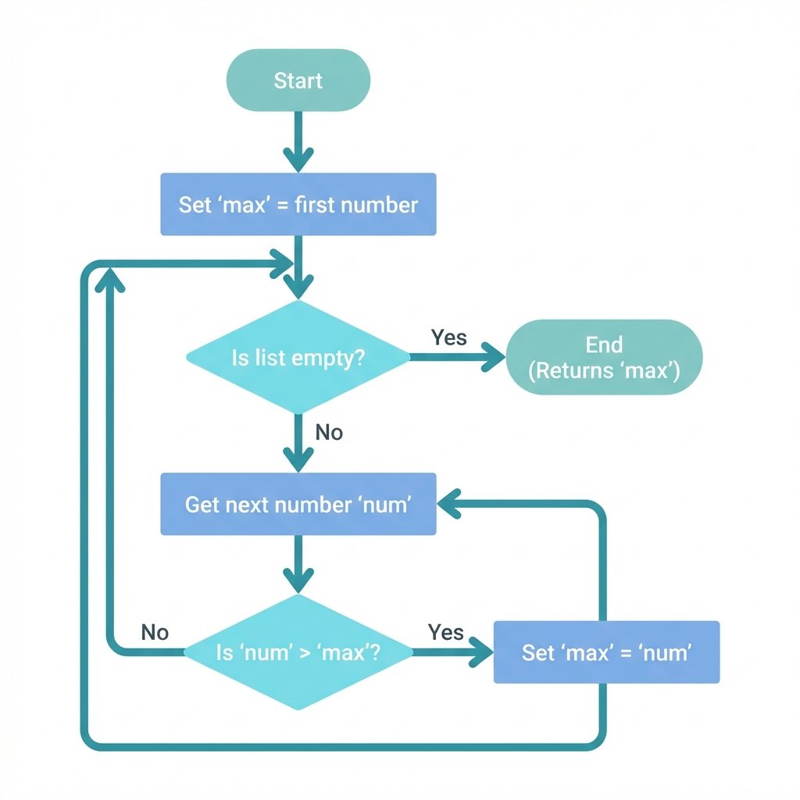
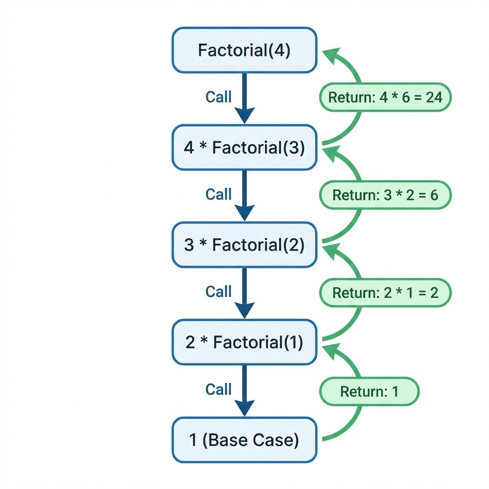
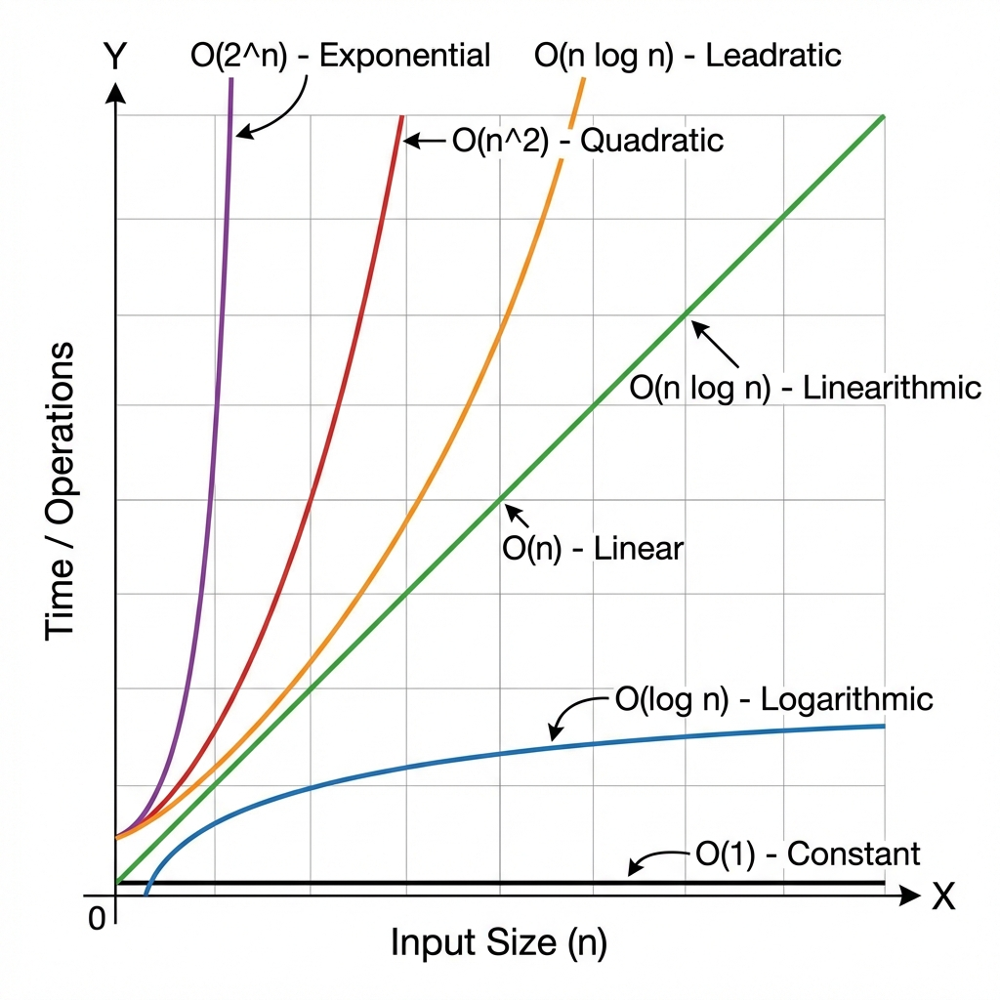
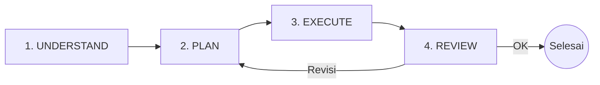
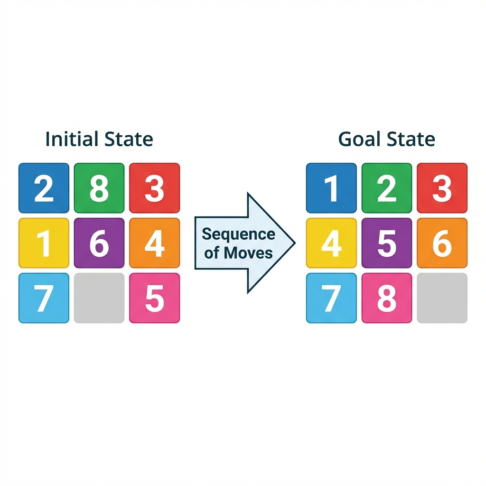
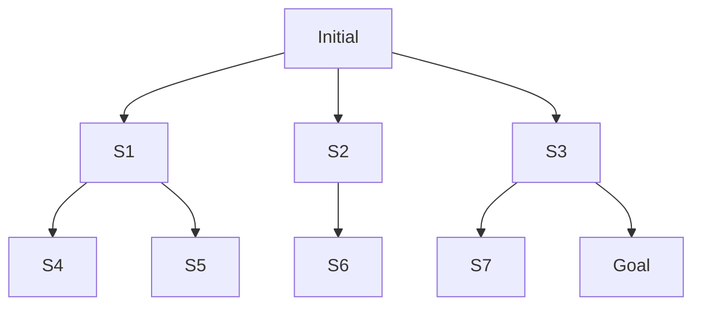
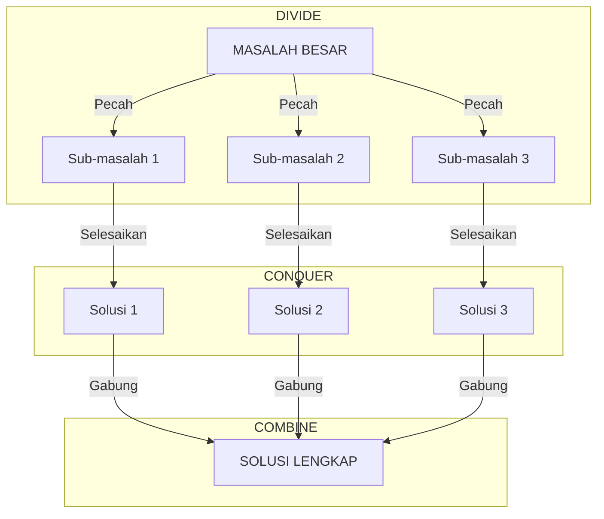
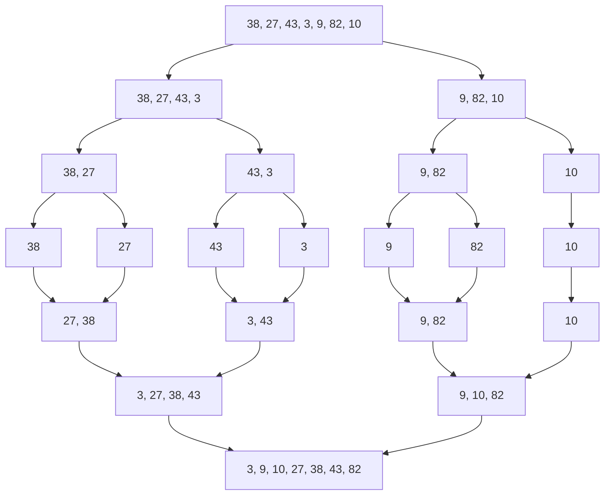

# BAB 2: Dasar-dasar Algoritma dan Pemecahan Masalah

---

## 🎯 Tujuan Pembelajaran

Setelah mempelajari bab ini, Anda akan mampu:

- Mendefinisikan apa itu algoritma dan karakteristiknya
- Memahami konsep rekursi dan iterasi
- Menganalisis kompleksitas algoritma menggunakan notasi Big-O
- Menerapkan langkah-langkah sistematis dalam pemecahan masalah
- Memahami konsep problem space, state space, dan search tree
- Menjelaskan strategi Divide and Conquer

---

## 📖 Pendahuluan

Sebelum kita menyelami algoritma AI yang kompleks, kita perlu memahami fondasi dasarnya: **algoritma** itu sendiri. Bayangkan algoritma sebagai "resep" untuk menyelesaikan masalah — serangkaian instruksi yang jelas dan terurut yang jika diikuti akan membawa kita ke solusi.

Dalam bab ini, kita akan belajar bagaimana "berpikir seperti komputer" — sebuah kemampuan yang disebut **computational thinking**. Kemampuan ini adalah fondasi dari semua yang akan kita pelajari tentang AI.

---

## 2.1 Apa Itu Algoritma?

### 2.1.1 Definisi

**Algoritma** adalah urutan langkah-langkah yang terdefinisi dengan jelas untuk menyelesaikan suatu masalah atau mencapai tujuan tertentu dalam waktu yang terbatas.

> 💡 **Analogi**: Algoritma seperti resep masakan. Resep memberikan langkah-langkah spesifik (potong bawang, tumis dengan minyak, tambahkan garam) yang jika diikuti dengan benar akan menghasilkan hidangan yang diinginkan.

### 2.1.2 Karakteristik Algoritma

Sebuah algoritma yang valid harus memiliki lima karakteristik berikut:

| Karakteristik               | Penjelasan                                            | Contoh                                                            |
| --------------------------- | ----------------------------------------------------- | ----------------------------------------------------------------- |
| **Finiteness (Terbatas)**   | Harus berhenti setelah jumlah langkah yang terbatas   | Tidak boleh berjalan selamanya                                    |
| **Definiteness (Pasti)**    | Setiap langkah harus jelas dan tidak ambigu           | "Tambahkan sedikit garam" ❌ vs "Tambahkan 1 sendok teh garam" ✅ |
| **Input**                   | Memiliki nol atau lebih input                         | Data yang akan diproses                                           |
| **Output**                  | Menghasilkan satu atau lebih output                   | Hasil akhir yang diinginkan                                       |
| **Effectiveness (Efektif)** | Setiap operasi harus cukup dasar untuk bisa dilakukan | Operasi yang bisa dikerjakan                                      |

### 2.1.3 Contoh Algoritma Sederhana: Mencari Nilai Terbesar

**Masalah**: Diberikan sebuah daftar angka, temukan angka terbesar.

**Algoritma dalam bahasa natural:**

```
1. Ambil angka pertama, sebut sebagai "terbesar_sementara"
2. Untuk setiap angka berikutnya dalam daftar:
   a. Jika angka tersebut lebih besar dari "terbesar_sementara"
   b. Maka ganti "terbesar_sementara" dengan angka tersebut
3. Setelah semua angka diperiksa, "terbesar_sementara" adalah jawabannya
```



**Gambar 2.1**: Flowchart algoritma sederhana untuk mencari angka terbesar dalam sebuah daftar.

**Pseudocode:**

```
FUNGSI CariTerbesar(daftar):
    terbesar ← daftar[0]

    UNTUK setiap angka DALAM daftar:
        JIKA angka > terbesar:
            terbesar ← angka

    KEMBALIKAN terbesar
```

**Trace (Penelusuran) dengan contoh [3, 7, 2, 9, 5]:**

| Langkah   | Angka saat ini | terbesar_sementara | Aksi          |
| --------- | -------------- | ------------------ | ------------- |
| 1         | 3              | 3                  | Inisialisasi  |
| 2         | 7              | 7                  | 7 > 3, update |
| 3         | 2              | 7                  | 2 < 7, skip   |
| 4         | 9              | 9                  | 9 > 7, update |
| 5         | 5              | 9                  | 5 < 9, skip   |
| **Hasil** | -              | **9**              | Selesai       |

---

## 2.2 Rekursi dan Iterasi

Ada dua pendekatan dasar untuk menyelesaikan masalah berulang:

### 2.2.1 Iterasi

**Iterasi** adalah pengulangan langkah-langkah menggunakan loop (perulangan).

```
FUNGSI Faktorial_Iteratif(n):
    hasil ← 1
    UNTUK i DARI 1 SAMPAI n:
        hasil ← hasil × i
    KEMBALIKAN hasil
```

**Contoh:** 5! = 1 × 2 × 3 × 4 × 5 = 120

### 2.2.2 Rekursi

**Rekursi** adalah teknik di mana fungsi memanggil dirinya sendiri dengan input yang lebih kecil.

Rekursi terdiri dari dua komponen penting:

1. **Base case (Kasus dasar)**: Kondisi berhenti
2. **Recursive case (Kasus rekursif)**: Pemanggilan diri dengan input yang lebih kecil

```
FUNGSI Faktorial_Rekursif(n):
    JIKA n ≤ 1:                    // Base case
        KEMBALIKAN 1
    LAINNYA:                        // Recursive case
        KEMBALIKAN n × Faktorial(n - 1)
```



**Gambar 2.2**: Visualisasi pohon pemanggilan fungsi rekursif untuk menghitung Faktorial(4).

### 2.2.3 Perbandingan Iterasi vs Rekursi

| Aspek           | Iterasi              | Rekursi                  |
| --------------- | -------------------- | ------------------------ |
| **Konsep**      | Perulangan eksplisit | Pemanggilan diri         |
| **Memori**      | Lebih hemat          | Lebih boros (call stack) |
| **Keterbacaan** | Kadang lebih sulit   | Sering lebih intuitif    |
| **Risiko**      | Infinite loop        | Stack overflow           |
| **Penggunaan**  | Masalah linear       | Masalah bersarang/tree   |

> 📌 **Tips**: Rekursi sangat penting dalam AI, terutama dalam algoritma pencarian dan struktur data seperti tree (pohon).

---

## 2.3 Analisis Kompleksitas Algoritma

Tidak semua algoritma diciptakan sama. Beberapa lebih cepat dari yang lain. Untuk membandingkan efisiensi algoritma, kita menggunakan **analisis kompleksitas**.

### 2.3.1 Mengapa Kompleksitas Penting?

Pertimbangkan dua algoritma untuk masalah yang sama:

- Algoritma A: Memproses 1000 data dalam 1 detik
- Algoritma B: Memproses 1000 data dalam 1 detik juga

Terlihat sama? Belum tentu! Mari lihat apa yang terjadi dengan 1.000.000 data:

- Algoritma A (O(n)): ~1000 detik = 16.7 menit
- Algoritma B (O(n²)): ~1.000.000.000.000 operasi = 31.7 tahun!

### 2.3.2 Notasi Big-O

**Notasi Big-O** menggambarkan bagaimana waktu atau ruang yang dibutuhkan algoritma tumbuh seiring bertambahnya ukuran input.

| Notasi        | Nama         | Contoh                |
| ------------- | ------------ | --------------------- |
| $O(1)$        | Constant     | Akses array by index  |
| $O(\log n)$   | Logarithmic  | Binary search         |
| $O(n)$        | Linear       | Linear search         |
| $O(n \log n)$ | Linearithmic | Merge sort            |
| $O(n^2)$      | Quadratic    | Bubble sort           |
| $O(2^n)$      | Exponential  | Rekursi tanpa memo    |
| $O(n!)$       | Factorial    | Brute force permutasi |



**Gambar 2.3**: Visualisasi pertumbuhan waktu komputasi terhadap ukuran input (n) untuk berbagai kelas kompleksitas Big-O.

### 2.3.4 Cara Menghitung Kompleksitas

**Aturan sederhana:**

1. **Operasi dasar**: O(1)

   ```
   x ← 5       // O(1)
   y ← x + 3   // O(1)
   ```

2. **Loop tunggal n kali**: O(n)

   ```
   UNTUK i DARI 1 SAMPAI n:
       // operasi O(1)
   ```

3. **Loop bersarang**: Kalikan

   ```
   UNTUK i DARI 1 SAMPAI n:      // O(n)
       UNTUK j DARI 1 SAMPAI n:  // × O(n)
           // operasi O(1)
   // Total: O(n²)
   ```

4. **Loop berurutan**: Ambil yang terbesar
   ```
   UNTUK i DARI 1 SAMPAI n:      // O(n)
       // ...
   UNTUK j DARI 1 SAMPAI n:      // O(n)
       // ...
   // Total: O(n) + O(n) = O(n)
   ```

### 2.3.5 Contoh Analisis

**Linear Search (Pencarian Linear):**

```
FUNGSI LinearSearch(daftar, target):
    UNTUK setiap elemen DALAM daftar:     // Loop n kali
        JIKA elemen = target:              // O(1)
            KEMBALIKAN posisi              // O(1)
    KEMBALIKAN "tidak ditemukan"
```

**Kompleksitas: O(n)** — Perlu memeriksa hingga n elemen

**Binary Search (Pencarian Biner):**

```
FUNGSI BinarySearch(daftar_terurut, target):
    kiri ← 0
    kanan ← panjang(daftar) - 1

    SELAMA kiri ≤ kanan:
        tengah ← (kiri + kanan) / 2
        JIKA daftar[tengah] = target:
            KEMBALIKAN tengah
        LAINNYA JIKA daftar[tengah] < target:
            kiri ← tengah + 1
        LAINNYA:
            kanan ← tengah - 1

    KEMBALIKAN "tidak ditemukan"
```

**Kompleksitas: O(log n)** — Setiap iterasi membagi ruang pencarian menjadi setengah

### 2.3.6 Kompleksitas Ruang (Space Complexity)

Selain waktu, kita juga perlu mempertimbangkan **ruang memori** yang digunakan.

| Kasus                       | Kompleksitas Ruang    |
| --------------------------- | --------------------- |
| Menyimpan beberapa variabel | O(1)                  |
| Menyalin seluruh array      | O(n)                  |
| Matriks n × n               | O(n²)                 |
| Rekursi dengan kedalaman n  | O(n) untuk call stack |

---

## 2.4 Pemecahan Masalah Secara Sistematis

### 2.4.1 Langkah-langkah Pemecahan Masalah

George Pólya, matematikawan Hungaria, merumuskan empat langkah pemecahan masalah yang masih relevan hingga hari ini:



| Langkah | Nama | Kegiatan |
|:-------:|:----:|----------|
| 1 | **UNDERSTAND** | Pahami masalah: Apa yang ditanya? Apa yang diketahui? |
| 2 | **PLAN** | Rencanakan solusi: Strategi apa? Pola apa? |
| 3 | **EXECUTE** | Jalankan rencana: Implementasi langkah demi langkah |
| 4 | **REVIEW** | Tinjau ulang: Validasi hasil, optimasi jika perlu |

**Gambar 2.4**: Diagram alur langkah pemecahan masalah menurut George Polya (Understand, Plan, Execute, Review).

### 2.4.2 Computational Thinking

**Computational thinking** adalah cara berpikir untuk memecahkan masalah yang dapat dieksekusi oleh komputer. Empat pilar utamanya:

1. **Decomposition (Dekomposisi)**
   - Memecah masalah besar menjadi bagian-bagian kecil yang lebih mudah dikelola
   - _Contoh_: Membangun rumah = fondasi + dinding + atap + instalasi listrik + ...

2. **Pattern Recognition (Pengenalan Pola)**
   - Menemukan kesamaan atau tren dalam data atau masalah
   - _Contoh_: Semua bilangan genap habis dibagi 2

3. **Abstraction (Abstraksi)**
   - Fokus pada informasi penting, abaikan detail yang tidak relevan
   - _Contoh_: Peta kota menunjukkan jalan, bukan setiap pohon

4. **Algorithm Design (Perancangan Algoritma)**
   - Membuat langkah-langkah untuk menyelesaikan masalah
   - _Contoh_: Resep masakan, instruksi IKEA

---

## 2.5 Problem Space dan State Space

Dalam AI, masalah sering direpresentasikan sebagai **ruang pencarian** (search space).

### 2.5.1 Definisi Komponen

| Istilah              | Definisi                             | Contoh (Puzzle 8-Tile)              |
| -------------------- | ------------------------------------ | ----------------------------------- |
| **State**            | Kondisi/konfigurasi pada suatu waktu | Posisi semua tile                   |
| **Initial State**    | Kondisi awal                         | Posisi acak awal                    |
| **Goal State**       | Kondisi yang ingin dicapai           | Tile terurut 1-8                    |
| **Action**           | Operasi yang mengubah state          | Geser tile ke atas/bawah/kiri/kanan |
| **Transition Model** | Hasil dari menerapkan action         | State baru setelah geser            |
| **State Space**      | Semua kemungkinan state              | Semua konfigurasi tile yang mungkin |
| **Path**             | Urutan state dari initial ke goal    | Rangkaian gerakan solusi            |
| **Path Cost**        | Biaya untuk mencapai goal            | Jumlah gerakan                      |



**Gambar 2.5**: Representasi Initial State dan Goal State pada Puzzle 8-Tile.

### 2.5.3 State Space Graph vs Search Tree

**State Space Graph:**

- Setiap node adalah state yang unik
- Edges menunjukkan aksi yang mungkin
- Finite (terbatas) jika state terbatas

**Search Tree:**

- Root adalah initial state
- Setiap cabang adalah aksi
- Leaves bisa berupa goal state atau dead end
- Bisa infinite (tak terbatas) jika ada loop



**Keterangan:**
- **Level 0**: Initial (Root)
- **Level 1**: S1, S2, S3
- **Level 2**: S4, S5, S6, S7, Goal

**Gambar 2.6**: Ilustrasi Search Tree sederhana. Root adalah kondisi awal, dan Goal adalah solusi yang dicari.

---

## 2.6 Strategi Divide and Conquer

### 2.6.1 Konsep Dasar

**Divide and Conquer** adalah strategi pemecahan masalah dengan tiga langkah:

1. **Divide (Bagi)**: Pecah masalah menjadi sub-masalah yang lebih kecil
2. **Conquer (Taklukkan)**: Selesaikan sub-masalah secara rekursif
3. **Combine (Gabung)**: Gabungkan solusi sub-masalah menjadi solusi keseluruhan



**Gambar 2.7**: Skema strategi Divide and Conquer: memecah masalah, menyelesaikan, lalu menggabungkan solusi.

### 2.6.2 Contoh: Merge Sort

**Masalah**: Urutkan daftar angka

**Algoritma Merge Sort:**

```
FUNGSI MergeSort(daftar):
    JIKA panjang(daftar) ≤ 1:
        KEMBALIKAN daftar           // Base case

    // DIVIDE
    tengah ← panjang(daftar) / 2
    kiri ← daftar[0...tengah]
    kanan ← daftar[tengah...akhir]

    // CONQUER
    kiri_terurut ← MergeSort(kiri)
    kanan_terurut ← MergeSort(kanan)

    // COMBINE
    KEMBALIKAN Merge(kiri_terurut, kanan_terurut)

FUNGSI Merge(kiri, kanan):
    hasil ← []
    SELAMA kiri DAN kanan tidak kosong:
        JIKA kiri[0] ≤ kanan[0]:
            Tambahkan kiri[0] ke hasil
            Hapus kiri[0] dari kiri
        LAINNYA:
            Tambahkan kanan[0] ke hasil
            Hapus kanan[0] dari kanan
    Tambahkan sisa kiri dan kanan ke hasil
    KEMBALIKAN hasil
```

**Visualisasi Merge Sort untuk [38, 27, 43, 3, 9, 82, 10]:**



**Gambar 2.8**: Visualisasi langkah demi langkah algoritma Merge Sort memecah dan mengurutkan array.

**Kompleksitas**: O(n log n) — lebih baik dari Bubble Sort O(n²)

### 2.6.3 Contoh Lain Divide and Conquer

| Algoritma            | Masalah                       | Kompleksitas       |
| -------------------- | ----------------------------- | ------------------ |
| Binary Search        | Pencarian dalam array terurut | O(log n)           |
| Merge Sort           | Pengurutan                    | O(n log n)         |
| Quick Sort           | Pengurutan                    | O(n log n) average |
| Strassen's Algorithm | Perkalian matriks             | O(n^2.807)         |
| Karatsuba            | Perkalian bilangan besar      | O(n^1.585)         |

---

## 2.7 Contoh Klasik: Water Jug Problem

### 2.7.1 Deskripsi Masalah

**Masalah**: Anda memiliki dua kendi—satu berkapasitas 4 liter dan satu lagi 3 liter. Tidak ada penanda volume di kendi. Bagaimana Anda mendapatkan tepat 2 liter air?

**Aksi yang diperbolehkan:**

1. Isi penuh kendi dari keran
2. Kosongkan kendi
3. Tuang dari satu kendi ke kendi lain (sampai penuh atau kosong)

### 2.7.2 Representasi State Space

**State**: (x, y) dimana x = isi kendi 4L, y = isi kendi 3L

**Initial State**: (0, 0)

**Goal State**: (2, y) untuk sembarang y — artinya kendi 4L berisi 2 liter

**Aksi dan Transisi:**

| Aksi               | Kondisi      | Hasil                      |
| ------------------ | ------------ | -------------------------- |
| Isi kendi 4L       | x < 4        | (4, y)                     |
| Isi kendi 3L       | y < 3        | (x, 3)                     |
| Kosongkan kendi 4L | x > 0        | (0, y)                     |
| Kosongkan kendi 3L | y > 0        | (x, 0)                     |
| Tuang 4L → 3L      | x > 0, y < 3 | (x-(3-y), 3) atau (0, x+y) |
| Tuang 3L → 4L      | y > 0, x < 4 | (4, y-(4-x)) atau (x+y, 0) |

### 2.7.3 Solusi

```
Langkah 1: (0, 0) → Isi kendi 4L → (4, 0)
Langkah 2: (4, 0) → Tuang ke kendi 3L → (1, 3)
Langkah 3: (1, 3) → Kosongkan kendi 3L → (1, 0)
Langkah 4: (1, 0) → Tuang ke kendi 3L → (0, 1)
Langkah 5: (0, 1) → Isi kendi 4L → (4, 1)
Langkah 6: (4, 1) → Tuang ke kendi 3L → (2, 3) ✓
```

**Visualisasi:**

```mermaid
graph TD
    Step0[Start<br/>(4L: 0, 3L: 0)] -->|Isi 4L| Step1[Langkah 1<br/>(4L: 4, 3L: 0)]
    Step1 -->|Tuang ke 3L| Step2[Langkah 2<br/>(4L: 1, 3L: 3)]
    Step2 -->|Kosongkan 3L| Step3[Langkah 3<br/>(4L: 1, 3L: 0)]
    Step3 -->|Tuang 4L ke 3L| Step4[Langkah 4<br/>(4L: 0, 3L: 1)]
    Step4 -->|Isi 4L| Step5[Langkah 5<br/>(4L: 4, 3L: 1)]
    Step5 -->|Tuang ke 3L| Step6[Langkah 6: GOAL<br/>(4L: 2, 3L: 3)]
```

**Gambar 2.9**: Visualisasi langkah penyelesaian Water Jug Problem (mendapatkan 2 liter dari kendi 4L dan 3L).

---

## 📝 Ringkasan

1. **Algoritma** adalah urutan langkah pasti untuk menyelesaikan masalah

2. **Karakteristik algoritma**: Finite, Definite, Input, Output, Effective

3. **Rekursi vs Iterasi**: Dua pendekatan untuk perulangan; rekursi penting untuk masalah bersarang

4. **Notasi Big-O**: Cara mengukur efisiensi algoritma
   - O(1) < O(log n) < O(n) < O(n log n) < O(n²) < O(2ⁿ)

5. **Problem Space**: State, Initial State, Goal State, Actions, Transitions

6. **Divide and Conquer**: Bagi, Taklukkan, Gabung — strategi powerful untuk masalah kompleks

---

## 📚 Studi Kasus: Menara Hanoi

### Deskripsi

Terdapat 3 tiang dan n cakram dengan ukuran berbeda. Semua cakram dimulai di tiang pertama, diurutkan dari besar (bawah) ke kecil (atas). Tujuan: pindahkan semua cakram ke tiang ketiga.

**Aturan:**

1. Hanya boleh memindahkan 1 cakram per langkah
2. Cakram yang lebih besar tidak boleh di atas cakram yang lebih kecil

### Solusi Rekursif

```

FUNGSI Hanoi(n, sumber, tujuan, bantuan):
JIKA n = 1:
Pindahkan cakram dari sumber ke tujuan
KEMBALIKAN

    Hanoi(n-1, sumber, bantuan, tujuan)    // Pindahkan n-1 cakram ke bantuan
    Pindahkan cakram terbesar ke tujuan     // Pindahkan cakram terbesar
    Hanoi(n-1, bantuan, tujuan, sumber)    // Pindahkan n-1 cakram ke tujuan

```

### Analisis

- Jumlah langkah minimum: $2^n - 1$
- Untuk 3 cakram: 7 langkah
- Untuk 64 cakram: 18,446,744,073,709,551,615 langkah!

> 💡 **Legenda**: Menurut legenda, ada menara dengan 64 cakram emas di Hanoi. Ketika puzzle selesai, dunia akan berakhir. Dengan 1 gerakan per detik, ini akan memakan waktu 585 miliar tahun!

---

## ✏️ Soal Latihan

### Pilihan Ganda

**1.** Karakteristik algoritma yang menyatakan bahwa algoritma harus berhenti adalah:

- a) Definiteness
- b) Finiteness
- c) Effectiveness
- d) Input

**2.** Kompleksitas waktu dari Binary Search adalah:

- a) O(n)
- b) O(n²)
- c) O(log n)
- d) O(1)

**3.** Jika algoritma A memiliki kompleksitas O(n) dan algoritma B memiliki O(n²), maka untuk n = 1000:

- a) Algoritma A lebih lambat
- b) Algoritma B lebih cepat
- c) Keduanya sama
- d) Algoritma A lebih cepat

**4.** Dalam rekursi, kondisi yang menghentikan pemanggilan diri disebut:

- a) Recursive case
- b) Base case
- c) Terminal case
- d) Stop condition

**5.** Strategi Divide and Conquer TIDAK mencakup langkah:

- a) Divide
- b) Sort
- c) Conquer
- d) Combine

### Esai Singkat

**6.** Tuliskan algoritma (dalam pseudocode) untuk menghitung jumlah semua elemen dalam sebuah array. Kemudian tentukan kompleksitas waktunya.

**7.** Jelaskan perbedaan antara State Space Graph dan Search Tree.

**8.** Untuk Water Jug Problem dengan kapasitas 5 liter dan 3 liter, temukan langkah-langkah untuk mendapatkan 4 liter di kendi 5L.

### Tantangan

**9.** Buktikan bahwa kompleksitas Merge Sort adalah O(n log n) dengan menjelaskan rekurensinya.

**10.** Jika Puzzle 8-Tile memiliki 9!/2 = 181,440 state yang valid, berapa state yang valid untuk Puzzle 15-Tile (4×4)?

---

## 📖 Glosarium Bab 2

| Istilah                    | Definisi                                                    |
| -------------------------- | ----------------------------------------------------------- |
| **Algoritma**              | Urutan langkah-langkah pasti untuk menyelesaikan masalah    |
| **Big-O Notation**         | Notasi untuk menggambarkan kompleksitas asimptotik          |
| **Rekursi**                | Teknik di mana fungsi memanggil dirinya sendiri             |
| **Iterasi**                | Pengulangan menggunakan loop                                |
| **Base Case**              | Kondisi berhenti dalam rekursi                              |
| **State**                  | Kondisi/konfigurasi pada suatu waktu                        |
| **State Space**            | Himpunan semua state yang mungkin                           |
| **Search Tree**            | Representasi pencarian sebagai struktur pohon               |
| **Divide and Conquer**     | Strategi: Bagi, Taklukkan, Gabung                           |
| **Computational Thinking** | Cara berpikir untuk memecahkan masalah secara komputasional |
| **Time Complexity**        | Ukuran waktu yang dibutuhkan algoritma                      |
| **Space Complexity**       | Ukuran memori yang dibutuhkan algoritma                     |

---

## 📚 Bacaan Lebih Lanjut

1. Cormen, T. H., et al. (2009). _Introduction to Algorithms_ (3rd ed.). MIT Press.
2. Sedgewick, R., & Wayne, K. (2011). _Algorithms_ (4th ed.). Addison-Wesley.
3. Pólya, G. (1945). _How to Solve It_. Princeton University Press.

---

_← [BAB 1: Pengantar Kecerdasan Buatan](./bab-01-pengantar-ai.md) | [BAB 3: Representasi Pengetahuan dalam AI](./bab-03-representasi.md) →_

```

```
