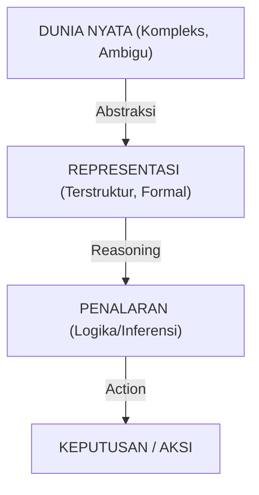
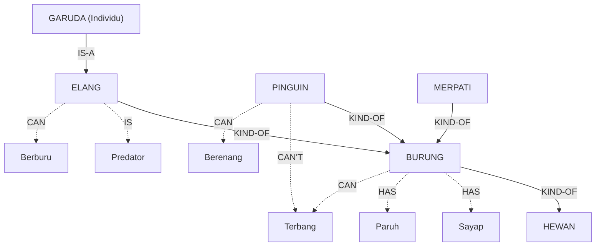
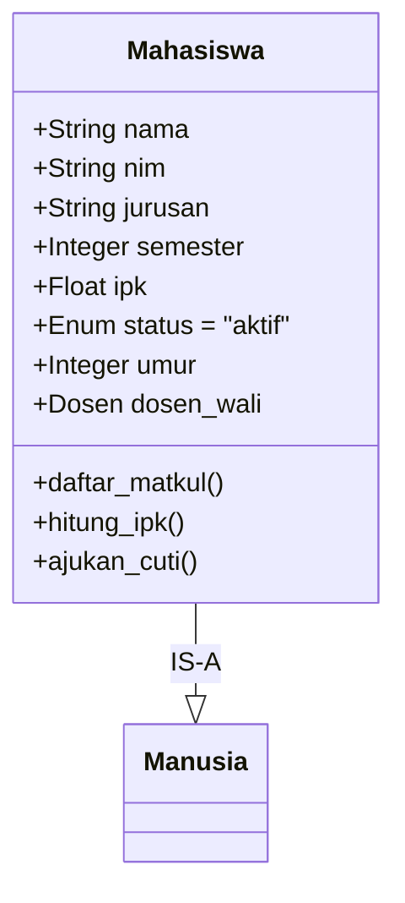
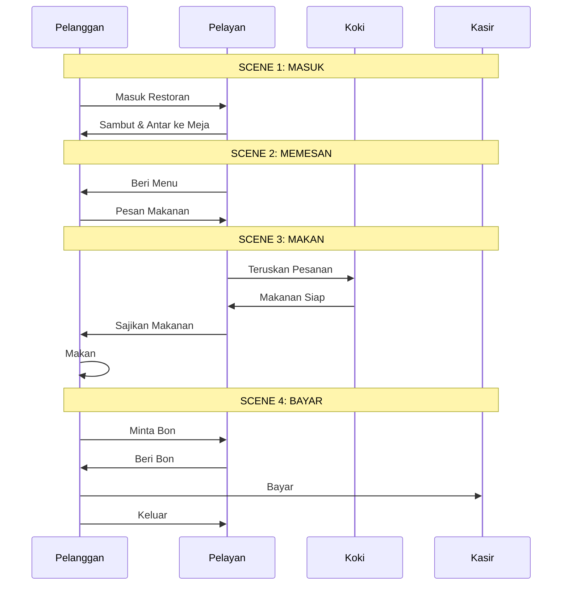
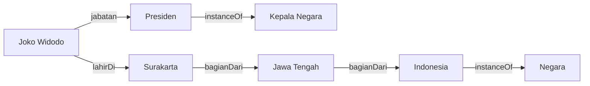
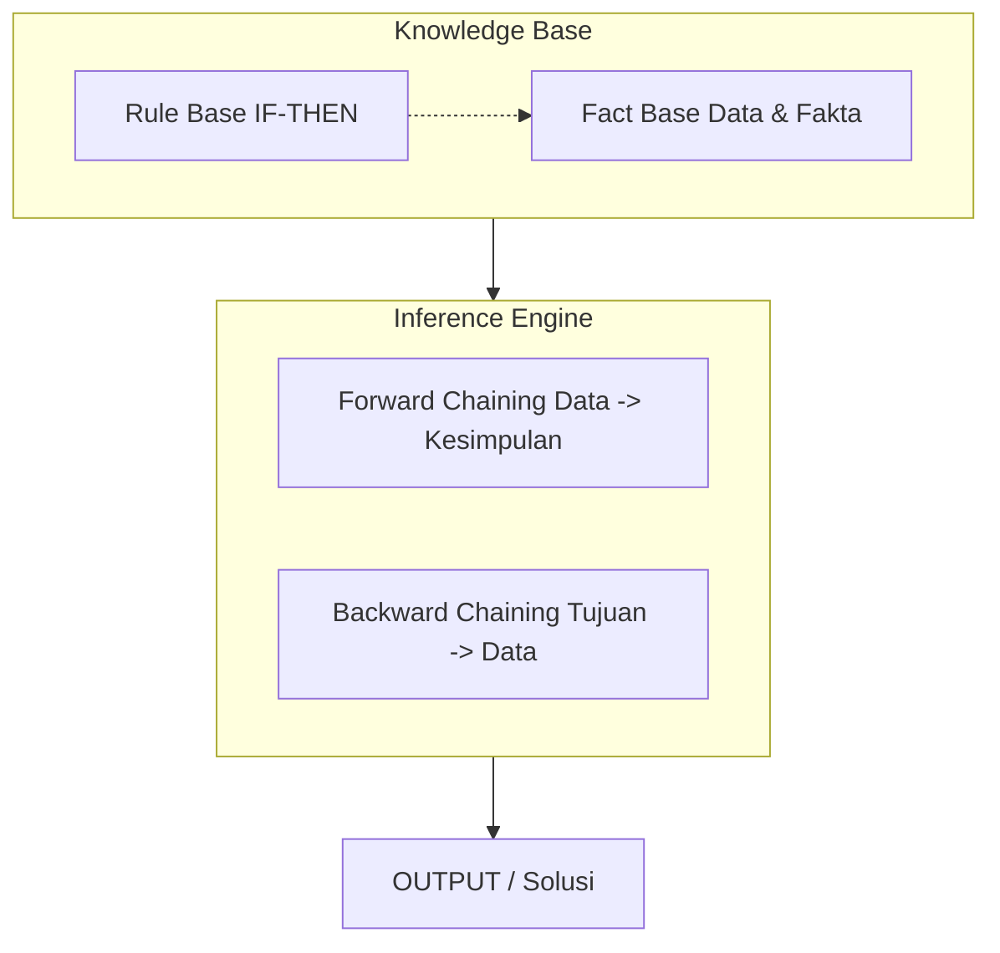
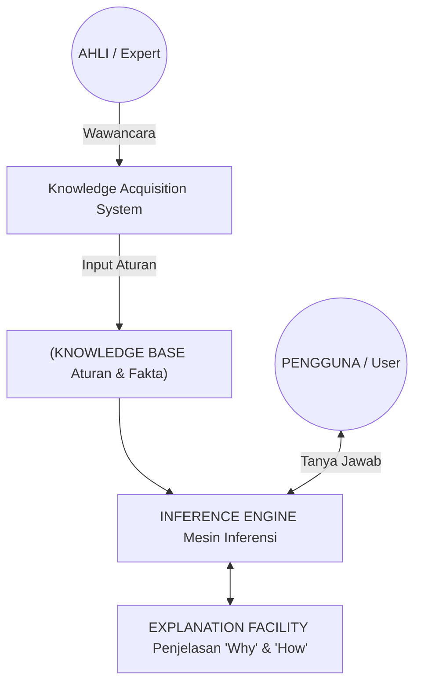
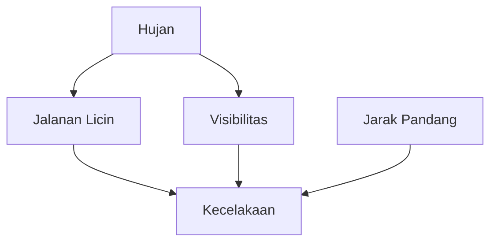
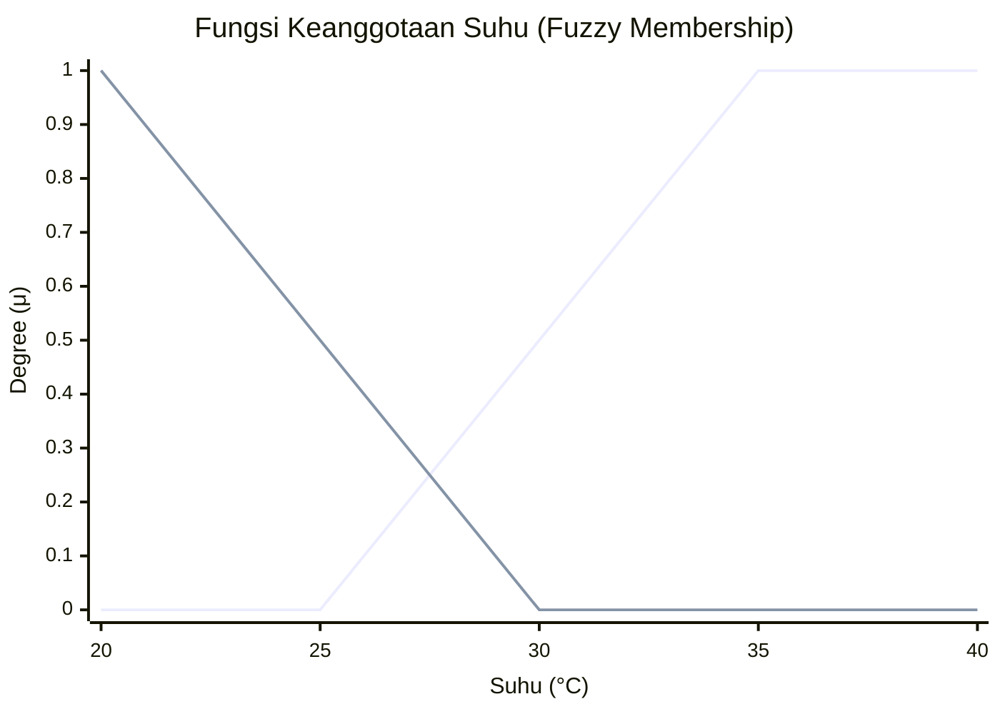

# BAB 3: Representasi Pengetahuan dalam AI

---

## 🎯 Tujuan Pembelajaran

Setelah mempelajari bab ini, Anda akan mampu:

- Menjelaskan mengapa representasi pengetahuan penting dalam AI
- Memahami logika proposisional dan logika predikat
- Menggambarkan pengetahuan menggunakan semantic networks
- Mendefinisikan konsep frame dan script
- Menjelaskan dasar-dasar ontology dan knowledge graphs
- Memahami sistem aturan produksi (production rules)
- Mengenal dasar Expert Systems
- Memahami pengantar Bayesian Networks dan Fuzzy Logic

---

## 📖 Pendahuluan

Bayangkan Anda sedang mengajar seorang anak tentang hewan. Anda tidak hanya memberi tahu bahwa "kucing adalah hewan," tetapi juga bahwa "kucing memiliki empat kaki," "kucing bisa mengeong," dan "kucing adalah mamalia." Anda membangun jaringan pengetahuan yang saling terhubung.

Dalam AI, kita menghadapi tantangan serupa: **Bagaimana kita merepresentasikan pengetahuan dunia nyata dalam format yang dapat dipahami dan diproses oleh komputer?**

Representasi pengetahuan (_knowledge representation_) adalah fondasi dari banyak sistem AI, terutama dalam AI simbolik atau AI klasik. Bab ini akan membahas berbagai cara untuk "mengajarkan" pengetahuan kepada mesin.

---

## 3.1 Mengapa Representasi Pengetahuan Penting?

### 3.1.1 Peran dalam AI

Representasi pengetahuan adalah jembatan antara dunia nyata dan pemahaman komputer:



**Gambar 3.1**: Rantai proses pengetahuan dalam AI: dari dunia nyata ke keputusan.

### 3.1.2 Kriteria Representasi yang Baik

Representasi pengetahuan yang baik harus memenuhi:

| Kriteria                        | Penjelasan                                                |
| ------------------------------- | --------------------------------------------------------- |
| **Adequacy (Kecukupan)**        | Mampu merepresentasikan semua pengetahuan yang diperlukan |
| **Efficiency (Efisiensi)**      | Dapat diakses dan diproses dengan cepat                   |
| **Transparency (Transparansi)** | Mudah dipahami oleh manusia                               |
| **Consistency (Konsistensi)**   | Tidak mengandung kontradiksi                              |
| **Flexibility (Fleksibilitas)** | Mudah diperbarui atau diperluas                           |

---

## 3.2 Logika Proposisional

### 3.2.1 Konsep Dasar

**Logika proposisional** adalah bentuk logika paling sederhana yang berurusan dengan proposisi (pernyataan) yang bernilai benar (True/T) atau salah (False/F).

**Contoh proposisi:**

- P: "Hari ini hujan" → bisa True atau False
- Q: "Jalanan basah" → bisa True atau False

### 3.2.2 Operator Logika

| Operator | Simbol            | Nama        | Contoh                | Arti                                      |
| -------- | ----------------- | ----------- | --------------------- | ----------------------------------------- |
| NOT      | $\neg$            | Negasi      | $\neg P$              | "Tidak hujan"                             |
| AND      | $\land$           | Konjungsi   | $P \land Q$           | "Hujan DAN jalanan basah"                 |
| OR       | $\lor$            | Disjungsi   | $P \lor Q$            | "Hujan ATAU jalanan basah"                |
| IMPLIES  | $\Rightarrow$     | Implikasi   | $P \Rightarrow Q$     | "JIKA hujan MAKA jalanan basah"           |
| IFF      | $\Leftrightarrow$ | Biimplikasi | $P \Leftrightarrow Q$ | "Hujan JIKA DAN HANYA JIKA jalanan basah" |

### 3.2.3 Tabel Kebenaran

**Tabel kebenaran untuk operator dasar:**

| P   | Q   | $\neg P$ | $P \land Q$ | $P \lor Q$ | $P \Rightarrow Q$ |
| --- | --- | -------- | ----------- | ---------- | ----------------- |
| T   | T   | F        | T           | T          | T                 |
| T   | F   | F        | F           | T          | F                 |
| F   | T   | T        | F           | T          | T                 |
| F   | F   | T        | F           | F          | T                 |

> 💡 **Catatan Penting**: Implikasi ($P \Rightarrow Q$) hanya salah ketika P benar tetapi Q salah. "Jika hujan, maka jalanan basah" salah hanya jika hujan tetapi jalanan tidak basah.

### 3.2.4 Contoh dalam AI

**Knowledge Base (Basis Pengetahuan):**

```
P: Cuaca cerah
Q: Kita pergi piknik
R: Membawa payung

Aturan:
1. P → Q         (Jika cerah, kita piknik)
2. ¬P → R        (Jika tidak cerah, bawa payung)
3. Q → ¬R        (Jika piknik, tidak perlu payung)
```

**Inference (Penalaran):**
Jika kita tahu P = True:

- Dari aturan 1: Q = True (kita piknik)
- Dari aturan 3: R = False (tidak bawa payung)

### 3.2.5 Keterbatasan Logika Proposisional

❌ Tidak bisa menyatakan: "Semua manusia mortal"
❌ Tidak bisa menangani variabel: "x adalah mahasiswa"
❌ Terbatas untuk fakta individual

---

## 3.3 Logika Predikat (First-Order Logic)

### 3.3.1 Konsep Dasar

**Logika predikat** memperluas logika proposisional dengan menambahkan:

- **Predikat**: Sifat atau relasi (contoh: `Manusia(x)`, `KepalaNegara(x, y)`)
- **Variabel**: Placeholder untuk objek (contoh: x, y, z)
- **Konstanta**: Objek spesifik (contoh: `Socrates`, `Indonesia`)
- **Quantifier**: Ekspresi "semua" ($\forall$) dan "ada" ($\exists$)

### 3.3.2 Quantifier

| Simbol    | Nama        | Arti                  | Contoh                                                        |
| --------- | ----------- | --------------------- | ------------------------------------------------------------- |
| $\forall$ | Universal   | "Untuk semua"         | $\forall x: \text{Manusia}(x) \Rightarrow \text{Mortal}(x)$   |
| $\exists$ | Existential | "Ada setidaknya satu" | $\exists x: \text{Mahasiswa}(x) \land \text{RajinBelajar}(x)$ |

### 3.3.3 Contoh Representasi

**Fakta dunia nyata → Logika Predikat:**

| Pernyataan                           | Representasi                                                          |
| ------------------------------------ | --------------------------------------------------------------------- |
| "Socrates adalah manusia"            | $\text{Manusia(Socrates)}$                                            |
| "Semua manusia mortal"               | $\forall x: \text{Manusia}(x) \Rightarrow \text{Mortal}(x)$           |
| "Joko adalah presiden Indonesia"     | $\text{Presiden(Joko, Indonesia)}$                                    |
| "Ada mahasiswa yang lulus cum laude" | $\exists x: \text{Mahasiswa}(x) \land \text{CumLaude}(x)$             |
| "Setiap anak menyukai es krim"       | $\forall x: \text{Anak}(x) \Rightarrow \text{Suka}(x, \text{EsKrim})$ |

### 3.3.4 Silogisme dalam Logika Predikat

**Contoh klasik:**

```
Premis 1: ∀x: Manusia(x) → Mortal(x)    "Semua manusia mortal"
Premis 2: Manusia(Socrates)              "Socrates adalah manusia"
────────────────────────────────────────────────────────────────
Konklusi: Mortal(Socrates)               "Socrates mortal"
```

Ini adalah bentuk penalaran yang disebut **Modus Ponens**:
$$\frac{P \Rightarrow Q, \quad P}{Q}$$

---

## 3.4 Semantic Networks

### 3.4.1 Konsep Dasar

**Semantic network** adalah representasi pengetahuan berbentuk graf di mana:

- **Node (simpul)**: Merepresentasikan objek, konsep, atau entitas
- **Edge (sisi)**: Merepresentasikan relasi antar node

### 3.4.2 Jenis Relasi Umum

| Relasi                     | Arti                    | Contoh               |
| -------------------------- | ----------------------- | -------------------- |
| **IS-A**                   | Merupakan instance dari | Tweety IS-A Burung   |
| **KIND-OF** / **SUBCLASS** | Merupakan subkelas dari | Burung KIND-OF Hewan |
| **PART-OF**                | Merupakan bagian dari   | Sayap PART-OF Burung |
| **HAS**                    | Memiliki properti       | Burung HAS Sayap     |
| **CAN**                    | Mampu melakukan         | Burung CAN Terbang   |

### 3.4.3 Contoh Semantic Network



**Gambar 3.2**: Contoh Semantic Network yang menunjukkan hierarki hewan dan propertinya.

### 3.4.4 Inheritance (Pewarisan)

Salah satu kekuatan semantic networks adalah **inheritance** — kemampuan untuk mewarisi properti dari node di atasnya.

**Contoh:**

- Garuda IS-A Elang
- Elang KIND-OF Burung
- Burung HAS Sayap

Maka: **Garuda HAS Sayap** (meskipun tidak dinyatakan secara eksplisit)

> ⚠️ **Exception Handling**: Pinguin adalah burung tetapi tidak bisa terbang. Ini menunjukkan perlunya **non-monotonic reasoning** — kemampuan untuk menangani pengecualian.

---

## 3.5 Frame

### 3.5.1 Konsep Dasar

**Frame** adalah struktur data untuk merepresentasikan objek atau situasi stereotip. Diciptakan oleh Marvin Minsky pada tahun 1975.

Frame terdiri dari:

- **Nama frame**: Identitas objek/konsep
- **Slots**: Atribut atau properti
- **Fillers**: Nilai dari slot
- **Default values**: Nilai standar jika tidak dispesifikasikan
- **Facets**: Batasan atau prosedur pada slot

### 3.5.2 Struktur Frame



**Gambar 3.3**: Struktur Frame untuk konsep 'Mahasiswa'.

### 3.5.3 Instance Frame

```
┌─────────────────────────────────────────────────────────┐
│  INSTANCE: Budi_Santoso                                 │
├─────────────────────────────────────────────────────────┤
│  IS-A: Mahasiswa                                        │
├─────────────────────────────────────────────────────────┤
│  SLOTS:                                                 │
│  ├── nama        : "Budi Santoso"                       │
│  ├── nim         : "21.001.0042"                        │
│  ├── jurusan     : "Teknik Informatika"                 │
│  ├── semester    : 5                                    │
│  ├── ipk         : 3.45                                 │
│  ├── status      : aktif (inherited default)            │
│  ├── umur        : 21 (computed)                        │
│  └── dosen_wali  : → Dr_Ahmad_Wijaya                    │
└─────────────────────────────────────────────────────────┘
```

### 3.5.4 Keuntungan Frame

✅ **Modular**: Pengetahuan terorganisir dalam unit-unit yang jelas
✅ **Inheritance**: Efisien dalam merepresentasikan hierarki
✅ **Default values**: Menangani ketidaklengkapan informasi
✅ **Procedural attachment**: Bisa menjalankan prosedur

---

## 3.6 Script

### 3.6.1 Konsep Dasar

**Script** adalah frame khusus untuk merepresentasikan urutan kejadian yang stereotip (skenario yang umum terjadi).

Diciptakan oleh Roger Schank dan Robert Abelson untuk memahami cerita dan situasi.

### 3.6.2 Komponen Script

| Komponen             | Penjelasan                                 | Contoh (Makan di Restoran) |
| -------------------- | ------------------------------------------ | -------------------------- |
| **Entry conditions** | Kondisi yang harus dipenuhi sebelum script | Lapar, punya uang          |
| **Roles**            | Pelaku dalam script                        | Pelanggan, Pelayan, Koki   |
| **Props**            | Objek yang terlibat                        | Menu, meja, makanan, uang  |
| **Scenes**           | Urutan kejadian                            | Masuk, pesan, makan, bayar |
| **Results**          | Kondisi setelah script                     | Kenyang, uang berkurang    |

### 3.6.3 Contoh Script: Restoran



**Gambar 3.4**: Visualisasi Script "Makan di Restoran" sebagai urutan kejadian.

### 3.6.4 Penggunaan Script dalam AI

Script membantu AI untuk:

- **Memahami cerita**: Mengisi informasi yang tidak disebutkan eksplisit
- **Memprediksi**: Apa yang mungkin terjadi selanjutnya
- **Menjawab pertanyaan**: Tentang situasi yang familiar

**Contoh:**
Cerita: "Budi pergi ke restoran. Dia memesan nasi goreng. Setelah selesai, dia pulang."

Question: "Apakah Budi membayar?"
Answer: "Ya" (dari script kita tahu bahwa membayar adalah bagian dari skenario restoran, meskipun tidak disebutkan eksplisit)

---

## 3.7 Ontology dan Knowledge Graphs

### 3.7.1 Ontology

**Ontology** adalah spesifikasi formal dan eksplisit dari konseptualisasi bersama (shared conceptualization).

Dalam konteks AI:

- Mendefinisikan **kosakata** domain tertentu
- Menspesifikasikan **hubungan** antar konsep
- Menetapkan **batasan** dan **aturan**

### 3.7.2 Komponen Ontology

| Komponen       | Penjelasan          | Contoh                                   |
| -------------- | ------------------- | ---------------------------------------- |
| **Classes**    | Kategori objek      | Hewan, Tumbuhan                          |
| **Instances**  | Objek individual    | Tweety, Pohon di halaman                 |
| **Properties** | Atribut atau relasi | memilikiKaki, tinggalDi                  |
| **Axioms**     | Aturan logis        | "Jika X memakan Y, maka X membutuhkan Y" |

### 3.7.3 Knowledge Graph

**Knowledge Graph** adalah implementasi praktis dari ontology, berupa graf yang menyimpan fakta-fakta dalam format triple:

$$\text{(Subject, Predicate, Object)}$$

atau sering ditulis:
$$\text{(Entitas1, Relasi, Entitas2)}$$

**Contoh Knowledge Graph:**



**Gambar 3.5**: Visualisasi graf pengetahuan (Knowledge Graph) sederhana tentang entitas Joko Widodo.

### 3.7.4 Knowledge Graphs Terkenal

| Knowledge Graph            | Pembuat              | Keterangan                       |
| -------------------------- | -------------------- | -------------------------------- |
| **Google Knowledge Graph** | Google               | Digunakan dalam pencarian Google |
| **Wikidata**               | Wikimedia Foundation | Open source, berbasis komunitas  |
| **DBpedia**                | Komunitas            | Ekstraksi dari Wikipedia         |
| **YAGO**                   | Max Planck Institute | Gabungan Wikipedia dan WordNet   |
| **Freebase**               | Google (dihentikan)  | Basis untuk Google KG            |

### 3.7.5 Aplikasi Knowledge Graph

- 🔍 **Pencarian semantik**: "Siapa presiden Indonesia yang lahir di Jawa?"
- 🤖 **Chatbot dan QA**: Menjawab pertanyaan berdasarkan fakta
- 📊 **Rekomendasi**: Menemukan item yang berhubungan
- 🏥 **Diagnosis medis**: Menghubungkan gejala, penyakit, obat

---

## 3.8 Production Rules (Sistem Aturan Produksi)

### 3.8.1 Konsep Dasar

**Production rules** adalah representasi pengetahuan dalam bentuk aturan IF-THEN:

```
JIKA <kondisi> MAKA <aksi>
IF <condition> THEN <action>
```

### 3.8.2 Struktur Sistem Berbasis Aturan



**Gambar 3.6**: Arsitektur Sistem Berbasis Aturan (Rule-Based System).

### 3.8.3 Forward Chaining vs Backward Chaining

**Forward Chaining (Data-Driven):**

- Mulai dari fakta yang diketahui
- Terapkan aturan untuk mendapatkan fakta baru
- Terus sampai tidak ada aturan yang bisa diterapkan

\*\*Backward Chaining (Goal-Driven):

- Mulai dari tujuan/hipotesis
- Cari aturan yang menghasilkan tujuan tersebut
- Buktikan kondisi aturan tersebut (bisa jadi sub-goal)

### 3.8.4 Contoh: Diagnosis Penyakit

```
ATURAN:
R1: IF demam AND batuk THEN kemungkinan_flu
R2: IF demam AND ruam_kulit THEN kemungkinan_campak
R3: IF kemungkinan_flu AND sakit_kepala THEN flu = HIGH
R4: IF kemungkinan_campak AND mata_merah THEN campak = HIGH

FAKTA:
- demam = true
- batuk = true
- sakit_kepala = true
```

**Forward Chaining:**

```
Langkah 1: Cek R1 → demam ✓, batuk ✓ → Tambah: kemungkinan_flu
Langkah 2: Cek R3 → kemungkinan_flu ✓, sakit_kepala ✓ → Tambah: flu = HIGH
Hasil: Pasien kemungkinan besar menderita FLU
```

---

## 3.9 Expert Systems

### 3.9.1 Apa Itu Expert System?

**Expert System** (Sistem Pakar) adalah program komputer yang meniru kemampuan pengambilan keputusan seorang ahli manusia dalam domain tertentu.

### 3.9.2 Komponen Expert System



**Gambar 3.7**: Arsitektur lengkap dari sebuah Expert System.

### 3.9.3 Expert Systems Terkenal

| Nama           | Domain                    | Tahun | Keterangan                                  |
| -------------- | ------------------------- | ----- | ------------------------------------------- |
| **MYCIN**      | Diagnosis infeksi bakteri | 1970s | Salah satu yang pertama dan paling terkenal |
| **DENDRAL**    | Analisis struktur kimia   | 1960s | Expert system pertama                       |
| **R1/XCON**    | Konfigurasi komputer DEC  | 1980s | Sukses komersial besar                      |
| **PROSPECTOR** | Eksplorasi mineral        | 1970s | Menemukan deposit molybdenum                |

### 3.9.4 Kelebihan dan Keterbatasan

**✅ Kelebihan:**

- Konsisten — tidak lelah, tidak lupa
- Dapat menjelaskan penalaran
- Menyimpan pengetahuan ahli permanen

**❌ Keterbatasan:**

- Sulit memperoleh pengetahuan dari ahli (knowledge acquisition bottleneck)
- Tidak bisa belajar dari pengalaman sendiri
- Terbatas pada domain yang sempit

---

## 3.10 Probabilistic Reasoning dan Bayesian Networks

### 3.10.1 Mengapa Probabilitas?

Dunia nyata penuh ketidakpastian. Logika klasik terlalu "hitam-putih" — sesuatu hanya bisa benar atau salah. Kita butuh cara untuk menangani **derajat keyakinan**.

### 3.10.2 Teorema Bayes

**Teorema Bayes** adalah fondasi dari penalaran probabilistik:

$$P(A|B) = \frac{P(B|A) \cdot P(A)}{P(B)}$$

Dimana:

- $P(A|B)$ = **Posterior**: Probabilitas A setelah mengetahui B
- $P(B|A)$ = **Likelihood**: Probabilitas B jika A benar
- $P(A)$ = **Prior**: Probabilitas awal A
- $P(B)$ = **Evidence**: Probabilitas B secara keseluruhan

### 3.10.3 Contoh: Diagnosis Medis

**Kasus:** Tes untuk penyakit X memiliki:

- Akurasi 99% (jika sakit, tes positif 99%)
- False positive 5% (jika sehat, tes positif 5%)
- Prevalensi penyakit: 1% populasi

**Pertanyaan:** Jika seseorang tes positif, berapa probabilitas dia benar-benar sakit?

**Solusi dengan Bayes:**

- $P(\text{Sakit}) = 0.01$ (prior)
- $P(\text{Positif}|\text{Sakit}) = 0.99$ (sensitivity)
- $P(\text{Positif}|\text{Sehat}) = 0.05$ (false positive rate)

$$P(\text{Positif}) = P(\text{Positif}|\text{Sakit}) \cdot P(\text{Sakit}) + P(\text{Positif}|\text{Sehat}) \cdot P(\text{Sehat})$$
$$P(\text{Positif}) = 0.99 \times 0.01 + 0.05 \times 0.99 = 0.0099 + 0.0495 = 0.0594$$

$$P(\text{Sakit}|\text{Positif}) = \frac{0.99 \times 0.01}{0.0594} \approx 0.167 = 16.7\%$$

> 💡 **Insight**: Meskipun tes 99% akurat, dengan penyakit yang jarang (1%), hasil positif hanya berarti 16.7% kemungkinan benar-benar sakit! Ini disebut **base rate fallacy**.

### 3.10.4 Bayesian Network

**Bayesian Network** adalah cara untuk merepresentasikan hubungan probabilistik antar variabel dalam bentuk graf berarah.



**Gambar 3.8**: Contoh struktur Bayesian Network sederhana untuk prediksi kecelakaan.

---

## 3.11 Fuzzy Logic

### 3.11.1 Konsep Dasar

**Fuzzy Logic** (Logika Fuzzy) menangani kebenaran parsial — nilai antara 0 dan 1, bukan hanya 0 atau 1.

**Logika Klasik vs Fuzzy:**

- Klasik: "Apakah air ini panas?" → Ya/Tidak
- Fuzzy: "Seberapa panas air ini?" → 0.7 panas

### 3.11.2 Fungsi Keanggotaan

Dalam fuzzy logic, elemen bisa "setengah anggota" dari sebuah himpunan.



_(Catatan: Grafik di atas adalah representasi sederhana. Dalam Fuzzy Logic, kurva biasanya tumpang tindih untuk merepresentasikan transisi halus antara 'Dingin', 'Hangat', dan 'Panas'.)_

**Gambar 3.9**: Konsep Fungsi Keanggotaan Fuzzy. Nilai 30°C bisa memiliki keanggotaan 0.5 di himpunan 'Panas'.

### 3.11.3 Aturan Fuzzy

Aturan dalam sistem fuzzy menggunakan istilah linguistik:

```
JIKA suhu PANAS DAN kelembaban TINGGI MAKA ac KENCANG
JIKA suhu HANGAT DAN kelembaban SEDANG MAKA ac SEDANG
JIKA suhu DINGIN MAKA ac MATI
```

### 3.11.4 Aplikasi Fuzzy Logic

| Aplikasi         | Penggunaan Fuzzy                          |
| ---------------- | ----------------------------------------- |
| Mesin cuci       | Menentukan jumlah deterjen dan waktu cuci |
| AC               | Mengatur suhu secara halus                |
| Kamera autofocus | Menentukan titik fokus optimal            |
| ABS mobil        | Mengontrol pengereman                     |
| Elevator         | Optimasi pergerakan                       |

---

## 📝 Ringkasan

1. **Representasi pengetahuan** adalah cara mengkodekan pengetahuan dunia nyata agar dapat diproses komputer

2. **Logika Proposisional**: Menangani pernyataan benar/salah dengan operator logika

3. **Logika Predikat**: Memperluas logika proposisional dengan variabel dan quantifier

4. **Semantic Networks**: Representasi graf dengan node dan edge

5. **Frames**: Struktur terorganisir dengan slot dan inheritance

6. **Scripts**: Representasi urutan kejadian stereotip

7. **Knowledge Graphs**: Triple (Subject, Predicate, Object) dalam skala besar

8. **Production Rules**: Aturan IF-THEN untuk penalaran

9. **Expert Systems**: Program yang meniru keahlian manusia

10. **Bayesian Networks**: Menangani ketidakpastian dengan probabilitas

11. **Fuzzy Logic**: Menangani kebenaran parsial (derajat keanggotaan)

---

## 📚 Studi Kasus: MYCIN — Expert System untuk Diagnosis Medis

### Latar Belakang

MYCIN dikembangkan di Stanford pada tahun 1970-an untuk mendiagnosis infeksi bakteri dalam darah dan merekomendasikan antibiotik.

### Bagaimana MYCIN Bekerja

**Contoh aturan MYCIN:**

```
JIKA:
  (1) Infeksi adalah meningitis, DAN
  (2) Pasien adalah anak dewasa, DAN
  (3) Organisme gram-positif, DAN
  (4) Morfologi adalah coccus, DAN
  (5) Tumbuh dalam rantai
MAKA:
  Ada kemungkinan kuat (0.7) bahwa organisme adalah Streptococcus
```

### Certainty Factor

MYCIN menggunakan **Certainty Factor (CF)** untuk menangani ketidakpastian:

- CF = 1: Pasti benar
- CF = -1: Pasti salah
- CF = 0: Tidak tahu

### Hasil

Dalam studi evaluasi, MYCIN memberikan rekomendasi yang benar dalam 65% kasus — setara atau lebih baik dari banyak dokter spesialis!

### Pelajaran

- Expert systems bisa sangat efektif dalam domain yang terdefinisi baik
- Penjelasan (explanation) sangat penting untuk kepercayaan pengguna
- Knowledge acquisition tetap menjadi tantangan terbesar

---

## ✏️ Soal Latihan

### Pilihan Ganda

**1.** Dalam logika proposisional, $P \Rightarrow Q$ bernilai FALSE ketika:

- a) P true, Q true
- b) P true, Q false
- c) P false, Q true
- d) P false, Q false

**2.** Simbol $\forall$ dalam logika predikat berarti:

- a) Ada setidaknya satu
- b) Untuk semua
- c) Tidak ada
- d) Tepat satu

**3.** Dalam semantic network, relasi "Burung IS-A Hewan" menunjukkan:

- a) Burung adalah bagian dari hewan
- b) Burung adalah instance dari Hewan
- c) Burung adalah subkelas dari Hewan
- d) Burung memiliki Hewan

**4.** Komponen Expert System yang memberikan penjelasan "mengapa" disebut:

- a) Knowledge Base
- b) Inference Engine
- c) Explanation Facility
- d) User Interface

**5.** Dalam fuzzy logic, nilai keanggotaan 0.5 berarti:

- a) Pasti bukan anggota
- b) Pasti anggota
- c) Setengah anggota
- d) Tidak valid

### Esai Singkat

**6.** Tuliskan dalam logika predikat:

- a) "Semua mahasiswa belajar keras"
- b) "Ada dosen yang mengajar lebih dari 3 mata kuliah"
- c) "Joko adalah teman Budi dan Budi adalah teman Ani"

**7.** Gambarkan semantic network untuk pengetahuan berikut:

- Kucing adalah mamalia
- Mamalia adalah hewan
- Kucing memiliki cakar
- Garfield adalah kucing
- Garfield berwarna oranye

**8.** Buat 5 production rules untuk sistem pakar sederhana yang menentukan apakah seseorang layak mendapat kredit bank.

### Tantangan

**9.** Jika prevalensi penyakit adalah 5%, sensitivitas tes 95%, dan spesifisitas tes 90%, berapa probabilitas seseorang benar-benar sakit jika hasil tesnya positif?

**10.** Desain fungsi keanggotaan fuzzy untuk variabel "kecepatan" dengan kategori: lambat, sedang, cepat.

---

## 📖 Glosarium Bab 3

| Istilah                      | Definisi                                                                       |
| ---------------------------- | ------------------------------------------------------------------------------ |
| **Knowledge Representation** | Metode untuk mengkodekan pengetahuan dalam format yang dapat diproses komputer |
| **Proposisi**                | Pernyataan yang bernilai benar atau salah                                      |
| **Predikat**                 | Fungsi yang mengembalikan benar/salah berdasarkan argumen                      |
| **Quantifier**               | Operator logika untuk "semua" (∀) atau "ada" (∃)                               |
| **Semantic Network**         | Representasi pengetahuan berbentuk graf                                        |
| **Frame**                    | Struktur data untuk objek stereotip dengan slot dan filler                     |
| **Script**                   | Representasi urutan kejadian yang stereotip                                    |
| **Ontology**                 | Spesifikasi formal dari konseptualisasi                                        |
| **Knowledge Graph**          | Graf yang menyimpan fakta dalam format triple                                  |
| **Production Rule**          | Aturan IF-THEN untuk penalaran                                                 |
| **Expert System**            | Program yang meniru keahlian manusia                                           |
| **Inference Engine**         | Komponen yang melakukan penalaran                                              |
| **Bayesian Network**         | Representasi hubungan probabilistik antar variabel                             |
| **Fuzzy Logic**              | Logika yang menangani kebenaran parsial                                        |
| **Certainty Factor**         | Ukuran kepercayaan dalam expert systems                                        |

---

## 📚 Bacaan Lebih Lanjut

1. Russell, S., & Norvig, P. (2020). _Artificial Intelligence: A Modern Approach_ (4th ed.). Chapter 8-14.
2. Minsky, M. (1975). A Framework for Representing Knowledge. MIT AI Laboratory.
3. Schank, R. C., & Abelson, R. P. (1977). _Scripts, Plans, Goals and Understanding_.
4. Pearl, J. (1988). _Probabilistic Reasoning in Intelligent Systems_.

---

_← [BAB 2: Dasar Algoritma dan Pemecahan Masalah](./bab-02-algoritma.md) | [BAB 4: Algoritma Pencarian](./bab-04-pencarian.md) →_
