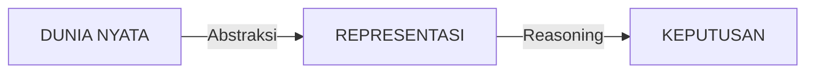
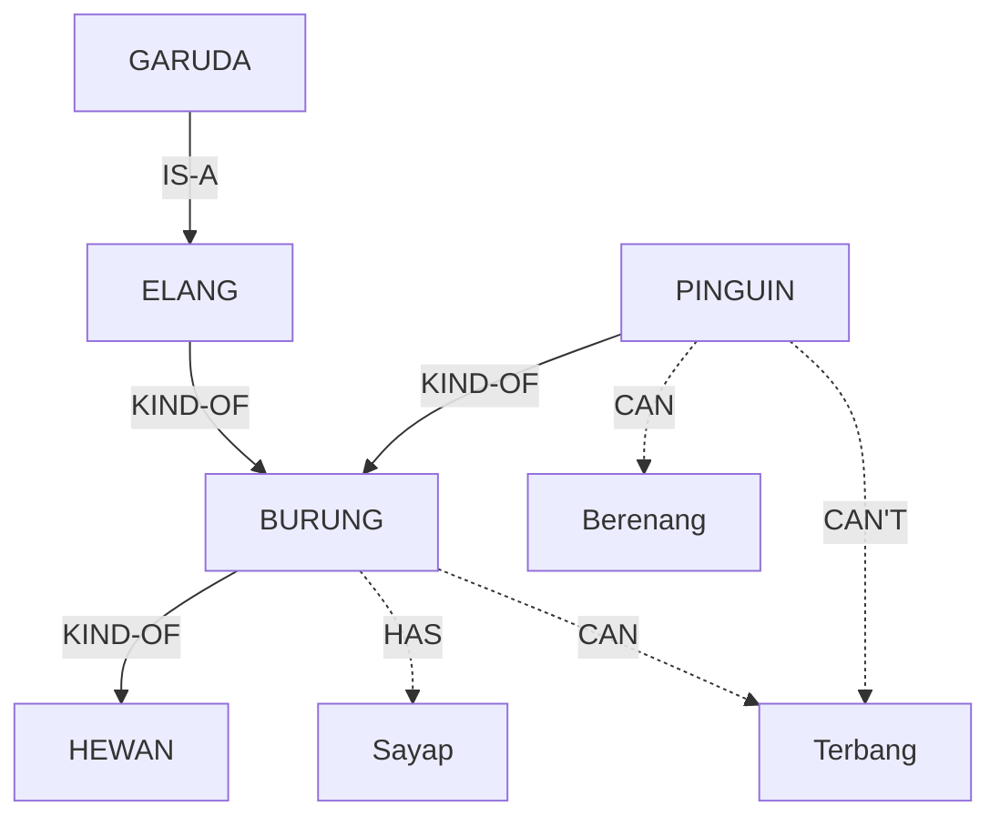
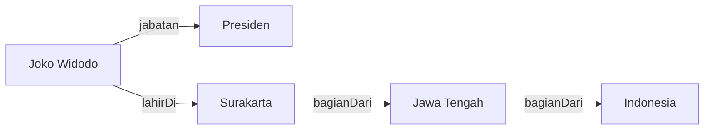
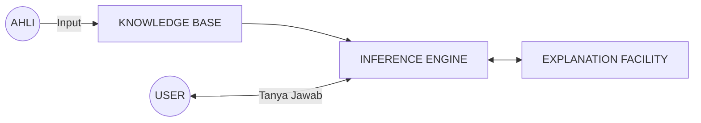
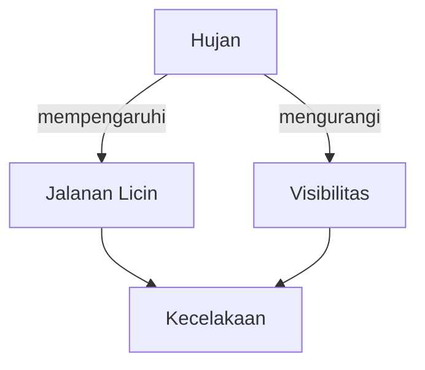

# BAB 3: Representasi Pengetahuan dalam AI

---

## 🎯 Tujuan Pembelajaran

Setelah mempelajari bab ini, Anda akan mampu:

- Menjelaskan pentingnya representasi pengetahuan dalam AI
- Memahami logika proposisional dan logika predikat
- Menggambarkan pengetahuan menggunakan semantic networks, frame, dan script
- Menjelaskan ontology, knowledge graphs, dan production rules
- Mengenal Expert Systems, Bayesian Networks, dan Fuzzy Logic

---

## 📖 Pendahuluan

Bayangkan Anda mengajar anak tentang hewan — Anda tidak hanya mengatakan "kucing adalah hewan," tetapi juga "kucing memiliki empat kaki," "kucing bisa mengeong," dan "kucing adalah mamalia." Anda membangun jaringan pengetahuan yang saling terhubung. Dalam AI, kita menghadapi tantangan serupa: **Bagaimana merepresentasikan pengetahuan dunia nyata dalam format yang dapat diproses komputer?**

Representasi pengetahuan (_knowledge representation_) adalah fondasi banyak sistem AI, terutama dalam AI simbolik (Russell & Norvig, 2020). Bab ini membahas berbagai cara untuk "mengajarkan" pengetahuan kepada mesin.

---

## 3.1 Mengapa Representasi Pengetahuan Penting?

Representasi pengetahuan adalah jembatan antara dunia nyata dan pemahaman komputer:



**Gambar 3.1**: Rantai proses pengetahuan dalam AI.

Representasi yang baik harus memenuhi: **Kecukupan** (mampu merepresentasikan semua pengetahuan yang diperlukan), **Efisiensi** (dapat diproses cepat), **Transparansi** (mudah dipahami manusia), **Konsistensi** (tanpa kontradiksi), dan **Fleksibilitas** (mudah diperbarui).

---

## 3.2 Logika Proposisional

**Logika proposisional** berurusan dengan proposisi yang bernilai benar (T) atau salah (F) (Russell & Norvig, 2020, Ch. 7). Contoh: P = "Hari ini hujan", Q = "Jalanan basah".

**Operator Logika:**

| Operator | Simbol            | Contoh                | Arti                            |
| -------- | ----------------- | --------------------- | ------------------------------- |
| NOT      | $\neg$            | $\neg P$              | "Tidak hujan"                   |
| AND      | $\land$           | $P \land Q$           | "Hujan DAN jalanan basah"       |
| OR       | $\lor$            | $P \lor Q$            | "Hujan ATAU jalanan basah"      |
| IMPLIES  | $\Rightarrow$     | $P \Rightarrow Q$     | "JIKA hujan MAKA jalanan basah" |
| IFF      | $\Leftrightarrow$ | $P \Leftrightarrow Q$ | "Hujan JIKA DAN HANYA JIKA..."  |

**Tabel Kebenaran:**

| P   | Q   | $\neg P$ | $P \land Q$ | $P \lor Q$ | $P \Rightarrow Q$ |
| --- | --- | -------- | ----------- | ---------- | ----------------- |
| T   | T   | F        | T           | T          | T                 |
| T   | F   | F        | F           | T          | F                 |
| F   | T   | T        | F           | T          | T                 |
| F   | F   | T        | F           | F          | T                 |

> 💡 **Catatan**: Implikasi ($P \Rightarrow Q$) hanya salah ketika P benar tetapi Q salah.

**Keterbatasan**: Tidak bisa menyatakan "Semua manusia mortal" atau menangani variabel — untuk itu diperlukan logika predikat.

---

## 3.3 Logika Predikat (First-Order Logic)

**Logika predikat** memperluas logika proposisional dengan menambahkan **predikat** (contoh: `Manusia(x)`), **variabel** (x, y), **konstanta** (`Socrates`), dan **quantifier** ($\forall$ = untuk semua, $\exists$ = ada setidaknya satu) (Russell & Norvig, 2020, Ch. 8-9).

**Contoh Representasi:**

| Pernyataan                     | Representasi Logika Predikat                                |
| ------------------------------ | ----------------------------------------------------------- |
| "Semua manusia mortal"         | $\forall x: \text{Manusia}(x) \Rightarrow \text{Mortal}(x)$ |
| "Socrates adalah manusia"      | $\text{Manusia(Socrates)}$                                  |
| "Ada mahasiswa yang cum laude" | $\exists x: \text{Mahasiswa}(x) \land \text{CumLaude}(x)$   |

**Silogisme (Modus Ponens):**

```
Premis 1: ∀x: Manusia(x) → Mortal(x)    "Semua manusia mortal"
Premis 2: Manusia(Socrates)              "Socrates adalah manusia"
────────────────────────────────────────────────────────────────
Konklusi: Mortal(Socrates)               "Socrates mortal"
```

$$\frac{P \Rightarrow Q, \quad P}{Q}$$

---

## 3.4 Semantic Networks

**Semantic network** adalah representasi berbentuk graf: **node** (objek/konsep) dan **edge** (relasi). Relasi umum: **IS-A** (instance dari), **KIND-OF** (subkelas), **PART-OF** (bagian dari), **HAS** (memiliki), **CAN** (mampu).



**Gambar 3.2**: Semantic Network dengan hierarki hewan dan propertinya.

**Inheritance**: Garuda IS-A Elang → Elang KIND-OF Burung → Burung HAS Sayap, maka **Garuda HAS Sayap** (meskipun tidak dinyatakan eksplisit). Pengecualian (pinguin tak bisa terbang) memerlukan **non-monotonic reasoning**.

---

## 3.5 Frame dan Script

### Frame

**Frame** (Minsky, 1975) adalah struktur data untuk merepresentasikan objek stereotip, terdiri dari: **nama frame**, **slots** (atribut), **fillers** (nilai), **default values**, dan **facets** (batasan).

```
┌──────────────────────────────────────────┐
│  FRAME: Mahasiswa  (IS-A: Manusia)       │
├──────────────────────────────────────────┤
│  nama        : String                    │
│  nim         : String                    │
│  jurusan     : String                    │
│  semester    : Integer                   │
│  ipk         : Float                     │
│  status      : "aktif" (default)         │
│  dosen_wali  : → Dosen                   │
│  Methods: daftar_matkul(), hitung_ipk()  │
└──────────────────────────────────────────┘
```

**Gambar 3.3**: Struktur Frame untuk konsep 'Mahasiswa'.

Keuntungan: modular, mendukung inheritance, menangani ketidaklengkapan informasi via default values.

### Script

**Script** (Schank & Abelson, 1977) adalah frame khusus untuk urutan kejadian stereotip. Komponen: **entry conditions**, **roles**, **props**, **scenes**, dan **results**.

**Contoh Script "Makan di Restoran"**: Masuk → Disambut pelayan → Diberi menu → Pesan makanan → Koki masak → Makan → Minta bon → Bayar → Keluar.

Script membantu AI **memahami cerita**, **memprediksi** kejadian, dan **menjawab pertanyaan** implisit. Contoh: cerita menyebut "Budi makan di restoran lalu pulang" — AI bisa menyimpulkan Budi telah membayar, meskipun tidak disebutkan.

---

## 3.6 Ontology dan Knowledge Graphs

**Ontology** adalah spesifikasi formal dari konseptualisasi bersama — mendefinisikan kosakata domain, hubungan antar konsep, serta batasan dan aturan (Russell & Norvig, 2020, Ch. 12). Komponen: **Classes**, **Instances**, **Properties**, **Axioms**.

**Knowledge Graph** adalah implementasi praktis berupa graf yang menyimpan fakta dalam format triple: **(Subject, Predicate, Object)**.



**Gambar 3.4**: Knowledge Graph sederhana.

**Knowledge Graphs terkenal**: Google Knowledge Graph, Wikidata, DBpedia, YAGO. Aplikasi: pencarian semantik, chatbot, sistem rekomendasi, diagnosis medis.

---

## 3.7 Production Rules dan Expert Systems

### Production Rules

**Production rules** merepresentasikan pengetahuan dalam bentuk **IF-THEN**. Sistem terdiri dari **Rule Base**, **Fact Base**, dan **Inference Engine**.

- **Forward Chaining** (data-driven): mulai dari fakta → terapkan aturan → hasilkan fakta baru
- **Backward Chaining** (goal-driven): mulai dari tujuan → cari aturan yang mendukung → buktikan kondisi

**Contoh Diagnosis:**

```
R1: IF demam AND batuk THEN kemungkinan_flu
R3: IF kemungkinan_flu AND sakit_kepala THEN flu = HIGH

Fakta: demam=true, batuk=true, sakit_kepala=true
Forward: R1→kemungkinan_flu, R3→flu=HIGH → Diagnosis: FLU
```

### Expert Systems

**Expert System** adalah program yang meniru kemampuan pengambilan keputusan seorang ahli dalam domain tertentu. Komponen utama:



**Gambar 3.5**: Arsitektur Expert System.

**Expert Systems terkenal**: MYCIN (diagnosis infeksi bakteri, 1970s), DENDRAL (analisis kimia, 1960s), R1/XCON (konfigurasi komputer, 1980s).

**Kelebihan**: konsisten, dapat menjelaskan penalaran, menyimpan pengetahuan permanen. **Keterbatasan**: sulit memperoleh pengetahuan dari ahli, tidak bisa belajar sendiri, domain sempit.

---

## 3.8 Bayesian Networks

Dunia nyata penuh ketidakpastian. **Teorema Bayes** adalah fondasi penalaran probabilistik (Pearl, 1988):

$$P(A|B) = \frac{P(B|A) \cdot P(A)}{P(B)}$$

**Contoh**: Tes penyakit X dengan akurasi 99%, false positive 5%, prevalensi 1%. Jika tes positif:

$$P(\text{Sakit}|\text{Positif}) = \frac{0.99 \times 0.01}{0.99 \times 0.01 + 0.05 \times 0.99} = \frac{0.0099}{0.0594} \approx 16.7\%$$

> 💡 **Insight**: Meskipun tes 99% akurat, dengan penyakit jarang (1%), hasil positif hanya 16.7% kemungkinan benar sakit (**base rate fallacy**).

**Bayesian Network** merepresentasikan hubungan probabilistik antar variabel dalam graf berarah:



**Gambar 3.6**: Contoh Bayesian Network sederhana untuk prediksi kecelakaan.

---

## 3.9 Fuzzy Logic

**Fuzzy Logic** (Zadeh, 1965) menangani kebenaran parsial — nilai antara 0 dan 1 (bukan hanya 0 atau 1).

- Logika Klasik: "Apakah air panas?" → Ya/Tidak
- Fuzzy: "Seberapa panas?" → 0.7 panas

**Aturan Fuzzy** menggunakan istilah linguistik:

```
JIKA suhu PANAS DAN kelembaban TINGGI MAKA ac KENCANG
JIKA suhu DINGIN MAKA ac MATI
```

**Aplikasi**: mesin cuci (jumlah deterjen), AC (pengaturan suhu halus), kamera autofocus, ABS mobil.

---

## 📝 Ringkasan

| No  | Metode               | Karakteristik Utama                           |
| --- | -------------------- | --------------------------------------------- |
| 1   | Logika Proposisional | Pernyataan benar/salah dengan operator logika |
| 2   | Logika Predikat      | Variabel, predikat, dan quantifier            |
| 3   | Semantic Networks    | Graf dengan node dan edge (relasi)            |
| 4   | Frame                | Struktur slot-filler dengan inheritance       |
| 5   | Script               | Urutan kejadian stereotip                     |
| 6   | Knowledge Graphs     | Triple (Subject, Predicate, Object)           |
| 7   | Production Rules     | Aturan IF-THEN + inference engine             |
| 8   | Expert Systems       | Meniru keahlian manusia di domain tertentu    |
| 9   | Bayesian Networks    | Penalaran probabilistik                       |
| 10  | Fuzzy Logic          | Kebenaran parsial (derajat keanggotaan)       |

---

## 📚 Studi Kasus: MYCIN

MYCIN (Shortliffe, 1976) mendiagnosis infeksi bakteri dan merekomendasikan antibiotik menggunakan ~600 aturan IF-THEN dengan **Certainty Factor** (CF: -1 hingga 1). Contoh aturan: "JIKA infeksi meningitis DAN organisme gram-positif DAN morfologi coccus MAKA kemungkinan 0.7 Streptococcus." Dalam evaluasi, MYCIN akurat 65% — setara atau lebih baik dari banyak dokter spesialis.

---

## ✏️ Soal Latihan

### Pilihan Ganda

**1.** $P \Rightarrow Q$ bernilai FALSE ketika:

- a) P true, Q true
- b) P true, Q false
- c) P false, Q true
- d) P false, Q false

**2.** Simbol $\forall$ dalam logika predikat berarti:

- a) Ada setidaknya satu
- b) Untuk semua
- c) Tidak ada
- d) Tepat satu

**3.** Relasi "Burung IS-A Hewan" menunjukkan:

- a) Bagian dari
- b) Instance dari
- c) Subkelas dari
- d) Memiliki

**4.** Komponen Expert System untuk penjelasan "mengapa" disebut:

- a) Knowledge Base
- b) Inference Engine
- c) Explanation Facility
- d) User Interface

**5.** Nilai keanggotaan fuzzy 0.5 berarti:

- a) Pasti bukan anggota
- b) Pasti anggota
- c) Setengah anggota
- d) Tidak valid

### Esai Singkat

**6.** Tuliskan dalam logika predikat: (a) "Semua mahasiswa belajar keras" (b) "Ada dosen yang mengajar lebih dari 3 mata kuliah"

**7.** Gambarkan semantic network: Kucing adalah mamalia, Mamalia adalah hewan, Kucing memiliki cakar, Garfield adalah kucing.

**8.** Buat 5 production rules untuk sistem pakar kelayakan kredit bank.

### Tantangan

**9.** Prevalensi penyakit 5%, sensitivitas 95%, spesifisitas 90%. Hitung probabilitas benar-benar sakit jika tes positif.

**10.** Desain fungsi keanggotaan fuzzy untuk variabel "kecepatan" dengan kategori: lambat, sedang, cepat.

---

## 📖 Glosarium Bab 3

| Istilah                      | Definisi                                                                 |
| ---------------------------- | ------------------------------------------------------------------------ |
| **Knowledge Representation** | Metode mengkodekan pengetahuan dalam format yang dapat diproses komputer |
| **Proposisi**                | Pernyataan yang bernilai benar atau salah                                |
| **Predikat**                 | Fungsi yang mengembalikan benar/salah berdasarkan argumen                |
| **Quantifier**               | Operator logika untuk "semua" (∀) atau "ada" (∃)                         |
| **Semantic Network**         | Representasi pengetahuan berbentuk graf                                  |
| **Frame**                    | Struktur data untuk objek stereotip dengan slot dan filler               |
| **Script**                   | Representasi urutan kejadian stereotip                                   |
| **Knowledge Graph**          | Graf yang menyimpan fakta dalam format triple                            |
| **Production Rule**          | Aturan IF-THEN untuk penalaran                                           |
| **Expert System**            | Program yang meniru keahlian manusia                                     |
| **Bayesian Network**         | Representasi hubungan probabilistik antar variabel                       |
| **Fuzzy Logic**              | Logika yang menangani kebenaran parsial                                  |

---

## 📚 Referensi

1. Russell, S., & Norvig, P. (2020). _Artificial Intelligence: A Modern Approach_ (4th ed.). Pearson. Chapter 7-14.
2. Minsky, M. (1975). A Framework for Representing Knowledge. _MIT AI Laboratory Memo_ No. 306.
3. Schank, R. C., & Abelson, R. P. (1977). _Scripts, Plans, Goals and Understanding: An Inquiry into Human Knowledge Structures_. Lawrence Erlbaum Associates.
4. Pearl, J. (1988). _Probabilistic Reasoning in Intelligent Systems: Networks of Plausible Inference_. Morgan Kaufmann.
5. Zadeh, L. A. (1965). Fuzzy Sets. _Information and Control_, 8(3), 338–353.
6. Shortliffe, E. H. (1976). _Computer-Based Medical Consultations: MYCIN_. Elsevier.

---

_← [BAB 2: Dasar Algoritma dan Pemecahan Masalah](./bab-02-algoritma.md) | [BAB 4: Algoritma Pencarian](./bab-04-pencarian.md) →_
