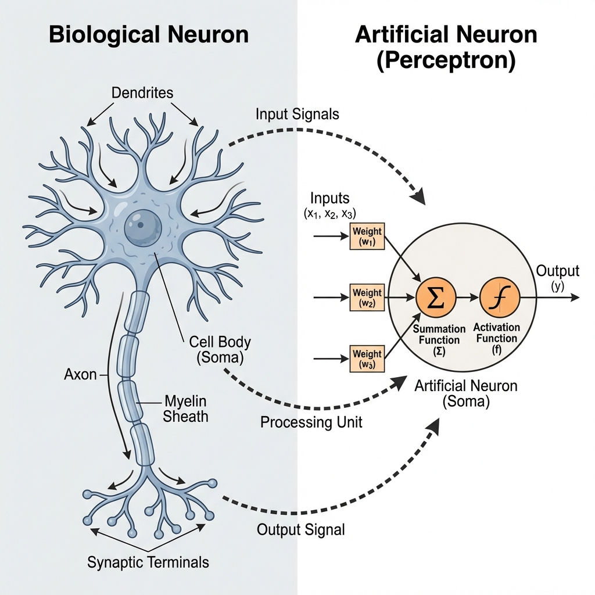
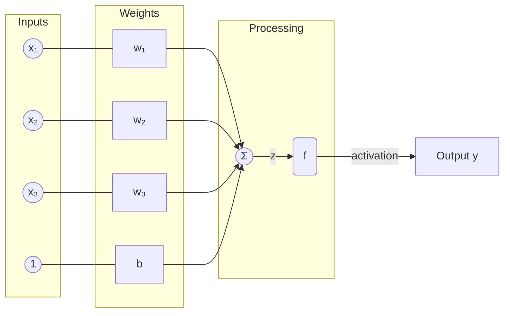
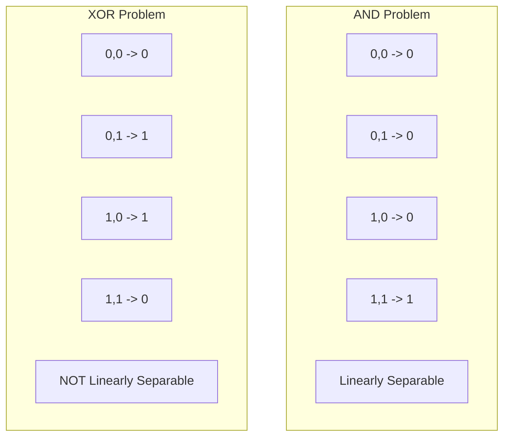
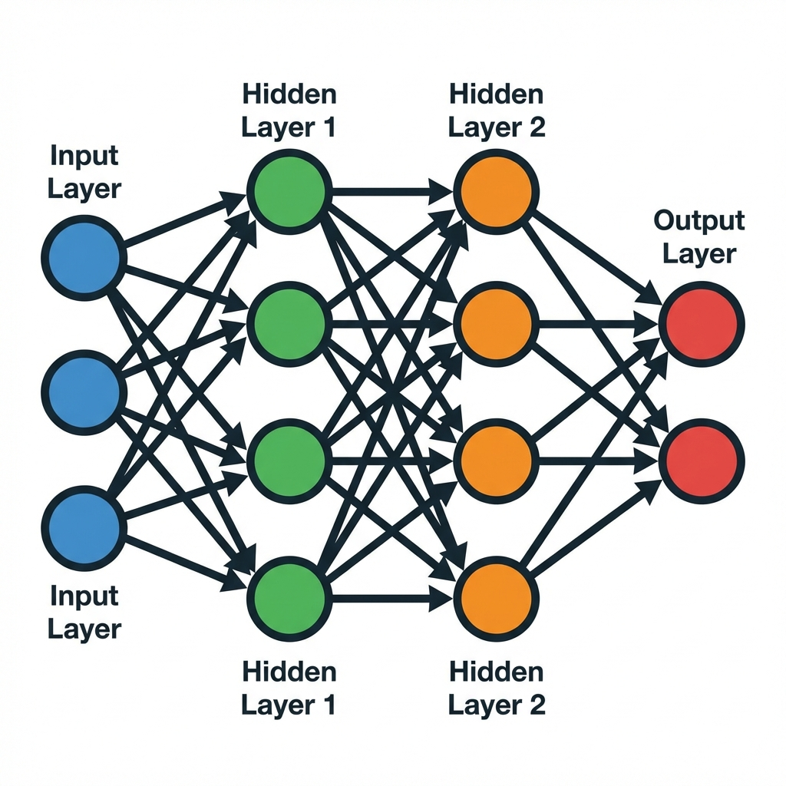
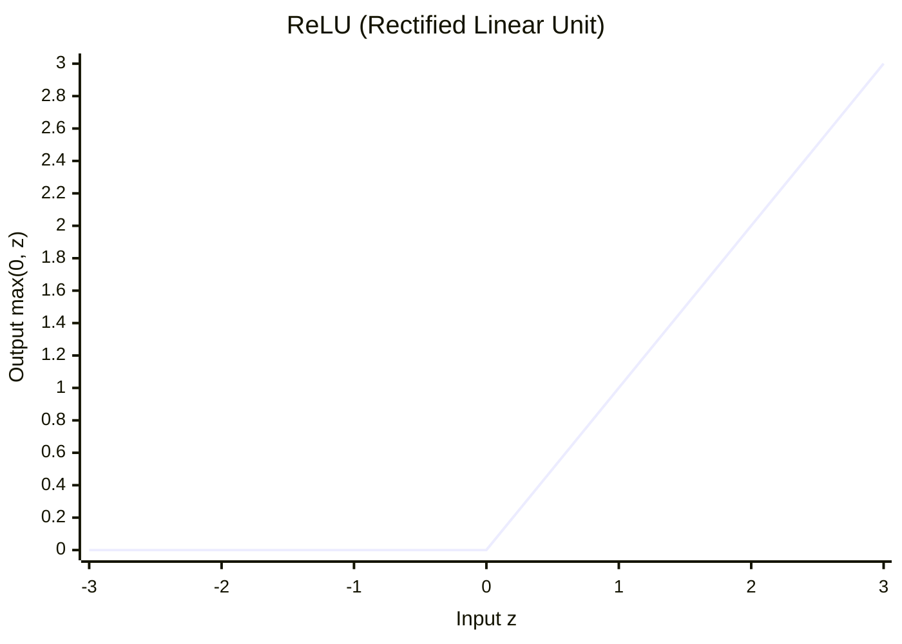

# BAB 8: Dasar Jaringan Saraf Tiruan

---

## 🎯 Tujuan Pembelajaran

Setelah mempelajari bab ini, Anda akan mampu:

- Memahami inspirasi biologis dari neural networks
- Menjelaskan struktur perceptron dan multi-layer perceptron (MLP)
- Memahami berbagai activation functions dan kapan menggunakannya
- Menjelaskan proses forward propagation dan backpropagation
- Memahami optimizers: Gradient Descent, SGD, Adam
- Membedakan batch, mini-batch, dan stochastic gradient descent
- Mengidentifikasi aplikasi praktis neural networks

---

## 📖 Pendahuluan

Otak manusia adalah komputer paling canggih yang pernah ada. Dengan sekitar 86 miliar neuron yang saling terhubung, otak mampu belajar, beradaptasi, dan mengenali pola dengan cara yang luar biasa. Bagaimana jika kita bisa membuat komputer yang "belajar" seperti otak?

Inilah inspirasi dari **Jaringan Saraf Tiruan** (_Artificial Neural Networks_ / ANN) — model komputasi yang terinspirasi dari struktur dan fungsi otak biologis. Neural networks adalah fondasi dari **Deep Learning** yang menggerakkan banyak kemajuan AI modern.

---

## 8.1 Inspirasi Biologis

### 8.1.1 Neuron Biologis



_Gambar 8.1: Perbandingan struktur neuron biologis (kiri) dan neuron tiruan/perceptron (kanan)._

### 8.1.2 Dari Biologis ke Artifisial

| Biologis         | Artifisial             |
| ---------------- | ---------------------- |
| Dendrites        | Input connections      |
| Synapse strength | Weights                |
| Cell body        | Summation + Activation |
| Axon firing      | Output                 |
| Learning         | Weight adjustment      |

---

## 8.2 Perceptron

### 8.2.1 Sejarah

**Perceptron** (Frank Rosenblatt, 1958) adalah neural network paling sederhana — single neuron yang dapat melakukan binary classification.

### 8.2.2 Struktur Perceptron



**Gambar 8.2**: Struktur Perceptron. Sinyal input dikalikan bobot (weights), dijumlahkan (sum), ditambah bias, dan masuk ke fungsi aktivasi.

### 8.2.3 Formulasi Matematis

$$z = \mathbf{w}^T \mathbf{x} + b = \sum_{i=1}^{n} w_i x_i + b$$

$$\hat{y} = \phi(z) = \begin{cases} 1 & \text{if } z \geq 0 \\ 0 & \text{if } z < 0 \end{cases}$$

### 8.2.4 Perceptron Learning Rule

```
UNTUK setiap (x, y) dalam training data:
    ŷ ← predict(x)
    error ← y - ŷ

    UNTUK setiap weight w_i:
        w_i ← w_i + η × error × x_i

    b ← b + η × error

Di mana η adalah learning rate
```

### 8.2.5 Contoh: Perceptron untuk AND Gate

| x₁  | x₂  | y (AND) |
| --- | --- | ------- |
| 0   | 0   | 0       |
| 0   | 1   | 0       |
| 1   | 0   | 0       |
| 1   | 1   | 1       |

**Solusi:**

- w₁ = 1, w₂ = 1, b = -1.5
- z = x₁ + x₂ - 1.5

Verifikasi:

- (0,0): z = -1.5 < 0 → 0 ✓
- (0,1): z = -0.5 < 0 → 0 ✓
- (1,0): z = -0.5 < 0 → 0 ✓
- (1,1): z = 0.5 ≥ 0 → 1 ✓

### 8.2.6 Keterbatasan Perceptron: XOR Problem

Perceptron hanya bisa menyelesaikan masalah yang **linearly separable**.



**Gambar 8.3**: Perbedaan AND (Separable) vs XOR (Not Separable). Garis lurus tidak bisa memisahkan output 0 dan 1 pada kasus XOR.

**Solusi:** Multi-layer Perceptron (MLP)!

---

## 8.3 Multi-Layer Perceptron (MLP)

### 8.3.1 Arsitektur

MLP terdiri dari beberapa **layer**:

1. **Input Layer**: Menerima fitur
2. **Hidden Layer(s)**: Memproses fitur
3. **Output Layer**: Menghasilkan prediksi



_Gambar 8.4: Arsitektur Multi-Layer Perceptron (MLP) dengan input layer, hidden layers, dan output layer._

### 8.3.2 Mengapa Perlu Hidden Layers?

Hidden layers memungkinkan network untuk:

- Belajar **non-linear decision boundaries**
- Membangun **hierarchical representations**
- Menyelesaikan masalah yang tidak linearly separable

> 💡 **Universal Approximation Theorem**: MLP dengan satu hidden layer (cukup lebar) dapat mendekati fungsi kontinu apapun!

### 8.3.3 Notasi

| Notasi    | Artinya                             |
| --------- | ----------------------------------- |
| $L$       | Jumlah layer (tidak termasuk input) |
| $n^{[l]}$ | Jumlah neuron di layer l            |
| $W^{[l]}$ | Matriks weights dari layer l-1 ke l |
| $b^{[l]}$ | Bias vector di layer l              |
| $z^{[l]}$ | Linear combination di layer l       |
| $a^{[l]}$ | Aktivasi (output) di layer l        |

---

## 8.4 Activation Functions

### 8.4.1 Mengapa Perlu Activation Function?

Tanpa activation function, MLP hanyalah kombinasi linear:
$$z^{[L]} = W^{[L]}(W^{[L-1]}(...(W^{[1]}x))) = W_{total}x$$

Activation function memberikan **non-linearity** sehingga network bisa mempelajari fungsi kompleks.

### 8.4.2 Jenis-jenis Activation Functions

#### Step Function (Threshold)

$$\phi(z) = \begin{cases} 1 & \text{if } z \geq 0 \\ 0 & \text{if } z < 0 \end{cases}$$

❌ Derivative = 0 hampir di mana-mana → tidak bisa di-training dengan gradient descent

#### Sigmoid

$$\sigma(z) = \frac{1}{1 + e^{-z}}$$

```mermaid
xychart-beta
    title "Sigmoid Function"
    x-axis "Input z" [-6, -4, -2, 0, 2, 4, 6]
    y-axis "Output σ(z)" 0 --> 1
    line [0.00, 0.02, 0.12, 0.5, 0.88, 0.98, 1.00]
```

**Gambar 8.5**: Fungsi Aktivasi Sigmoid. Mengubah input apapun menjadi range (0, 1).

✅ Output (0,1) — cocok untuk probabilitas
❌ **Vanishing gradient**: derivative → 0 untuk |z| besar
❌ Output tidak zero-centered

#### Tanh

$$\tanh(z) = \frac{e^z - e^{-z}}{e^z + e^{-z}}$$

```mermaid
xychart-beta
    title "Tanh Function"
    x-axis "Input z" [-3, -2, -1, 0, 1, 2, 3]
    y-axis "Output tanh(z)" -1 --> 1
    line [-0.99, -0.96, -0.76, 0, 0.76, 0.96, 0.99]
```

**Gambar 8.6**: Fungsi Aktivasi Tanh. Mirip Sigmoid tapi range (-1, 1) dan zero-centered.

✅ Output zero-centered (-1, 1)
❌ Masih vanishing gradient

#### ReLU (Rectified Linear Unit)

$$\text{ReLU}(z) = \max(0, z)$$



**Gambar 8.7**: Fungsi Aktivasi ReLU. Linear untuk z > 0, nol untuk z < 0. Mengatasi vanishing gradient.

✅ Mengatasi vanishing gradient untuk z > 0
✅ Komputasi cepat dan sederhana
✅ Sparse activation (efisien)
❌ **Dying ReLU**: jika z < 0, neuron "mati" (gradient = 0)

#### Leaky ReLU

$$\text{LeakyReLU}(z) = \begin{cases} z & \text{if } z > 0 \\ \alpha z & \text{if } z \leq 0 \end{cases}$$

(biasanya α = 0.01)

✅ Mengatasi dying ReLU problem

#### Softmax (untuk Output Multi-class)

$$\text{softmax}(z_i) = \frac{e^{z_i}}{\sum_{j} e^{z_j}}$$

✅ Output menjadi probabilitas (jumlah = 1)
✅ Cocok untuk klasifikasi multi-class

### 8.4.3 Kapan Menggunakan Activation Function Mana?

| Lokasi                   | Activation      | Alasan                  |
| ------------------------ | --------------- | ----------------------- |
| Hidden layers            | **ReLU**        | Default, works well     |
| Hidden (gradient issues) | Leaky ReLU, ELU | Mengatasi dying ReLU    |
| Output (binary)          | **Sigmoid**     | Probabilitas (0,1)      |
| Output (multi-class)     | **Softmax**     | Distribusi probabilitas |
| Output (regression)      | Linear/None     | Nilai tanpa batas       |

---

## 8.5 Forward Propagation

### 8.5.1 Proses

**Forward propagation** adalah proses menghitung output dari input melalui seluruh network.

```
Untuk layer l = 1, 2, ..., L:
    z[l] = W[l] × a[l-1] + b[l]    (linear combination)
    a[l] = g[l](z[l])              (activation)

Di mana a[0] = x (input)
```

### 8.5.2 Contoh Forward Propagation

Network: 2 input → 2 hidden → 1 output

```
Input: x = [0.5, 0.3]

Hidden Layer:
    W[1] = [[0.1, 0.2],     b[1] = [0.1, 0.2]
            [0.3, 0.4]]

    z[1] = W[1] × x + b[1]
         = [[0.1×0.5 + 0.2×0.3],     + [0.1,    = [0.21,
            [0.3×0.5 + 0.4×0.3]]       0.2]       0.47]

    a[1] = ReLU(z[1]) = [0.21, 0.47]

Output Layer:
    W[2] = [0.5, 0.6]    b[2] = 0.1

    z[2] = W[2] × a[1] + b[2]
         = 0.5×0.21 + 0.6×0.47 + 0.1 = 0.487

    a[2] = sigmoid(0.487) ≈ 0.62

Output: ŷ = 0.62
```

---

## 8.6 Backpropagation

### 8.6.1 Konsep

**Backpropagation** adalah algoritma untuk menghitung gradient dari loss function terhadap semua weights menggunakan **chain rule**.

Goal: Temukan ∂L/∂W untuk setiap weight, lalu update:
$$W \leftarrow W - \eta \frac{\partial L}{\partial W}$$

### 8.6.2 Chain Rule

Untuk fungsi komposit y = f(g(x)):
$$\frac{dy}{dx} = \frac{dy}{dg} \times \frac{dg}{dx}$$

### 8.6.3 Algoritma Backpropagation

```
┌─────────────────────────────────────────────────────────────┐
│                   BACKPROPAGATION                           │
├─────────────────────────────────────────────────────────────┤
│                                                             │
│   1. FORWARD PASS                                           │
│      Hitung semua z[l] dan a[l] untuk l = 1, ..., L         │
│                                                             │
│   2. COMPUTE OUTPUT ERROR                                   │
│      δ[L] = dL/da[L] × g'[L](z[L])                         │
│                                                             │
│   3. BACKPROPAGATE ERROR                                    │
│      Untuk l = L-1, L-2, ..., 1:                           │
│          δ[l] = (W[l+1]ᵀ × δ[l+1]) ⊙ g'[l](z[l])          │
│                                                             │
│   4. COMPUTE GRADIENTS                                      │
│      dL/dW[l] = δ[l] × a[l-1]ᵀ                            │
│      dL/db[l] = δ[l]                                       │
│                                                             │
│   5. UPDATE WEIGHTS                                         │
│      W[l] ← W[l] - η × dL/dW[l]                           │
│      b[l] ← b[l] - η × dL/db[l]                           │
│                                                             │
└─────────────────────────────────────────────────────────────┘
```

### 8.6.4 Visualisasi Flow

```mermaid
graph LR
    subgraph Forward_Pass [Forward Pass (Hitung Output)]
        direction LR
        x[Input x] --> z1[z₁] --> a1[a₁] --> z2[z₂] --> a2[Output a₂] --> L[Loss Function]
    end

    subgraph Backward_Pass [Backward Pass (Hitung Gradient)]
        direction RL
        L -.-> da2[∂L/∂a₂]
        da2 -.-> dz2[∂L/∂z₂]
        dz2 -.-> dW2[∂L/∂W₂] & da1[∂L/∂a₁]

        da1 -.-> dz1[∂L/∂z₁]
        dz1 -.-> dW1[∂L/∂W₁]
    end

    Forward_Pass --> Backward_Pass
```

**Gambar 8.8**: Alur Backpropagation. Forward pass menghitung prediksi dan loss, Backward pass mengalirkan error balik (chain rule) untuk menghitung gradient.

---

## 8.7 Optimizers

### 8.7.1 Gradient Descent

Basic update rule:
$$W \leftarrow W - \eta \nabla_W L$$

### 8.7.2 Batch vs Stochastic vs Mini-batch

| Jenis             | Data per Update   | Karakteristik                          |
| ----------------- | ----------------- | -------------------------------------- |
| **Batch GD**      | Semua data        | Stabil, lambat, butuh banyak memori    |
| **Stochastic GD** | 1 data            | Noisy, cepat, bisa escape local minima |
| **Mini-batch GD** | k data (e.g., 32) | Balance, paling umum digunakan         |

```
    Batch GD:       Update 1× per epoch (semua data)

    Mini-batch:     Update n/k× per epoch

    Stochastic:     Update n× per epoch (setiap data)
```

### 8.7.3 Momentum

Menambahkan "kecepatan" untuk mempercepat konvergensi:

$$v_t = \beta v_{t-1} + (1-\beta) \nabla L$$
$$W \leftarrow W - \eta v_t$$

```mermaid
graph TD
    subgraph SGD [Tanpa Momentum (Zig-zag)]
        S1((Start)) --> Z1 --> Z2 --> Z3 --> Z4 --> Z5 --> G1((Minima))
    end

    subgraph SGD_M [Dengan Momentum (Smooth)]
        S2((Start)) --> M1 --> M2 --> G2((Minima))
    end
```

**Gambar 8.9**: Ilustrasi Momentum. Tanpa momentum (kiri), update berosilasi lambat. Dengan momentum (kanan), update lebih cepat dan terarah menuju minima.

### 8.7.4 RMSprop

Adaptive learning rate per parameter:

$$s_t = \beta s_{t-1} + (1-\beta) (\nabla L)^2$$
$$W \leftarrow W - \frac{\eta}{\sqrt{s_t + \epsilon}} \nabla L$$

- Parameter dengan gradient besar → learning rate kecil
- Parameter dengan gradient kecil → learning rate besar

### 8.7.5 Adam (Adaptive Moment Estimation)

Kombinasi Momentum + RMSprop:

$$m_t = \beta_1 m_{t-1} + (1-\beta_1) \nabla L$$
$$v_t = \beta_2 v_{t-1} + (1-\beta_2) (\nabla L)^2$$
$$\hat{m}_t = \frac{m_t}{1-\beta_1^t}, \quad \hat{v}_t = \frac{v_t}{1-\beta_2^t}$$
$$W \leftarrow W - \frac{\eta}{\sqrt{\hat{v}_t} + \epsilon} \hat{m}_t$$

**Default hyperparameters:**

- β₁ = 0.9, β₂ = 0.999, ε = 10⁻⁸

> 💡 **Adam adalah optimizer paling populer** karena works well out-of-the-box untuk kebanyakan kasus.

### 8.7.6 Perbandingan Optimizers

| Optimizer      | Kelebihan                | Kapan Digunakan              |
| -------------- | ------------------------ | ---------------------------- |
| SGD            | Simple, generalizes well | Ketika compute tidak masalah |
| SGD + Momentum | Faster convergence       | CV tasks                     |
| RMSprop        | Adaptive LR              | RNN, non-stationary          |
| **Adam**       | Best of both worlds      | **Default choice**           |
| AdamW          | Adam + weight decay      | Modern deep learning         |

---

## 8.8 Training Neural Networks

### 8.8.1 Training Loop

```
UNTUK setiap epoch:
    UNTUK setiap mini-batch:
        1. Forward propagation → compute loss
        2. Backward propagation → compute gradients
        3. Update weights dengan optimizer

    Evaluate pada validation set
    Check for early stopping
```

### 8.8.2 Loss Functions

| Task                  | Loss Function             | Formula                                  |
| --------------------- | ------------------------- | ---------------------------------------- |
| Regression            | Mean Squared Error        | $\frac{1}{n}\sum(y-\hat{y})^2$           |
| Binary Classification | Binary Cross-Entropy      | $-[y\log\hat{y} + (1-y)\log(1-\hat{y})]$ |
| Multi-class           | Categorical Cross-Entropy | $-\sum_c y_c \log(\hat{y}_c)$            |

### 8.8.3 Regularization

Teknik untuk mencegah overfitting:

| Teknik                  | Deskripsi                              |
| ----------------------- | -------------------------------------- |
| **L2 Regularization**   | Tambah λ‖W‖² ke loss                   |
| **L1 Regularization**   | Tambah λ‖W‖ ke loss                    |
| **Dropout**             | Random "matikan" neurons saat training |
| **Early Stopping**      | Stop training ketika val loss naik     |
| **Batch Normalization** | Normalize aktivasi antar layer         |

### 8.8.4 Dropout

```mermaid
graph TD
    subgraph Training [Training (Dropout Applied)]
        I1((In1)) --- H1((H1)) --- O1((Out))
        I2((In2)) --- H2((X)):::drop
        I3((In3)) --- H3((H3)) --- O1

        I1 --- H2
        I2 --- H1
    end

    subgraph Testing [Testing (No Dropout)]
        TI1((In1)) --- TH1((H1)) --- TO1((Out))
        TI2((In2)) --- TH2((H2)) --- TO1
        TI3((In3)) --- TH3((H3)) --- TO1

        TI1 --- TH2
        TI2 --- TH1
    end
```

**Gambar 8.10**: Dropout Regularization. Saat training, sebagian neuron dimatikan secara random (X) untuk mencegah co-adaptation. Saat testing, semua neuron aktif.

### 8.8.5 Hyperparameters

| Hyperparameter | Typical Values    | Tuning                       |
| -------------- | ----------------- | ---------------------------- |
| Learning rate  | 0.001, 0.01, 0.1  | Most important!              |
| Batch size     | 32, 64, 128, 256  | Trade-off speed/memory       |
| Hidden layers  | 1-5               | Depends on complexity        |
| Hidden units   | 64, 128, 256, 512 | More = more capacity         |
| Dropout rate   | 0.2, 0.5          | Higher = more regularization |

---

## 8.9 Aplikasi Praktis

### 8.9.1 Image Classification (MNIST)

**Task:** Klasifikasi digit tulisan tangan (0-9)

**Architecture:**

- Input: 28×28 = 784 pixels
- Hidden 1: 128 units, ReLU
- Hidden 2: 64 units, ReLU
- Output: 10 units, Softmax

### 8.9.2 Sentiment Analysis

**Task:** Klasifikasi review positif/negatif

**Architecture:**

- Input: Bag-of-words atau word embeddings
- Hidden: 64-128 units, ReLU
- Output: 1 unit, Sigmoid

### 8.9.3 Regression (House Prices)

**Task:** Prediksi harga rumah

**Architecture:**

- Input: Features (luas, kamar, lokasi, dll)
- Hidden: 32-64 units, ReLU
- Output: 1 unit, Linear (no activation)

---

## 📝 Ringkasan

1. **Neural Networks** terinspirasi dari neuron biologis

2. **Perceptron**: Single neuron, hanya linearly separable

3. **MLP**: Multiple layers untuk non-linear problems
   - Input → Hidden → Output
   - Universal approximator

4. **Activation Functions**:
   - Hidden: ReLU (default)
   - Output: Sigmoid (binary), Softmax (multi-class), Linear (regression)

5. **Forward Propagation**: Input → Output melalui semua layers

6. **Backpropagation**: Hitung gradients dengan chain rule

7. **Optimizers**:
   - SGD, Momentum, RMSprop, **Adam** (default choice)
   - Mini-batch paling umum

8. **Training**: Forward → Loss → Backward → Update → Repeat

9. **Regularization**: Dropout, L2, Early stopping

---

## 📚 Studi Kasus: MNIST Digit Classification

### Problem

Klasifikasi gambar digit 0-9 dari dataset MNIST.

### Dataset

- 60,000 training images
- 10,000 test images
- Ukuran: 28×28 grayscale

### Arsitektur

```
Input (784) → Dense(256, ReLU) → Dropout(0.3) → Dense(128, ReLU) → Dropout(0.3) → Dense(10, Softmax)
```

### Hyperparameters

- Optimizer: Adam (lr=0.001)
- Batch size: 32
- Epochs: 20
- Loss: Categorical Cross-Entropy

### Hasil

- Training accuracy: 99.2%
- Test accuracy: 98.1%
- Tidak overfitting (gap kecil berkat dropout)

---

## ✏️ Soal Latihan

### Pilihan Ganda

**1.** Perceptron tidak bisa menyelesaikan XOR karena:

- a) Tidak punya bias
- b) Masalah tidak linearly separable
- c) Activation function salah
- d) Learning rate terlalu kecil

**2.** Vanishing gradient problem terjadi pada:

- a) ReLU
- b) Leaky ReLU
- c) Sigmoid dan Tanh
- d) Softmax

**3.** Activation function yang paling umum untuk hidden layers adalah:

- a) Sigmoid
- b) Tanh
- c) ReLU
- d) Softmax

**4.** Adam optimizer menggabungkan:

- a) SGD dan Batch GD
- b) Momentum dan RMSprop
- c) L1 dan L2 regularization
- d) Forward dan backward propagation

**5.** Dropout bekerja dengan cara:

- a) Mengurangi learning rate
- b) Random mematikan neurons saat training
- c) Menambah noise ke input
- d) Mengurangi jumlah layers

### Esai Singkat

**6.** Jelaskan mengapa ReLU lebih disukai daripada Sigmoid untuk hidden layers.

**7.** Apa itu vanishing gradient dan bagaimana cara mengatasinya?

**8.** Bandingkan Batch GD, Mini-batch GD, dan Stochastic GD dari segi kecepatan, stabilitas, dan memory usage.

### Tantangan

**9.** Hitung forward propagation untuk network berikut:

- Input: x = [1, 0]
- W₁ = [[0.2, 0.4], [0.5, 0.3]], b₁ = [0.1, 0.2]
- W₂ = [0.3, 0.7], b₂ = 0.1
- Hidden: ReLU, Output: Sigmoid

**10.** Desain arsitektur neural network untuk klasifikasi email spam berdasarkan 1000 fitur kata.

---

## 📖 Glosarium Bab 8

| Istilah                 | Definisi                                       |
| ----------------------- | ---------------------------------------------- |
| **Neural Network**      | Model komputasi terinspirasi otak              |
| **Perceptron**          | Neural network single layer                    |
| **MLP**                 | Multi-Layer Perceptron                         |
| **Activation Function** | Fungsi non-linear di neuron                    |
| **ReLU**                | Rectified Linear Unit: max(0, z)               |
| **Sigmoid**             | Fungsi S-shaped: 1/(1+e⁻ᶻ)                     |
| **Softmax**             | Konversi ke distribusi probabilitas            |
| **Forward Propagation** | Proses input → output                          |
| **Backpropagation**     | Algoritma hitung gradient                      |
| **Gradient Descent**    | Algoritma optimasi iteratif                    |
| **Adam**                | Optimizer populer (Momentum + RMSprop)         |
| **Epoch**               | Satu pass melalui seluruh training data        |
| **Batch Size**          | Jumlah data per update                         |
| **Learning Rate**       | Ukuran langkah update                          |
| **Dropout**             | Regularization dengan random mematikan neurons |

---

## 📚 Bacaan Lebih Lanjut

1. Goodfellow, I., et al. (2016). _Deep Learning_. MIT Press. Chapter 6-8.
2. Nielsen, M. (2015). _Neural Networks and Deep Learning_. Online book.
3. Rumelhart, D., et al. (1986). Learning representations by back-propagating errors. _Nature_.
4. Kingma, D., & Ba, J. (2015). Adam: A Method for Stochastic Optimization. _ICLR_.

---

_← [BAB 7: Algoritma Klastering](./bab-07-clustering.md) | [BAB 9: Evaluasi dan Optimasi Algoritma AI](./bab-09-evaluasi.md) →_
