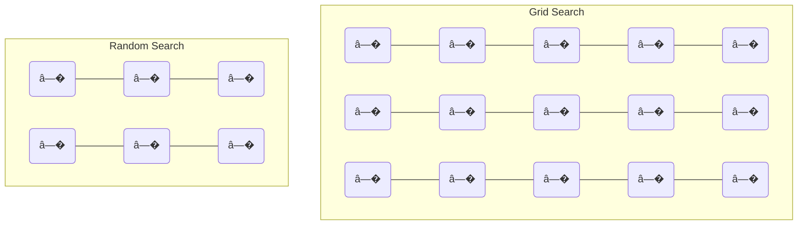
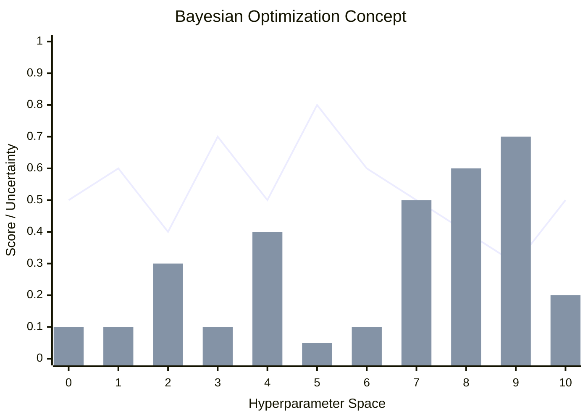
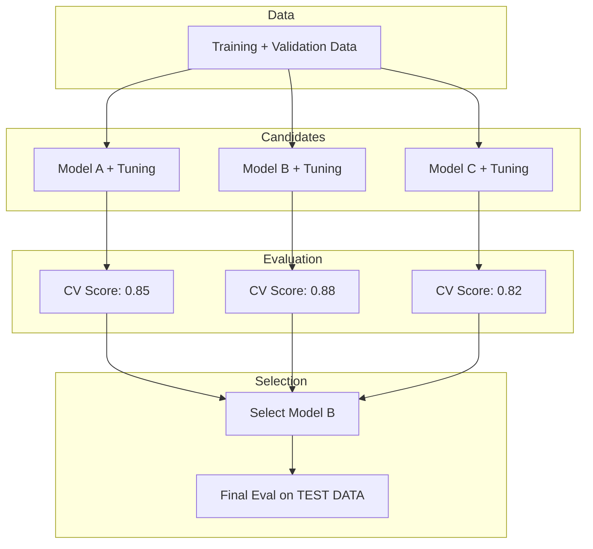
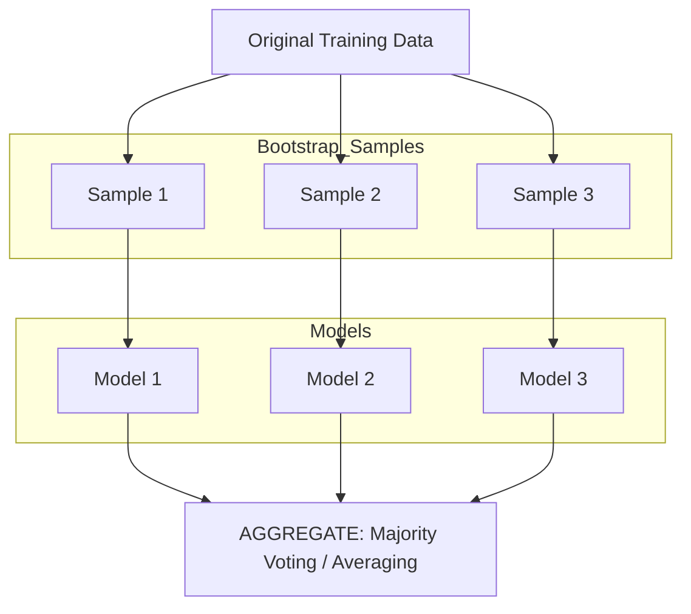
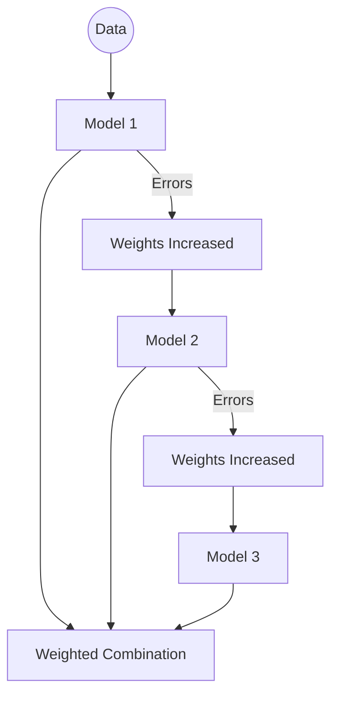
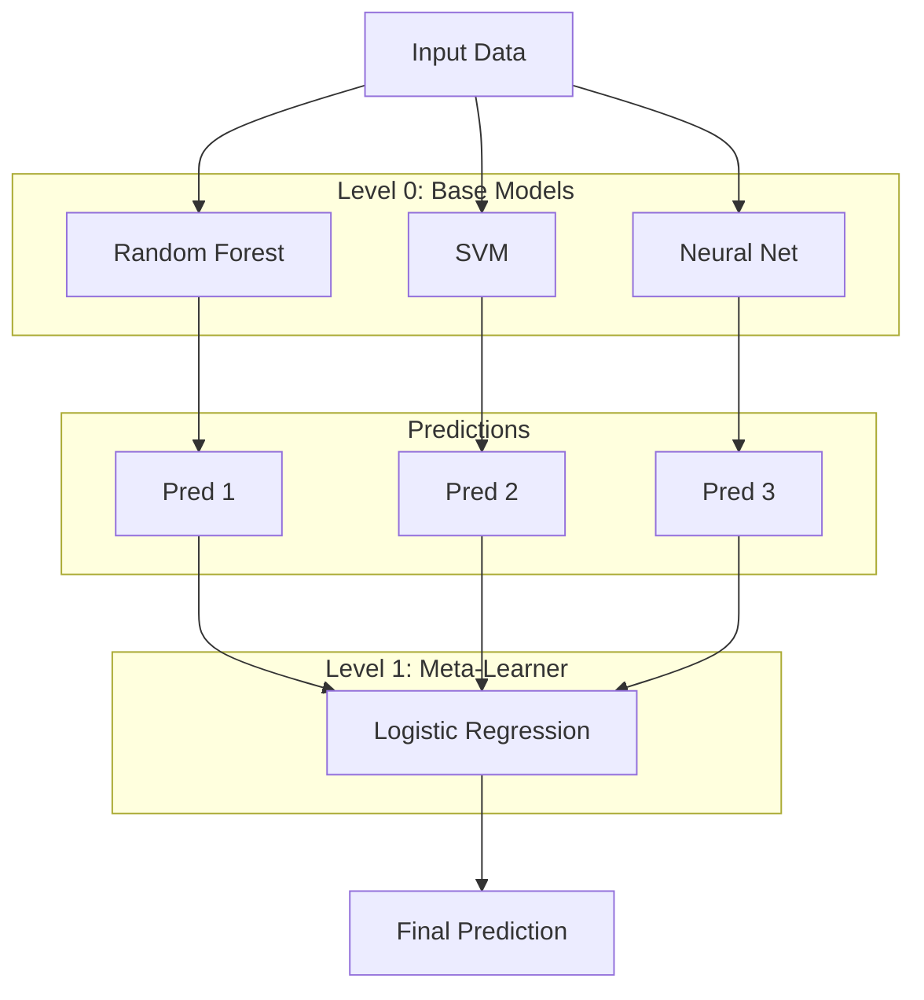
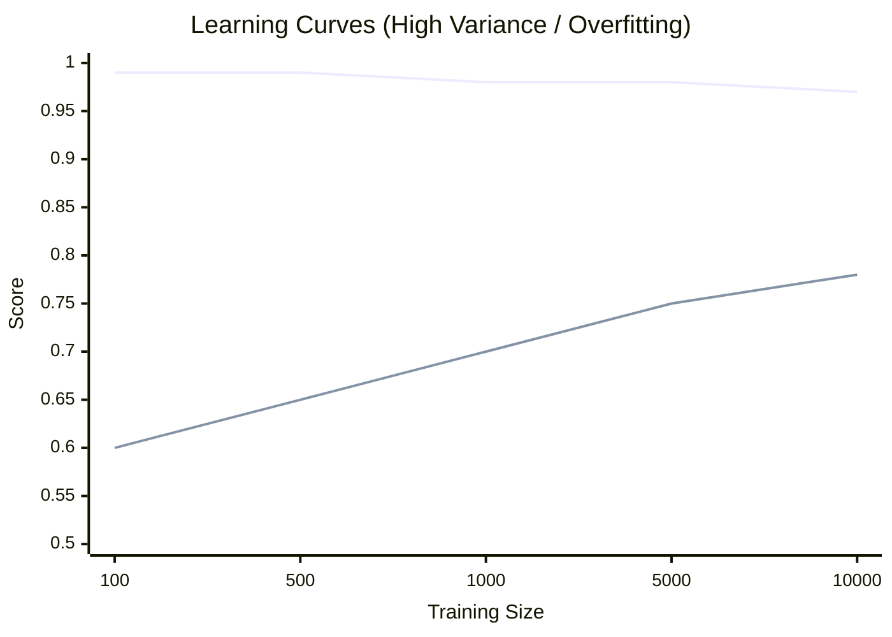
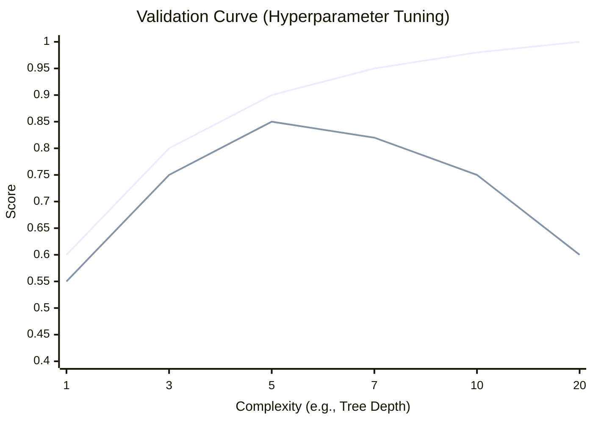
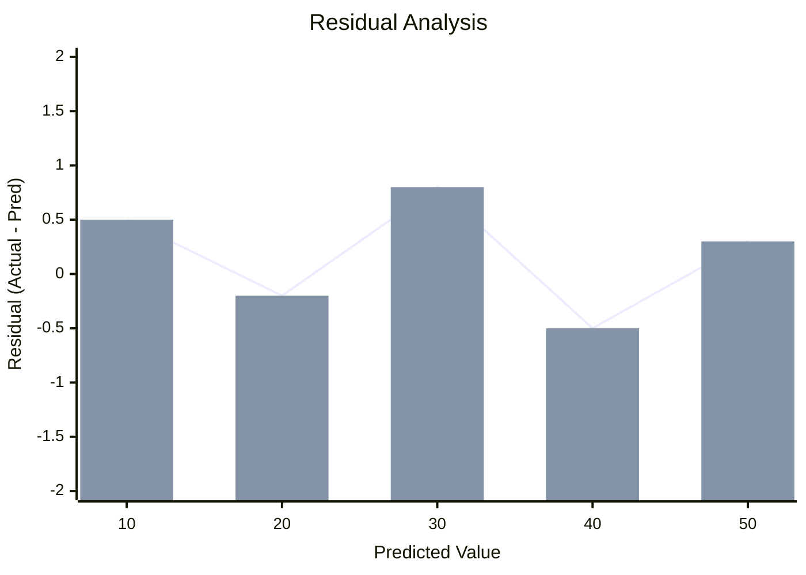

# BAB 9: Evaluasi dan Optimasi Algoritma AI

---

## � Tujuan Pembelajaran

Setelah mempelajari bab ini, Anda akan mampu:

- Memahami dan menerapkan Cross-Validation
- Melakukan Hyperparameter Tuning: Grid Search, Random Search, Bayesian Optimization
- Memahami model selection dan model comparison
- Menerapkan Ensemble Methods: Bagging, Boosting, Stacking
- Mendiagnosis dan mengatasi overfitting/underfitting
- Memahami learning curves dan validation curves
- Menginterpretasikan model AI

---

## 📖 Pendahuluan

Membangun model AI bukan hanya tentang memilih algoritma yang tepat. Model yang bagus membutuhkan **evaluasi yang benar** dan **optimasi yang sistematis**. Seberapa yakin kita bahwa model akan bekerja baik pada data baru? Apakah hyperparameter kita sudah optimal?

Dalam bab ini, kita akan mempelajari teknik-teknik untuk mengevaluasi performa model secara robust dan mengoptimalkan model untuk hasil terbaik.

---

## 9.1 Cross-Validation

### 9.1.1 Masalah dengan Single Train-Test Split

Single train-test split memiliki kelemahan:

- Hasil tergantung pada split tertentu
- Tidak memanfaatkan semua data untuk training
- Estimasi performa tidak stabil

### 9.1.2 K-Fold Cross-Validation

**K-Fold CV** membagi data menjadi k bagian (folds) dan melakukan training k kali, setiap kali menggunakan fold berbeda sebagai validation set.

```
5-Fold Cross Validation:

| Fold | Part 1 | Part 2 | Part 3 | Part 4 | Part 5 | Score |
|------|--------|--------|--------|--------|--------|-------|
|  1   |  VAL   | Train  | Train  | Train  | Train  | 0.85  |
|  2   | Train  |  VAL   | Train  | Train  | Train  | 0.82  |
|  3   | Train  | Train  |  VAL   | Train  | Train  | 0.88  |
|  4   | Train  | Train  | Train  |  VAL   | Train  | 0.84  |
|  5   | Train  | Train  | Train  | Train  |  VAL   | 0.86  |

Final Score = Mean ± Std = 0.85 ± 0.02
```

**Gambar 9.1**: Ilustrasi 5-Fold Cross Validation. Data dibagi menjadi 5 bagian. Model dilatih 5 kali, setiap kali menggunakan satu bagian berbeda sebagai validasi (orange).

### 9.1.3 Pseudocode K-Fold CV

```
FUNGSI KFoldCV(data, k, model):
    folds � split_data(data, k)
    scores � []

    UNTUK i DARI 1 SAMPAI k:
        val_set � folds[i]
        train_set � gabungkan folds selain i

        model.fit(train_set)
        score � model.evaluate(val_set)
        scores.tambah(score)

    KEMBALIKAN mean(scores), std(scores)
```

### 9.1.4 Variasi Cross-Validation

| Metode                  | Deskripsi                    | Kapan Digunakan                       |
| ----------------------- | ---------------------------- | ------------------------------------- |
| **K-Fold**              | Bagi menjadi k folds         | Default choice, k=5 atau 10           |
| **Stratified K-Fold**   | Jaga proporsi kelas          | Classification dengan imbalanced data |
| **Leave-One-Out (LOO)** | k = n (setiap data jadi val) | Dataset sangat kecil                  |
| **Time Series Split**   | Preserve temporal order      | Data time series                      |
| **Group K-Fold**        | Jaga group tidak bocor       | Data dengan grouping                  |

### 9.1.5 Stratified K-Fold

Memastikan setiap fold memiliki proporsi kelas yang sama:

```
Original Data:    70% Class A,  30% Class B

Stratified:
Fold 1:           70% A, 30% B
Fold 2:           70% A, 30% B
Fold 3:           70% A, 30% B
...
```

### 9.1.6 Time Series Split

Untuk data time series, jangan "melihat ke masa depan"!

```
Split 1: [Train  ] [Val]
Split 2: [Train    ][Val]
Split 3: [Train      ][Val]
         ───────────────────► Waktu
```

---

## 9.2 Hyperparameter Tuning

### 9.2.1 Parameters vs Hyperparameters

| Parameters              | Hyperparameters                 |
| ----------------------- | ------------------------------- |
| Dipelajari dari data    | Ditentukan sebelum training     |
| Contoh: weights, biases | Contoh: learning rate, k di KNN |
| Diupdate oleh training  | Ditentukan oleh kita/tuning     |

### 9.2.2 Grid Search

**Grid Search** mencoba **semua kombinasi** hyperparameters dalam grid yang ditentukan.

```
Grid untuk SVM:
    C: [0.1, 1, 10]
    gamma: [0.01, 0.1, 1]

Total kombinasi: 3 × 3 = 9
```
Grid Search Results:

|           | C=0.1 | C=1  | C=10 |
|-----------|-------|------|------|
| ?=0.01    | 0.82  | 0.84 | 0.85 |
| ?=0.1     | 0.85  | 0.89 | 0.88 |
| ?=1       | 0.83  | 0.86 | 0.84 |
```

```

**Pseudocode:**

```

FUNGSI GridSearch(model, param_grid, data, k):
best_score � -�
best_params � null

    UNTUK setiap kombinasi params DALAM param_grid:
        model.set_params(params)
        score � cross_validate(model, data, k)

        JIKA score > best_score:
            best_score � score
            best_params � params

    KEMBALIKAN best_params, best_score

```

**Kelebihan & Kekurangan:**

- ✅ Exhaustive, menjamin menemukan optimal dalam grid
- � Computationally expensive: O(|grid|^n × k)
- � Tidak efisien untuk banyak hyperparameters

### 9.2.3 Random Search

**Random Search** mengambil **sample random** dari distribusi hyperparameters.

```

Random Search: 10 samples dari distribusi

    C ~ log-uniform(0.1, 10)
    gamma ~ log-uniform(0.01, 1)

Samples: 1. C=0.5, gamma=0.03 → 0.83 2. C=2.1, gamma=0.15 → 0.88 3. C=0.8, gamma=0.07 → 0.86
...

```

**Mengapa Random bisa lebih baik?**



**Gambar 9.3**: Perbedaan Grid Search vs Random Search. Grid Search membuang resources pada parameter yang tidak penting (sumbu vertikal misal), sedangkan Random Search mengeksplorasi nilai unique lebih banyak.

**Kelebihan:**

- ✅ Lebih efisien untuk banyak hyperparameters
- ✅ Bisa cover range yang lebih luas
- ✅ Anytime algorithm (bisa stop kapan saja)

### 9.2.4 Bayesian Optimization

**Bayesian Optimization** membangun model probabilistik dari fungsi objective dan memilih next point secara cerdas.

**Ide:**

1. Fit Gaussian Process ke hasil sebelumnya
2. Gunakan acquisition function untuk pilih next point
3. Ulangi

```


**Gambar 9.4**: Bayesian Optimization. Titik (line) adalah mean prediction, bar adalah uncertainty. Algoritma memilih next point berdasarkan Acquisition Function.

```

**Acquisition Functions:**

- **Expected Improvement (EI)**: Balance explore vs exploit
- **Upper Confidence Bound (UCB)**: Optimistic exploration

**Kelebihan:**

- ✅ Sangat sample-efficient
- ✅ Converge lebih cepat

**Kekurangan:**

- � Overhead komputasi per iterasi
- � Sulit untuk > 20 hyperparameters

### 9.2.5 Perbandingan Metode Tuning

| Aspek               | Grid Search | Random Search | Bayesian |
| ------------------- | ----------- | ------------- | -------- |
| Exhaustive          | ✅          | �            | �       |
| Efficient           | �          | ✅            | ✅✅     |
| High dimensions     | �          | ✅            | ⚠�       |
| Sample efficient    | �          | ⚠�            | ✅✅     |
| Easy to parallelize | ✅          | ✅            | ⚠�       |

---

## 9.3 Model Selection

### 9.3.1 Proses Model Selection



**Gambar 9.5**: Pipeline Model Selection. Beberapa kandidat model dilatih dan divalidasi. Model terbaik dipilih berdasarkan CV Score untuk dievaluasi final di Test Data.

### 9.3.2 Statistical Comparison

Untuk membandingkan model secara fair, gunakan statistical tests:

| Test                     | Kapan Digunakan                       |
| ------------------------ | ------------------------------------- |
| **Paired t-test**        | Membandingkan 2 model pada same folds |
| **ANOVA**                | Membandingkan > 2 model               |
| **McNemar's test**       | Untuk classification errors           |
| **Wilcoxon signed-rank** | Non-parametric alternative            |

---

## 9.4 Ensemble Methods

### 9.4.1 Konsep Ensemble

**Ensemble learning** menggabungkan beberapa model untuk menghasilkan prediksi yang lebih robust.

> 💡 **Wisdom of the Crowd**: Kombinasi dari banyak model "lemah" bisa lebih kuat dari satu model "kuat"!

### 9.4.2 Bagging (Bootstrap Aggregating)

**Bagging** melatih beberapa model pada **bootstrap samples** berbeda dan menggabungkan prediksinya.



**Gambar 9.6**: Bagging (Bootstrap Aggregating). Sampel data diambil secara acak (bootstrap), model dilatih secara paralel, dan hasilnya digabungkan.

**Contoh:** Random Forest = Bagging + Decision Trees

**Kelebihan:**

- ✅ Mengurangi variance (overfitting)
- ✅ Parallelizable
- ✅ Robust terhadap noise

### 9.4.3 Boosting

**Boosting** melatih model secara **sequential**, setiap model fokus pada errors dari model sebelumnya.



**Gambar 9.7**: Boosting. Model dilatih secara berurutan (sequential). Model baru fokus memperbaiki kesalahan dari model sebelumnya.

**Algoritma Boosting populer:**

- **AdaBoost**: Adjust sample weights
- **Gradient Boosting**: Fit residuals
- **XGBoost, LightGBM, CatBoost**: Optimized implementations

### 9.4.4 Gradient Boosting

**Gradient Boosting** membangun model secara additive dengan fitting residuals.

```
Fâ‚€(x) = initial prediction (mean)
F�(x) = F₀(x) + γ� × h�(x)    // h� fits residuals of F₀
F₂(x) = F�(x) + γ₂ × h₂(x)    // h₂ fits residuals of F�
...
Fₘ(x) = Fₘ₋�(x) + γₘ × hₘ(x)  // Final prediction
```

**XGBoost** (eXtreme Gradient Boosting) adalah implementasi yang sangat optimized:

- Regularization built-in
- Parallelization
- Handling missing values
- Tree pruning

### 9.4.5 Stacking

**Stacking** menggunakan model ("meta-learner") untuk menggabungkan prediksi dari models lain.

```


**Gambar 9.8**: Stacking. Prediksi dari model-model dasar (Level 0) menjadi fitur input untuk model meta-learner (Level 1).

```

**Training Stacking:**

1. Train base models menggunakan cross-validation
2. Gunakan out-of-fold predictions sebagai features untuk meta-learner
3. Train meta-learner

### 9.4.6 Perbandingan Ensemble Methods

| Aspek            | Bagging         | Boosting    | Stacking          |
| ---------------- | --------------- | ----------- | ----------------- |
| Training         | Parallel        | Sequential  | Two-stage         |
| Focus            | Reduce variance | Reduce bias | Combine strengths |
| Overfit risk     | Low             | Higher      | Depends           |
| Interpretability | Medium          | Low         | Low               |
| Contoh           | Random Forest   | XGBoost     | Custom            |

---

## 9.5 Diagnosis Model

### 9.5.1 Learning Curves

**Learning curves** menunjukkan performa model seiring bertambahnya training data.



**Gambar 9.9**: Learning Curves dengan High Variance (Overfitting). Ada gap besar antara Training score (tinggi) dan CV score (rendah). Solusi: tambah data.

**Interpretasi:**

| Pattern                    | Diagnosis                   | Solusi                            |
| -------------------------- | --------------------------- | --------------------------------- |
| Gap besar, CV rendah       | High variance (overfitting) | Lebih banyak data, regularization |
| Keduanya rendah            | High bias (underfitting)    | Model lebih kompleks              |
| Gap kecil, keduanya tinggi | Good fit                    | -                                 |

### 9.5.2 Validation Curves

**Validation curves** menunjukkan performa vs hyperparameter.



**Gambar 9.10**: Validation Curve. Training score terus naik seiring kompleksitas, tapi Validation score mencapai puncak lalu turun (overfitting). Kit a ingin memilih hyperparameter di puncak validation score.

### 9.5.3 Residual Analysis (Regression)

Untuk regression, analisis residuals:
$$\text{residual} = y_{actual} - y_{predicted}$$



**Gambar 9.11**: Analisis Residual. Residual yang bagus tersebar acak di sekitar nol (randomness). Jika ada pola, berarti model melewatkan informasi tertentu.

---

## 9.6 Model Interpretability

### 9.6.1 Mengapa Interpretability Penting?

- **Trust**: Apakah bisa dipercaya?
- **Debugging**: Apa yang salah?
- **Compliance**: Regulasi (GDPR, etc.)
- **Insights**: Belajar dari model

### 9.6.2 Feature Importance

**Permutation Importance:**

1. Evaluate model: baseline score
2. Shuffle satu feature, evaluate: new score
3. Importance = baseline - new score (drop in performance)

```
Feature Importance:
─────────────────────────────────
Feature A   ████████████████  0.35
Feature B   ██████████        0.22
Feature C   ███████           0.15
Feature D   ████              0.08
Feature E   ██                0.05
```

### 9.6.3 SHAP Values

**SHAP (SHapley Additive exPlanations)** memberikan contribution setiap feature untuk setiap prediksi.

```
Prediction for one instance:
─────────────────────────────────────────
Base value:           3.2
+ Feature A:         +1.5 â–“â–“â–“â–“â–“â–“â–“â–“â–“
+ Feature B:         +0.8 â–“â–“â–“â–“â–“
- Feature C:         -0.3 â–‘â–‘
+ Feature D:         +0.2 â–“
─────────────────────────────────────────
Final prediction:     5.4
```

### 9.6.4 Partial Dependence Plots (PDP)

Menunjukkan hubungan antara feature dan prediksi, averaging over other features.

```
   Pred │
        │              ╭───
        │           ╭──╯
        │        ╭──╯
        │    ╭───╯
        │────╯
        └────────────────────► Feature Value

   "Semakin tinggi Feature X, prediksi semakin tinggi"
```

---

## � Ringkasan

1. **Cross-Validation**:
   - K-Fold untuk evaluasi robust
   - Stratified untuk imbalanced data
   - Time series split untuk temporal data

2. **Hyperparameter Tuning**:
   - Grid Search: exhaustive, expensive
   - Random Search: more efficient for many params
   - Bayesian: most sample-efficient

3. **Ensemble Methods**:
   - Bagging: reduce variance, parallelizable
   - Boosting: reduce bias, sequential
   - Stacking: combine different model types

4. **Diagnosis**:
   - Learning curves: data size effect
   - Validation curves: hyperparameter effect

5. **Interpretability**:
   - Feature importance
   - SHAP values
   - Partial dependence plots

---

## 📚 Studi Kasus: Kaggle Competition Approach

### Problem

Prediksi churn pelanggan untuk telecom company.

### Pipeline

1. **Exploratory Data Analysis**
   - Distribution, missing values, correlations

2. **Feature Engineering**
   - Create new features: tenure groups, usage ratios
   - Encoding: Label, One-hot

3. **Preprocessing**
   - Handle imbalance: SMOTE
   - Scaling: StandardScaler

4. **Model Selection (5-Fold Stratified CV)**
   | Model | CV Score |
   |-------|----------|
   | Logistic Regression | 0.78 |
   | Random Forest | 0.82 |
   | XGBoost | 0.85 |
   | LightGBM | 0.86 |

5. **Hyperparameter Tuning (Bayesian)**
   - LightGBM: n_estimators, max_depth, learning_rate
   - Best CV: 0.88

6. **Ensemble (Stacking)**
   - Base: LightGBM, XGBoost, Random Forest
   - Meta: Logistic Regression
   - Final CV: 0.89

7. **Final Submission**
   - Test Score: 0.88 (generalized well!)

---

## �� Soal Latihan

### Pilihan Ganda

**1.** Dalam 5-Fold Cross Validation, setiap data digunakan untuk validation sebanyak:

- a) 1 kali
- b) 4 kali
- c) 5 kali
- d) Tidak tentu

**2.** Random Search lebih efficient dari Grid Search ketika:

- a) Jumlah hyperparameter sedikit
- b) Tidak semua hyperparameter penting
- c) Data sangat besar
- d) Model sederhana

**3.** Bagging mengurangi:

- a) Bias
- b) Variance
- c) Kedua bias dan variance
- d) Tidak mengurangi keduanya

**4.** XGBoost adalah contoh dari:

- a) Bagging
- b) Boosting
- c) Stacking
- d) Random Search

**5.** SHAP values digunakan untuk:

- a) Feature selection
- b) Hyperparameter tuning
- c) Model interpretability
- d) Cross-validation

### Esai Singkat

**6.** Jelaskan perbedaan antara Bagging dan Boosting, dengan memberikan contoh algoritma masing-masing.

**7.** Mengapa Bayesian Optimization lebih sample-efficient daripada Grid Search?

**8.** Bagaimana cara menggunakan learning curves untuk mendiagnosis overfitting?

### Tantangan

**9.** Desain pipeline lengkap untuk model selection dan tuning, termasuk nested cross-validation.

**10.** Implementasikan simple Bagging classifier dalam pseudocode.

---

## 📖 Glosarium Bab 9

| Istilah                   | Definisi                                         |
| ------------------------- | ------------------------------------------------ |
| **Cross-Validation**      | Teknik evaluasi dengan multiple train-val splits |
| **K-Fold**                | CV dengan k partisi data                         |
| **Hyperparameter**        | Parameter yang ditentukan sebelum training       |
| **Grid Search**           | Tuning dengan mencoba semua kombinasi            |
| **Random Search**         | Tuning dengan random sampling                    |
| **Bayesian Optimization** | Tuning dengan probabilistic model                |
| **Ensemble**              | Kombinasi multiple models                        |
| **Bagging**               | Ensemble dengan bootstrap sampling               |
| **Boosting**              | Ensemble dengan sequential focus pada errors     |
| **Stacking**              | Ensemble dengan meta-learner                     |
| **XGBoost**               | Extreme Gradient Boosting                        |
| **Learning Curve**        | Plot performa vs training size                   |
| **SHAP**                  | SHapley Additive exPlanations                    |

---

## 📚 Bacaan Lebih Lanjut

1. Hastie, T., et al. (2009). _The Elements of Statistical Learning_. Chapter 7, 10, 15.
2. Bergstra, J., & Bengio, Y. (2012). Random Search for Hyper-Parameter Optimization. _JMLR_.
3. Chen, T., & Guestrin, C. (2016). XGBoost: A Scalable Tree Boosting System. _KDD_.
4. Lundberg, S., & Lee, S. (2017). A Unified Approach to Interpreting Model Predictions. _NeurIPS_.

---

_� [BAB 8: Dasar Jaringan Saraf Tiruan](./bab-08-neural-network.md) | [BAB 10: Etika dan Tantangan Algoritma AI](./bab-10-etika.md) →_
