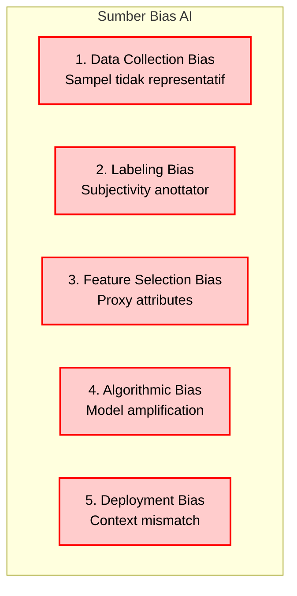
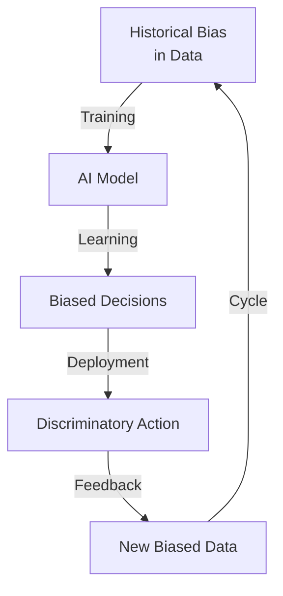
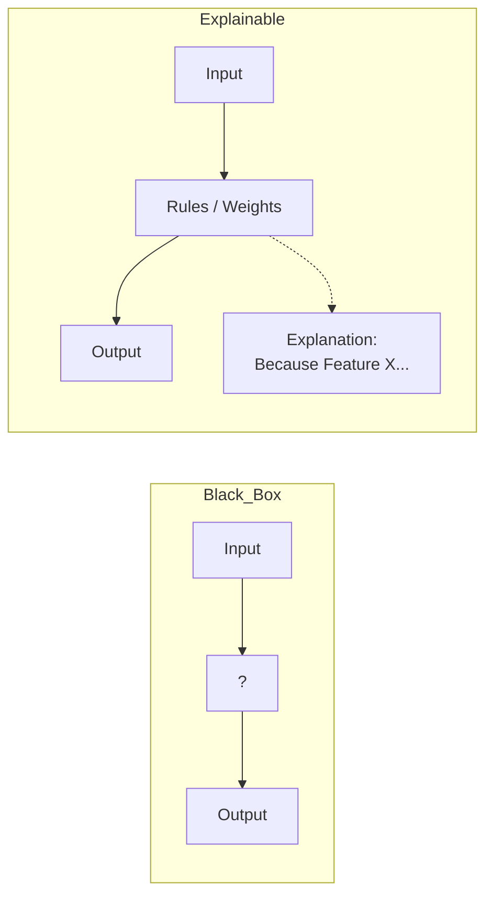
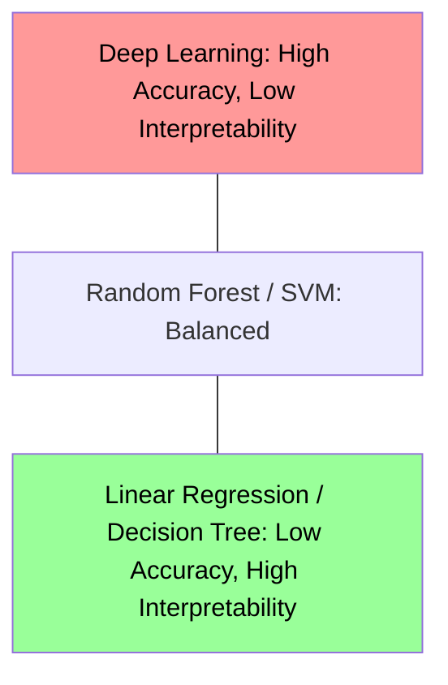
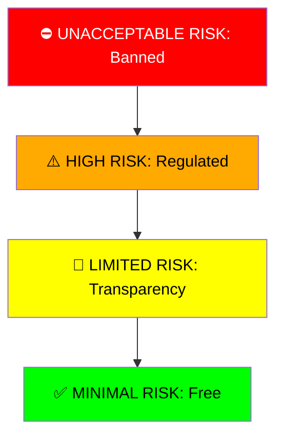
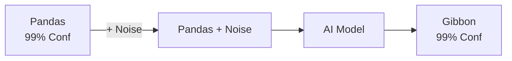
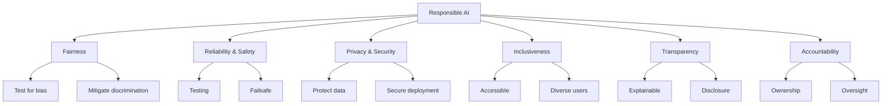

# BAB 10: Etika dan Tantangan Algoritma AI

---

## 🎯 Tujuan Pembelajaran

Setelah mempelajari bab ini, Anda akan mampu:

- Memahami isu-isu etika dalam pengembangan dan penerapan AI
- Mengenal bias dalam data dan algoritma serta dampaknya
- Memahami konsep fairness, transparency, dan accountability
- Mengetahui regulasi AI global dan Indonesia
- Memahami dampak AI terhadap pekerjaan dan masyarakat
- Menerapkan prinsip-prinsip AI yang bertanggung jawab
- Memahami AI Safety dan potensi risiko AI

---

## 📖 Pendahuluan

Kekuatan AI yang luar biasa datang dengan tanggung jawab yang besar. Algoritma AI kini mempengaruhi keputusan penting dalam hidup kita: siapa yang mendapat pinjaman, siapa yang lolos wawancara, bahkan berapa lama hukuman penjara. Ketika sistem ini bias atau salah, dampaknya bisa sangat merugikan.

Sebagai praktisi AI, kita tidak hanya harus membangun model yang akurat, tetapi juga yang **adil**, **transparan**, dan **bertanggung jawab**. Bab ini membahas tantangan etis dan sosial yang harus kita hadapi dalam era AI.

---

## 10.1 Bias dalam AI

### 10.1.1 Apa Itu Bias?

**Bias** dalam AI adalah kecenderungan sistematis untuk menghasilkan keputusan yang tidak adil terhadap kelompok tertentu.

> ⚠️ **Penting**: AI belajar dari data. Jika data mencerminkan bias masyarakat, AI akan mempelajari dan bahkan memperkuat bias tersebut!

### 10.1.2 Sumber-sumber Bias



**Gambar 10.1**: Sumber-sumber Bias AI. Bias bisa masuk di setiap tahap pipeline machine learning.

### 10.1.3 Contoh Kasus Bias AI

| Kasus                 | Apa yang Terjadi                                                                       | Pelajaran                                 |
| --------------------- | -------------------------------------------------------------------------------------- | ----------------------------------------- |
| **Amazon Hiring AI**  | Model diskriminasi terhadap wanita karena data historis rekrutmen yang didominasi pria | Data historis ≠ standar yang benar        |
| **COMPAS Recidivism** | Algoritma prediksi kriminal salah lebih sering untuk Black defendants                  | Perlu audit khusus untuk kelompok berbeda |
| **Face Recognition**  | Error rate lebih tinggi untuk wajah berkulit gelap dan wanita                          | Dataset perlu representatif               |
| **Google Photos**     | Salah label foto manusia sebagai "gorilla"                                             | Impact testing sebelum deployment         |

### 10.1.4 Feedback Loops



**Gambar 10.2**: Bias Feedback Loop. Data bias menghasilkan model bias, keputusan model menciptakan realita baru yang bias, yang kembali menjadi data training.

---

## 10.2 Fairness (Keadilan)

### 10.2.1 Mendefinisikan Fairness

Apa itu "adil" dalam konteks ML? Sayangnya, tidak ada satu definisi universal.

### 10.2.2 Definisi Matematis Fairness

| Definisi               | Formula                           | Arti                                            |
| ---------------------- | --------------------------------- | ----------------------------------------------- |
| **Demographic Parity** | P(Ŷ=1\|A=0) = P(Ŷ=1\|A=1)         | Proporsi prediksi positif sama untuk semua grup |
| **Equal Opportunity**  | P(Ŷ=1\|Y=1,A=0) = P(Ŷ=1\|Y=1,A=1) | True positive rate sama                         |
| **Equalized Odds**     | TPR dan FPR sama untuk semua grup | TPR dan FPR sama                                |
| **Calibration**        | P(Y=1\|Ŷ=p) = p untuk semua grup  | Probabilitas akurat untuk semua                 |

Di mana:

- A = atribut sensitif (misal: gender, ras)
- Y = label sebenarnya
- Ŷ = prediksi model

### 10.2.3 Impossibility Theorem

> ⚠️ **Teorema Ketidakmungkinan**: Tidak mungkin memenuhi semua definisi fairness secara bersamaan (kecuali kasus khusus)!

```
Contoh trade-off:

Demographic Parity:    50% pria dan 50% wanita diprediksi positif
                       → Tapi mungkin accuracy berbeda

Equal Opportunity:     TPR sama untuk semua grup
                       → Tapi proporsi prediksi positif mungkin berbeda
```

### 10.2.4 Teknik Mitigasi Bias

| Tahap               | Teknik                | Deskripsi                                        |
| ------------------- | --------------------- | ------------------------------------------------ |
| **Pre-processing**  | Resampling            | Balance atau reweight data                       |
|                     | Removing features     | Hapus atribut sensitif (tapi hati-hati proxy!)   |
| **In-processing**   | Fairness constraints  | Tambah constraint fairness saat training         |
|                     | Adversarial debiasing | Adversary yang mencoba prediksi atribut sensitif |
| **Post-processing** | Threshold adjustment  | Threshold berbeda per grup                       |
|                     | Reject option         | Ubah prediksi borderline                         |

---

## 10.3 Transparency dan Explainability

### 10.3.1 Mengapa Transparency Penting?

- **Trust**: Pengguna perlu mengerti keputusan
- **Debugging**: Developer perlu mendiagnosis masalah
- **Accountability**: Jika ada masalah, siapa bertanggung jawab?
- **Right to explanation**: Regulasi seperti GDPR

### 10.3.2 Black Box Problem



**Gambar 10.3**: Black Box vs Explainable AI. Black box (seperti Deep Learning) sulit dimengerti, sementara Explainable AI memberikan alasan di balik keputusan.

### 10.3.3 Spektrum Interpretability

```
    Interpretability
    ────────────────────────────────────────────────►

    High                                          Low
    ├─────────────────────────────────────────────┤

    Linear      Decision    Random    Neural     Deep
    Regression   Trees      Forest    Network    Learning

    "w × x"     If-then     ?         ???        ?????
                rules
```

### 10.3.4 Teknik Explainability

| Teknik              | Deskripsi                                       | Scope                |
| ------------------- | ----------------------------------------------- | -------------------- |
| **LIME**            | Local Interpretable Model-agnostic Explanations | Local (per prediksi) |
| **SHAP**            | SHapley Additive exPlanations                   | Local + Global       |
| **Attention**       | Visualisasi apa yang "diperhatikan" model       | Neural networks      |
| **Saliency Maps**   | Bagian input yang paling berpengaruh            | Image models         |
| **Counterfactuals** | "Apa yang harus berubah untuk hasil berbeda?"   | Local                |

### 10.3.5 Trade-off: Accuracy vs Interpretability



**Gambar 10.5**: Trade-off Accuracy vs Interpretability. Umumnya, semakin tinggi akurasi model (seperti Deep Learning di kiri atas), semakin rendah interpretability-nya. Model yang sangat interpretable (Linear Regression di kanan bawah) cenderung memiliki akurasi lebih rendah data kompleks.
_(Catatan: x-axis terbalik untuk ilustrasi sesuai konsep 'Trade-off')_

---

## 10.4 Privacy dan Data Ethics

### 10.4.1 Pentingnya Privasi Data

AI membutuhkan data — sering kali data pribadi. Bagaimana menyeimbangkan utility dengan privasi?

### 10.4.2 Risiko Privasi

| Risiko                   | Contoh                                      |
| ------------------------ | ------------------------------------------- |
| **Data breach**          | Database pelanggan bocor                    |
| **Re-identification**    | "Anonymous" data bisa di-link balik         |
| **Inference attacks**    | Menyimpulkan info sensitif dari data publik |
| **Model inversion**      | Merekonstruksi training data dari model     |
| **Membership inference** | Mendeteksi apakah data seseorang digunakan  |

### 10.4.3 Teknik Privacy-Preserving

| Teknik                             | Deskripsi                                                      |
| ---------------------------------- | -------------------------------------------------------------- |
| **Differential Privacy**           | Menambah noise sehingga kontribusi individual tidak terdeteksi |
| **Federated Learning**             | Training di device lokal, hanya share gradients                |
| **Secure Multi-party Computation** | Komputasi bersama tanpa sharing data mentah                    |
| **Homomorphic Encryption**         | Komputasi pada data terenkripsi                                |
| **Data Anonymization**             | Hapus/generalisasi identifiers                                 |

### 10.4.4 Prinsip Data Ethics

1. **Consent**: Dapatkan izin eksplisit
2. **Purpose limitation**: Gunakan hanya untuk tujuan yang disetujui
3. **Data minimization**: Kumpulkan hanya yang diperlukan
4. **Storage limitation**: Hapus setelah tidak diperlukan
5. **Transparency**: Jelaskan bagaimana data digunakan

---

## 10.5 Regulasi AI

### 10.5.1 Regulasi Global

| Regulasi                            | Wilayah       | Fokus                                 |
| ----------------------------------- | ------------- | ------------------------------------- |
| **GDPR**                            | EU            | Data protection, right to explanation |
| **EU AI Act**                       | EU            | Risk-based AI classification          |
| **CCPA**                            | California    | Consumer privacy rights               |
| **NYC 15**                          | New York City | Bias audit untuk hiring AI            |
| **Blueprint for AI Bill of Rights** | US            | Principles for AI systems             |

### 10.5.2 EU AI Act - Risk Categories



**Gambar 10.6**: Tingkatan Risiko dalam EU AI Act. Semakin tinggi risiko, semakin ketat regulasinya. High-risk AI wajib memiliki risk assessment dan oversight yang ketat.

### 10.5.3 Regulasi Indonesia

| Regulasi               | Keterangan                              |
| ---------------------- | --------------------------------------- |
| **UU PDP (2022)**      | Perlindungan Data Pribadi               |
| **Stranas AI**         | Strategi Nasional Kecerdasan Artifisial |
| **PP 71/2019**         | Penyelenggaraan Sistem Elektronik       |
| **Kominfo Guidelines** | Pedoman etika AI                        |

**Prinsip Stranas AI:**

1. Manusia sebagai pusat (_human-centric_)
2. Transparansi dan akuntabilitas
3. Keamanan dan keselamatan
4. Privasi dan perlindungan data
5. Inklusivitas

---

## 10.6 AI dan Pekerjaan

### 10.6.1 Dampak Otomasi

| Kelompok        | Status            | Contoh Pekerjaan                                         |
| :-------------- | :---------------- | :------------------------------------------------------- |
| **RISK TINGGI** | Terancam Automasi | Data Entry, Drivers, Cashiers, Repetitive Tasks          |
| **BERUBAH**     | Augmented by AI   | Doctors, Lawyers, Programmers, Designers                 |
| **JOB BARU**    | Muncul karena AI  | AI Ethicist, Prompt Engineer, AI Trainer, Data Scientist |

**Gambar 10.7**: Dampak AI terhadap Pekerjaan. Pekerjaan rutin berisiko digantikan, pekerjaan profesional akan teraugmentasi, dan pekerjaan baru akan muncul.

### 10.6.2 Studi Dampak

| Studi                | Temuan                                            |
| -------------------- | ------------------------------------------------- |
| McKinsey (2017)      | 400-800 juta pekerjaan terpengaruh global by 2030 |
| World Economic Forum | 85 juta hilang, 97 juta baru diciptakan by 2025   |
| OECD                 | 14% pekerjaan high risk otomasi                   |
| Indonesia (BAPPENAS) | 23 juta berisiko terdampak                        |

### 10.6.3 Respons dan Adaptasi

- **Reskilling/Upskilling**: Pelatihan ulang untuk skill baru
- **Education reform**: Pendidikan fokus pada skill yang sulit diotomasi
- **Social safety nets**: Jaring pengaman sosial
- **Human-AI collaboration**: AI sebagai alat bantu, bukan pengganti

---

## 10.7 AI Safety

### 10.7.1 Apa Itu AI Safety?

**AI Safety** adalah bidang yang mempelajari bagaimana membangun AI yang **aman** dan **aligned** dengan nilai-nilai manusia.

### 10.7.2 Masalah Utama

| Masalah              | Deskripsi                              | Contoh                                        |
| -------------------- | -------------------------------------- | --------------------------------------------- |
| **Alignment**        | AI melakukan apa yang kita inginkan    | "Maximize paperclips" → konversi semua materi |
| **Robustness**       | Tahan terhadap input adversarial       | Sticker yang mengibuli mobil otonom           |
| **Interpretability** | Mengerti kenapa AI membuat keputusan   | Black box membuat keputusan berbahaya         |
| **Control**          | Tetap bisa mengontrol AI yang powerful | Sistem trading yang tidak bisa dihentikan     |

### 10.7.3 Risiko Jangka Pendek vs Panjang

| Jangka Waktu                   | Risiko Utama                                                     |
| :----------------------------- | :--------------------------------------------------------------- |
| **Jangka Pendek** (0-5 thn)    | Bias & Diskriminasi, Deepfakes, Privacy Violations, Surveillance |
| **Jangka Menengah** (5-20 thn) | Mass Unemployment, Power Concentration, Weaponization            |
| **Jangka Panjang** (>20 thn)   | Superintelligence, Alignment Problem, Loss of Control            |

**Gambar 10.8**: Risiko AI Jangka Pendek hingga Panjang. Risiko berkembang dari isu sosial konkret saat ini hingga risiko eksistensial di masa depan.

### 10.7.4 Adversarial Machine Learning

AI bisa ditipu dengan input yang dirancang khusus:



**Gambar 10.9**: Adversarial Example. Penambahan noise yang tidak kasat mata bagi manusia bisa membuat AI salah mengenali gambar dengan percaya diri tinggi.

**Implikasi:**

- Mobil otonom bisa ditipu rambu lalu lintas palsu
- Detection system bisa dibypass
- Pentingnya **adversarial training**

---

## 10.8 Tanggung Jawab Developer

### 10.8.1 Principles of Responsible AI



**Gambar 10.10**: Prinsip AI yang Bertanggung Jawab. Enam pilar utama yang harus diperhatikan dalam pengembangan AI yang etis.

### 10.8.2 AI Ethics Checklist

Sebelum deploy sistem AI:

**Data:**

- [ ] Apakah data dikumpulkan dengan consent?
- [ ] Apakah data representatif?
- [ ] Apakah ada atribut sensitif yang perlu diperhatikan?

**Model:**

- [ ] Apakah sudah test untuk bias?
- [ ] Apakah performa adil untuk semua grup?
- [ ] Apakah ada penjelasan untuk keputusan?

**Deployment:**

- [ ] Apakah ada human oversight?
- [ ] Apakah ada mekanisme feedback?
- [ ] Apakah ada cara rollback jika bermasalah?

**Impact:**

- [ ] Siapa yang terdampak jika sistem salah?
- [ ] Apakah ada recourse untuk keputusan yang salah?
- [ ] Apakah benefits lebih besar dari risks?

### 10.8.3 AI Governance

Organisasi perlu:

- **Ethics Board/Committee**: Review project AI berisiko tinggi
- **AI Policy**: Guideline pengembangan dan deployment
- **Audit**: Regular bias dan performance audits
- **Documentation**: Model cards, data sheets
- **Training**: Edukasi tentang AI ethics untuk developer

---

## 📝 Ringkasan

1. **Bias dalam AI**:
   - Bersumber dari data, labeling, fitur, algoritma
   - Feedback loops memperkuat bias
   - Perlu active mitigation

2. **Fairness**:
   - Banyak definisi matematis, tidak bisa dipenuhi semua
   - Trade-offs yang harus dipertimbangkan
   - Teknik pre-, in-, post-processing

3. **Transparency**:
   - Right to explanation
   - Teknik: LIME, SHAP, dll.
   - Trade-off dengan accuracy

4. **Privacy**:
   - Data adalah aset sensitif
   - Teknik: Differential Privacy, Federated Learning
   - Prinsip consent dan minimization

5. **Regulasi**:
   - EU AI Act, GDPR sebagai standar
   - Indonesia: UU PDP, Stranas AI
   - High-risk AI membutuhkan oversight

6. **Dampak Pekerjaan**:
   - Beberapa pekerjaan hilang, baru muncul
   - Pentingnya reskilling

7. **AI Safety**:
   - Alignment, robustness, control
   - Adversarial attacks sebagai ancaman

8. **Tanggung Jawab Developer**:
   - Prinsip FAIR: Fairness, Accountability, Interpretability, Reliability
   - Ethics checklist sebelum deployment
   - Governance dan oversight

---

## 📚 Studi Kasus: Bias dalam Sistem Rekrutmen AI

### Latar Belakang

Sebuah perusahaan teknologi besar mengembangkan sistem AI untuk screening CV kandidat.

### Masalah yang Ditemukan

- Model dilatih pada data hiring 10 tahun terakhir
- Historis: mayoritas yang dihire adalah pria
- Model "belajar" untuk mendownrank resume dengan kata "women's" (e.g., "women's chess club")
- Resume dari universitas all-women di-penalty

### Root Cause Analysis

1. **Data bias**: Representasi gender tidak seimbang
2. **Proxy discrimination**: Kata-kata tertentu menjadi proxy gender
3. **Lack of fairness testing**: Tidak ada audit sebelum deployment

### Solusi yang Diimplementasikan

1. Retrain tanpa fitur yang correlate dengan gender
2. Remove gender-related proxies
3. Implement demographic parity constraint
4. Regular fairness audits
5. Human-in-the-loop untuk keputusan final

### Lessons Learned

- Data historis ≠ ground truth
- Bias bisa muncul dengan cara tidak terduga
- Perlu fairness testing dari awal
- Human oversight tetap penting

---

## ✏️ Soal Latihan

### Pilihan Ganda

**1.** Feedback loop dalam AI bias terjadi ketika:

- a) Model terlalu kompleks
- b) Keputusan bias menjadi data training baru
- c) Dataset terlalu besar
- d) Model terlalu sederhana

**2.** Demographic parity mensyaratkan:

- a) Accuracy sama untuk semua grup
- b) True positive rate sama
- c) Proporsi prediksi positif sama
- d) Dataset seimbang

**3.** EU AI Act mengategorikan hiring AI sebagai:

- a) Minimal risk
- b) Limited risk
- c) High risk
- d) Unacceptable risk

**4.** Differential privacy bekerja dengan:

- a) Menghapus data sensitif
- b) Menambah noise untuk proteksi individual
- c) Mengenkripsi semua data
- d) Federated learning

**5.** Adversarial examples adalah:

- a) Data yang sangat noisy
- b) Input yang dirancang untuk menipu model
- c) Data dari sumber tidak terpercaya
- d) Data dengan label yang salah

### Esai Singkat

**6.** Jelaskan mengapa fairness dalam ML sulit dicapai dengan menggunakan ilustrasi impossibility theorem.

**7.** Bagaimana EU AI Act mengkategorikan sistem AI dan apa implikasinya bagi developer?

**8.** Sebagai developer, langkah apa yang akan Anda ambil sebelum men-deploy sistem AI untuk keputusan kredit?

### Tantangan

**9.** Desain framework untuk mengevaluasi fairness dari sistem klasifikasi untuk loan approval.

**10.** Diskusikan trade-off antara privacy (differential privacy) dan accuracy. Bagaimana menyeimbangkannya?

---

## 📖 Glosarium Bab 10

| Istilah                  | Definisi                                        |
| ------------------------ | ----------------------------------------------- |
| **Bias**                 | Kecenderungan sistematis yang tidak adil        |
| **Fairness**             | Perlakuan yang adil untuk semua grup            |
| **Demographic Parity**   | Proporsi prediksi positif sama                  |
| **Equal Opportunity**    | TPR sama untuk semua grup                       |
| **Transparency**         | Keterbukaan tentang bagaimana AI bekerja        |
| **Explainability**       | Kemampuan menjelaskan keputusan AI              |
| **LIME**                 | Local Interpretable Model-agnostic Explanations |
| **SHAP**                 | SHapley Additive exPlanations                   |
| **Differential Privacy** | Privasi dengan noise matematika                 |
| **Federated Learning**   | Training di device, share gradients             |
| **GDPR**                 | General Data Protection Regulation              |
| **EU AI Act**            | Regulasi AI Uni Eropa                           |
| **AI Safety**            | Keamanan dan alignment AI                       |
| **Adversarial Examples** | Input yang dirancang menipu model               |
| **Alignment**            | Memastikan AI sesuai nilai manusia              |

---

## 📚 Bacaan Lebih Lanjut

1. Barocas, S., Hardt, M., & Narayanan, A. (2019). _Fairness and Machine Learning_. fairmlbook.org
2. Mehrabi, N., et al. (2021). A Survey on Bias and Fairness in Machine Learning. _ACM Computing Surveys_.
3. European Commission. (2021). _Proposal for a Regulation on AI (AI Act)_.
4. Russel, S. (2019). _Human Compatible: AI and the Problem of Control_. Viking.
5. O'Neil, C. (2016). _Weapons of Math Destruction_. Crown.

---

_← [BAB 9: Evaluasi dan Optimasi Algoritma AI](./bab-09-evaluasi.md) | [Lampiran A: Prasyarat Matematika](./lampiran-a-matematika.md) →_
