# BAB 4: Algoritma Pencarian

---

## 🎯 Tujuan Pembelajaran

Setelah mempelajari bab ini, Anda akan mampu:

- Membedakan uninformed search dan informed search
- Mengimplementasikan BFS, DFS, dan Uniform Cost Search
- Memahami dan menerapkan algoritma A\*
- Menjelaskan konsep heuristic dan admissibility
- Memahami local search: Hill Climbing dan Simulated Annealing
- Mengenal dasar-dasar Genetic Algorithm
- Menganalisis optimalitas dan completeness algoritma pencarian

---

## 📖 Pendahuluan

Bayangkan Anda sedang menggunakan Google Maps untuk mencari rute dari rumah ke kantor. Dalam hitungan detik, aplikasi memberikan beberapa opsi rute dengan perkiraan waktu tempuh. Bagaimana komputer bisa menemukan rute terbaik dari jutaan kemungkinan jalan?

Jawabannya adalah **algoritma pencarian** — metode sistematis untuk menemukan solusi dalam ruang masalah yang besar. Algoritma pencarian adalah jantung dari banyak aplikasi AI, dari game playing hingga robot navigation.

---

## 4.1 Konsep Dasar Pencarian

### 4.1.1 Masalah Pencarian

Sebuah **masalah pencarian** dapat didefinisikan dengan komponen berikut:

| Komponen             | Deskripsi                            | Contoh (Route Finding)           |
| -------------------- | ------------------------------------ | -------------------------------- |
| **State Space**      | Semua kemungkinan kondisi            | Semua lokasi di peta             |
| **Initial State**    | Kondisi awal                         | Lokasi rumah                     |
| **Goal Test**        | Cara menentukan apakah goal tercapai | Lokasi = Kantor?                 |
| **Actions**          | Aksi yang mungkin di suatu state     | Jalan ke persimpangan berikutnya |
| **Transition Model** | Hasil dari aksi                      | Lokasi baru setelah berjalan     |
| **Path Cost**        | Biaya dari initial ke current state  | Total jarak/waktu tempuh         |

### 4.1.2 Search Tree

Pencarian dapat divisualisasikan sebagai **pohon pencarian**:

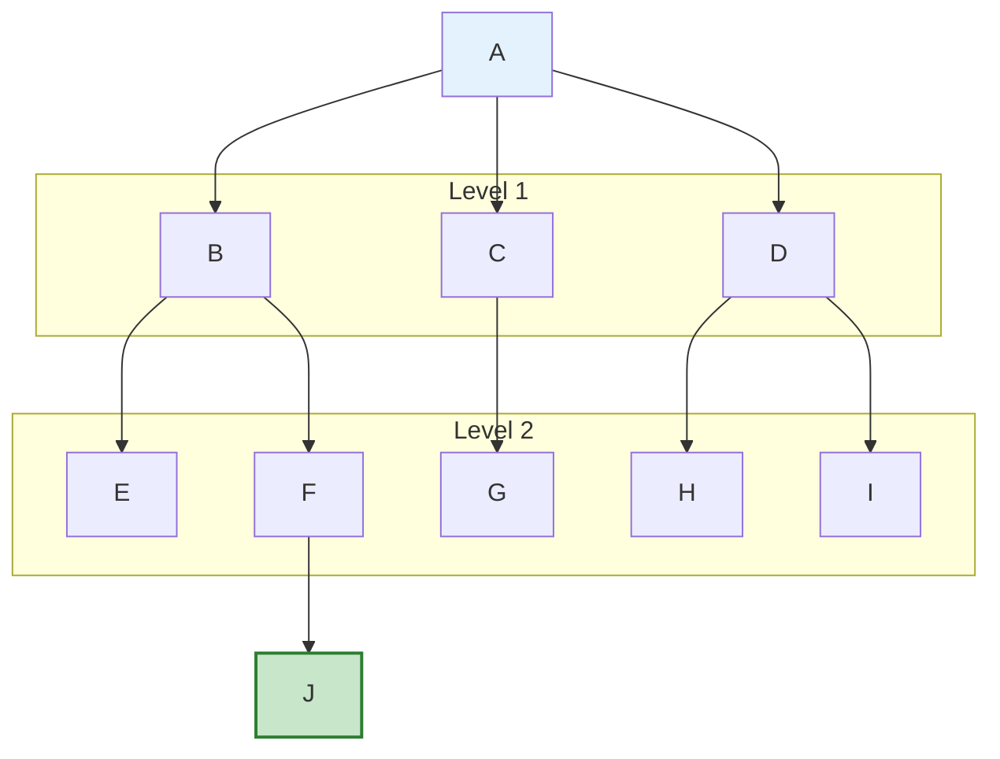

**Gambar 4.1**: Struktur Pohon Pencarian (Search Tree). Node J adalah Goal State.

**Terminologi:**

- **Node**: State dalam pohon
- **Root**: Initial state
- **Leaf**: Node tanpa children
- **Branching Factor (b)**: Rata-rata jumlah children per node
- **Depth (d)**: Jarak dari root ke node tertentu
- **Frontier**: Node yang sudah di-generate tapi belum di-explore

### 4.1.3 Kategorisasi Algoritma Pencarian

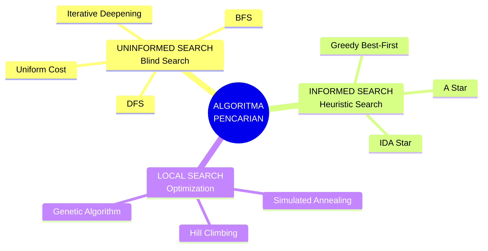

**Gambar 4.2**: Klasifikasi Algoritma Pencarian dalam AI.

### 4.1.4 Kriteria Evaluasi

| Kriteria             | Deskripsi                                |
| -------------------- | ---------------------------------------- |
| **Completeness**     | Apakah selalu menemukan solusi jika ada? |
| **Optimality**       | Apakah selalu menemukan solusi terbaik?  |
| **Time Complexity**  | Berapa lama untuk menemukan solusi?      |
| **Space Complexity** | Berapa memori yang dibutuhkan?           |

---

## 4.2 Uninformed Search (Blind Search)

Algoritma **uninformed search** tidak memiliki informasi tentang seberapa dekat suatu state ke goal — hanya tahu apakah sudah sampai goal atau belum.

### 4.2.1 Breadth-First Search (BFS)

**Strategi**: Eksplorasi semua node di level saat ini sebelum ke level berikutnya.

**Karakteristik**: Menggunakan struktur data **Queue** (FIFO - First In First Out).

**Pseudocode:**

```
FUNGSI BFS(initial, goal):
    frontier ← Queue dengan initial state
    explored ← himpunan kosong

    SELAMA frontier tidak kosong:
        node ← frontier.dequeue()

        JIKA node adalah goal:
            KEMBALIKAN path ke node

        explored.tambah(node)

        UNTUK setiap successor dari node:
            JIKA successor tidak di explored DAN tidak di frontier:
                frontier.enqueue(successor)

    KEMBALIKAN "tidak ditemukan"
```

**Visualisasi BFS:**

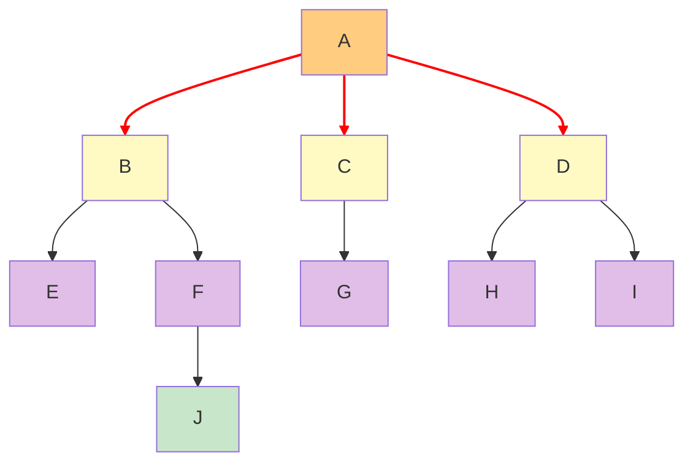

**Gambar 4.3**: Urutan eksplorasi BFS (Level by Level): 1, 2, 3, 4, ... sampai 10.

**Analisis:**
| Kriteria | Nilai | Catatan |
|----------|-------|---------|
| Complete? | ✅ Ya | Jika branching factor b terbatas |
| Optimal? | ✅ Ya | Jika semua step cost sama |
| Time | O(b^d) | b = branching factor, d = depth of goal |
| Space | O(b^d) | Menyimpan semua node di frontier |

> ⚠️ **Kelemahan**: Space complexity sangat besar. Untuk b=10 dan d=10, perlu menyimpan ~10 miliar node!

### 4.2.2 Depth-First Search (DFS)

**Strategi**: Eksplorasi sedalam mungkin sebelum backtrack.

**Karakteristik**: Menggunakan struktur data **Stack** (LIFO - Last In First Out) atau rekursi.

**Pseudocode:**

```
FUNGSI DFS(initial, goal):
    frontier ← Stack dengan initial state
    explored ← himpunan kosong

    SELAMA frontier tidak kosong:
        node ← frontier.pop()

        JIKA node adalah goal:
            KEMBALIKAN path ke node

        explored.tambah(node)

        UNTUK setiap successor dari node:
            JIKA successor tidak di explored:
                frontier.push(successor)

    KEMBALIKAN "tidak ditemukan"
```

**Visualisasi DFS:**

```mermaid
graph TD
    A[A] --> B[B]
    A --> C[C]
    A --> D[D]

    B --> E[E]
    B --> F[F]
    C --> G[G]
    D --> H[H]
    D --> I[I]

    F --> J[J]

    linkStyle 0 stroke:#ff0000,stroke-width:2px;
    linkStyle 3 stroke:#ff0000,stroke-width:2px;
    linkStyle 4 stroke:#ff0000,stroke-width:2px;
    linkStyle 9 stroke:#ff0000,stroke-width:2px;

    style A fill:#ffcc80
    style B fill:#fff9c4
    style E fill:#e1bee7
    style F fill:#e1bee7
    style J fill:#c8e6c9
```

**Gambar 4.4**: Urutan eksplorasi DFS (Depth First): 1, 2 (turun), 3 (naik-turun), 4 (Goal).

**Analisis:**
| Kriteria | Nilai | Catatan |
|----------|-------|---------|
| Complete? | ❌ Tidak | Bisa terjebak di infinite path |
| Optimal? | ❌ Tidak | Menemukan solusi pertama, bukan terbaik |
| Time | O(b^m) | m = maximum depth |
| Space | O(b × m) | Hanya menyimpan path saat ini |

> 💡 **Kelebihan**: Space complexity jauh lebih kecil dari BFS!

### 4.2.3 Perbandingan BFS vs DFS

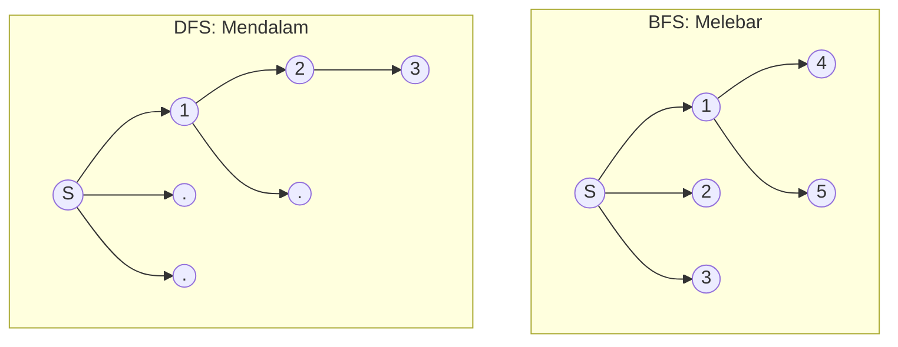

**Gambar 4.5**: Perbandingan visual strategi ekspansi node antara BFS dan DFS. BFS menyapu melebar, DFS menusuk mendalam.

### 4.2.4 Uniform Cost Search (UCS)

**Strategi**: Eksplorasi node dengan path cost terendah terlebih dahulu.

**Karakteristik**: Menggunakan **Priority Queue** berdasarkan g(n) = path cost dari start ke node n.

**Perbedaan dengan BFS:**

- BFS optimal hanya jika semua edge cost sama
- UCS optimal untuk edge cost berbeda-beda

**Contoh:**

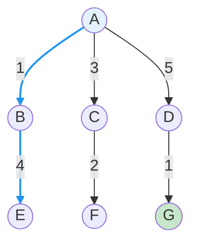

**Gambar 4.6**: Uniform Cost Search memilih path dengan biaya total terendah (A→B→E = 5, A→C→F = 5, A→D→G = 6). UCS akan mengeksplorasi A, B, C, D, lalu F dan E sebelum G.

**Pseudocode:**

```
FUNGSI UCS(initial, goal):
    frontier ← PriorityQueue dengan (initial, cost=0)
    explored ← himpunan kosong

    SELAMA frontier tidak kosong:
        node, cost ← frontier.pop_min()  // Ambil node dengan cost terkecil

        JIKA node adalah goal:
            KEMBALIKAN path ke node dengan cost

        explored.tambah(node)

        UNTUK setiap (successor, step_cost) dari node:
            new_cost ← cost + step_cost
            JIKA successor tidak di explored:
                JIKA successor tidak di frontier:
                    frontier.push(successor, new_cost)
                LAINNYA JIKA new_cost < cost di frontier:
                    frontier.update(successor, new_cost)

    KEMBALIKAN "tidak ditemukan"
```

**Analisis:**
| Kriteria | Nilai |
|----------|-------|
| Complete? | ✅ Ya (jika step cost > ε > 0) |
| Optimal? | ✅ Ya |
| Time | O(b^(1+⌊C*/ε⌋)) dimana C* = cost solusi optimal |
| Space | O(b^(1+⌊C\*/ε⌋)) |

### 4.2.5 Iterative Deepening Depth-First Search (IDDFS)

**Ide**: Kombinasikan kelebihan BFS (complete, optimal) dengan kelebihan DFS (low memory).

**Strategi**: Jalankan DFS dengan depth limit yang meningkat secara iteratif.

```
Iterasi 1: DFS dengan depth limit = 0
Iterasi 2: DFS dengan depth limit = 1
Iterasi 3: DFS dengan depth limit = 2
...dan seterusnya sampai goal ditemukan
```

**Visualisasi:**

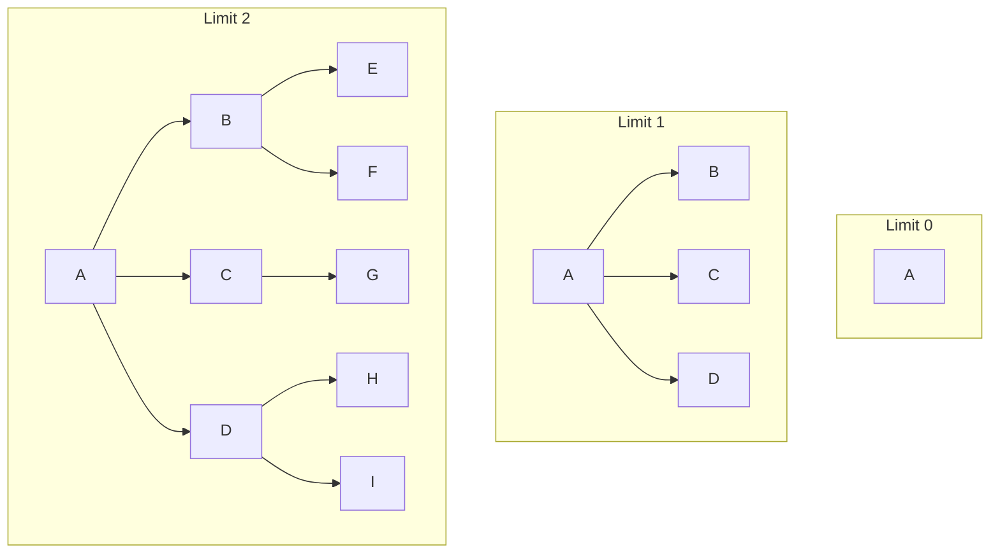

**Gambar 4.7**: Ilustrasi Iterative Deepening. Algoritma melakukan DFS berulang-ulang dengan batas kedalaman yang semakin bertambah.

**Pseudocode:**

```
FUNGSI IDDFS(initial, goal):
    UNTUK depth DARI 0 SAMPAI ∞:
        result ← DLS(initial, goal, depth)
        JIKA result ≠ "cutoff":
            KEMBALIKAN result

FUNGSI DLS(node, goal, limit):  // Depth-Limited Search
    JIKA node adalah goal:
        KEMBALIKAN node
    JIKA limit = 0:
        KEMBALIKAN "cutoff"

    cutoff_occurred ← false
    UNTUK setiap successor dari node:
        result ← DLS(successor, goal, limit - 1)
        JIKA result = "cutoff":
            cutoff_occurred ← true
        LAINNYA JIKA result ≠ "failure":
            KEMBALIKAN result

    KEMBALIKAN "cutoff" JIKA cutoff_occurred LAINNYA "failure"
```

**Analisis:**
| Kriteria | Nilai |
|----------|-------|
| Complete? | ✅ Ya |
| Optimal? | ✅ Ya (jika step cost = 1) |
| Time | O(b^d) |
| Space | O(b × d) — seperti DFS! |

> 💡 **Insight**: Meskipun terlihat boros (mengulang dari awal), overhead hanya sekitar 11% untuk b=10. IDDFS adalah pilihan terbaik ketika branching factor besar dan kedalaman solusi tidak diketahui.

---

## 4.3 Informed Search (Heuristic Search)

Algoritma **informed search** menggunakan **heuristic** — estimasi seberapa dekat suatu state ke goal.

### 4.3.1 Heuristic Function

**Heuristic function h(n)** memberikan estimasi biaya dari node n ke goal.

**Contoh heuristic untuk route finding:**

- **Straight-line distance**: Jarak garis lurus ke tujuan
- **Manhattan distance**: |x₁-x₂| + |y₁-y₂|

**Sifat penting:**

- h(n) ≥ 0 untuk semua n
- h(goal) = 0

### 4.3.2 Greedy Best-First Search

**Strategi**: Eksplorasi node yang **terlihat** paling dekat ke goal (berdasarkan h(n) saja).

**Evaluation function**: f(n) = h(n)

**Pseudocode:**

```
FUNGSI GreedyBestFirst(initial, goal):
    frontier ← PriorityQueue dengan (initial, h(initial))
    explored ← himpunan kosong

    SELAMA frontier tidak kosong:
        node ← frontier.pop_min()  // Node dengan h(n) terkecil

        JIKA node adalah goal:
            KEMBALIKAN path ke node

        explored.tambah(node)

        UNTUK setiap successor dari node:
            JIKA successor tidak di explored DAN tidak di frontier:
                frontier.push(successor, h(successor))

    KEMBALIKAN "tidak ditemukan"
```

**Contoh:**

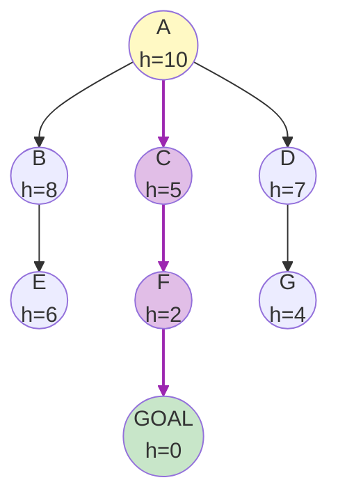

**Gambar 4.8**: Greedy Best-First Search selalu memilih node dengan nilai heuristic terkecil (h). Di sini A→C→F→GOAL dipilih karena tampaknya paling dekat.

**Analisis:**
| Kriteria | Nilai |
|----------|-------|
| Complete? | ❌ Tidak (bisa masuk loop) |
| Optimal? | ❌ Tidak |
| Time | O(b^m) worst case, tergantung h(n) |
| Space | O(b^m) |

> ⚠️ **Kelemahan**: Greedy bisa tertipu oleh heuristic yang misleading!

### 4.3.3 A\* Search

**A\*** adalah algoritma pencarian paling populer yang menggabungkan:

- **g(n)**: Actual cost dari start ke n
- **h(n)**: Estimated cost dari n ke goal

**Evaluation function**: f(n) = g(n) + h(n)

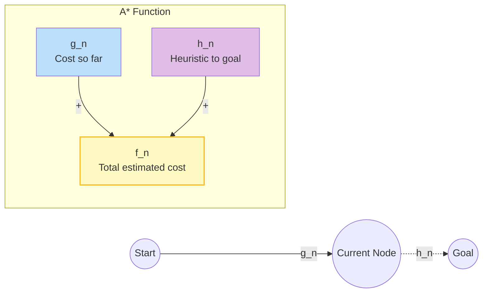

**Gambar 4.9**: Konsep A\* Search. Total cost f(n) adalah jumlah dari cost yang sudah ditempuh g(n) dan estimasi sisa jarak h(n).

**Pseudocode:**

```
FUNGSI AStar(initial, goal):
    frontier ← PriorityQueue dengan (initial, f=h(initial))
    g_score[initial] ← 0
    explored ← himpunan kosong

    SELAMA frontier tidak kosong:
        node ← frontier.pop_min()

        JIKA node adalah goal:
            KEMBALIKAN path ke node

        explored.tambah(node)

        UNTUK setiap (successor, step_cost) dari node:
            tentative_g ← g_score[node] + step_cost

            JIKA successor di explored DAN tentative_g >= g_score[successor]:
                LANJUTKAN  // Bukan path yang lebih baik

            JIKA successor tidak di frontier ATAU tentative_g < g_score[successor]:
                g_score[successor] ← tentative_g
                f_score ← tentative_g + h(successor)
                JIKA successor tidak di frontier:
                    frontier.push(successor, f_score)
                LAINNYA:
                    frontier.update(successor, f_score)

    KEMBALIKAN "tidak ditemukan"
```

### 4.3.4 Contoh A\* Step-by-Step

**Masalah**: Temukan jalan terpendek dari A ke G

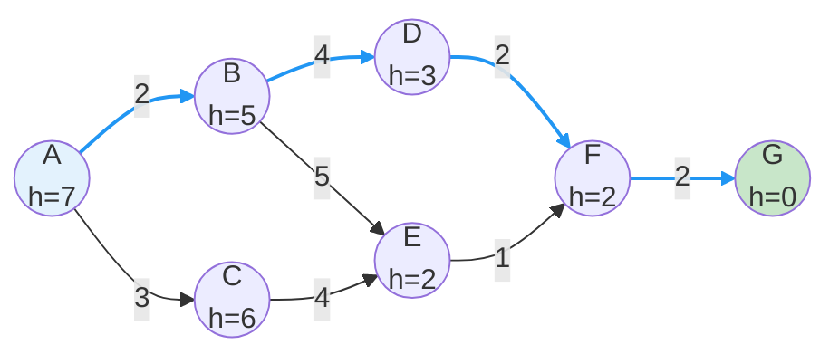

**Gambar 4.10**: Contoh graf untuk penelusuran A\*. Angka pada garis adalah cost sebenarnya, angka di node adalah heuristic (h).

**Trace A\*:**

| Step | Node              | g(n) | h(n) | f(n) | Frontier (sorted by f) |
| ---- | ----------------- | ---- | ---- | ---- | ---------------------- |
| 0    | A                 | 0    | 7    | 7    | A(7)                   |
| 1    | A→B               | 2    | 5    | 7    | B(7), C(9)             |
|      | A→C               | 3    | 6    | 9    |                        |
| 2    | B→D               | 5    | 3    | 8    | D(8), C(9), E(12)      |
|      | B→E               | 7    | 2    | 9    |                        |
| 3    | D→F               | 7    | 2    | 9    | C(9), F(9), E(12)      |
| 4    | C dieksplorasi... |      |      |      |                        |
| 5    | F→G               | 9    | 0    | 9    | **G(9) - GOAL!**       |

**Solusi**: A → B → D → F → G dengan total cost = 9

### 4.3.5 Admissibility dan Consistency

**Heuristic yang Admissible:**

- h(n) ≤ h\*(n) untuk semua n
- h\*(n) adalah actual cost dari n ke goal
- **Tidak pernah overestimate!**

> 💡 **Teorema**: Jika h(n) admissible, maka A\* optimal.

**Heuristic yang Consistent (Monotonic):**

- h(n) ≤ cost(n, n') + h(n') untuk semua n dan successor n'
- Consistent → Admissible (tapi tidak sebaliknya)
- Jika consistent, A\* lebih efisien (tidak perlu re-expand nodes)

**Contoh admissible heuristic:**

- Straight-line distance (selalu ≤ actual road distance)
- Manhattan distance untuk grid puzzle

### 4.3.6 Analisis A\*

| Kriteria  | Nilai                                     |
| --------- | ----------------------------------------- |
| Complete? | ✅ Ya (jika b terbatas dan step cost > ε) |
| Optimal?  | ✅ Ya (jika h admissible)                 |
| Time      | O(b^d) tergantung kualitas h              |
| Space     | O(b^d) — masalah utama A\*                |

> 📌 **Catatan**: A* optimal dan complete, tapi membutuhkan banyak memori. Varian seperti IDA* (Iterative Deepening A\*) mengatasi ini.

---

## 4.4 Local Search

Kadang kita tidak butuh path ke solusi, hanya **solusi terbaik**. Local search adalah pendekatan yang tepat untuk masalah optimasi.

### 4.4.1 Konsep Local Search

```
┌─────────────────────────────────────────────────────────────┐
│              LOCAL SEARCH vs PATH SEARCH                    │
├─────────────────────────────────────────────────────────────┤
│                                                             │
│   PATH SEARCH:              LOCAL SEARCH:                   │
│   • Mencari PATH            • Mencari STATE terbaik         │
│   • Menyimpan semua         • Hanya menyimpan current       │
│     node di frontier          state                         │
│   • Memory O(b^d)           • Memory O(1)                   │
│                                                             │
│   Contoh: Route finding     Contoh: Scheduling,             │
│                             Traveling Salesman Problem      │
│                                                             │
└─────────────────────────────────────────────────────────────┘
```

### 4.4.2 Hill Climbing

**Hill Climbing** adalah algoritma local search yang selalu bergerak ke arah yang meningkatkan nilai objective function.

**Analogi**: Mendaki gunung di malam hari tanpa peta — terus naik sampai tidak bisa naik lagi.

**Pseudocode:**

```
FUNGSI HillClimbing(initial):
    current ← initial

    LOOP SELAMANYA:
        neighbor ← successor terbaik dari current

        JIKA value(neighbor) ≤ value(current):
            KEMBALIKAN current  // Local maximum

        current ← neighbor
```

**Visualisasi:**

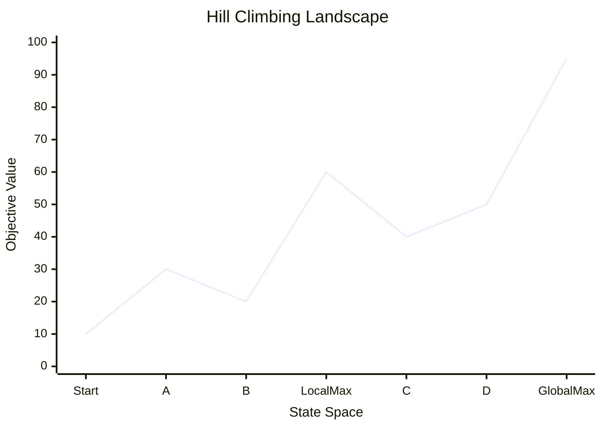

_(Catatan: Grafik di atas ilustrasi konsep. Hill Climbing bisa terjebak di 'LocalMax' (nilai 60) dan tidak mencapai 'GlobalMax' (nilai 95) jika tidak bisa turun dulu ke C)._

**Gambar 4.11**: Landscape pencarian Hill Climbing. Menunjukkan Global Maximum, Local Maximum, dan potensi terjebak.

**Masalah Hill Climbing:**

1. **Local Maximum**: Terjebak di puncak lokal
2. **Plateau**: Area datar tanpa arah yang jelas
3. **Ridge**: Area sempit yang sulit dinavigasi

### 4.4.3 Simulated Annealing

**Simulated Annealing** terinspirasi dari proses annealing dalam metalurgi — memanaskan logam kemudian mendinginkannya perlahan.

**Ide kunci**: Izinkan "langkah buruk" kadang-kadang untuk keluar dari local maximum.

**Pseudocode:**

```
FUNGSI SimulatedAnnealing(initial, schedule):
    current ← initial

    UNTUK t DARI 1 SAMPAI ∞:
        T ← schedule(t)  // Temperature, menurun seiring waktu

        JIKA T = 0:
            KEMBALIKAN current

        next ← random successor dari current
        ΔE ← value(next) - value(current)

        JIKA ΔE > 0:  // Move ke state yang lebih baik
            current ← next
        LAINNYA:  // Kadang-kadang move ke state lebih buruk
            current ← next dengan probabilitas e^(ΔE/T)
```

**Penjelasan:**

- **Temperature tinggi** → Probabilitas tinggi menerima langkah buruk → Eksplorasi
- **Temperature rendah** → Probabilitas rendah menerima langkah buruk → Eksploitasi
- **ΔE negatif besar** → Probabilitas lebih rendah untuk diterima

**Contoh schedule**: T(t) = T₀ × 0.95^t (cooling rate 5%)

### 4.4.4 Perbandingan Hill Climbing vs Simulated Annealing

| Aspek                | Hill Climbing   | Simulated Annealing            |
| -------------------- | --------------- | ------------------------------ |
| Accept worse moves?  | ❌ Tidak pernah | ✅ Ya, dengan probabilitas     |
| Escape local maxima? | ❌ Tidak        | ✅ Ya                          |
| Speed                | Cepat           | Lebih lambat                   |
| Quality guarantee    | No              | Theoretically optimal (∞ time) |

---

## 4.5 Genetic Algorithm

### 4.5.1 Konsep Dasar

**Genetic Algorithm (GA)** terinspirasi dari evolusi biologis Darwin:

- Populasi **individu** (solusi kandidat)
- Individu terbaik (**fittest**) berreproduksi
- Offspring mewarisi sifat parent dengan **mutasi**

### 4.5.2 Komponen Genetic Algorithm

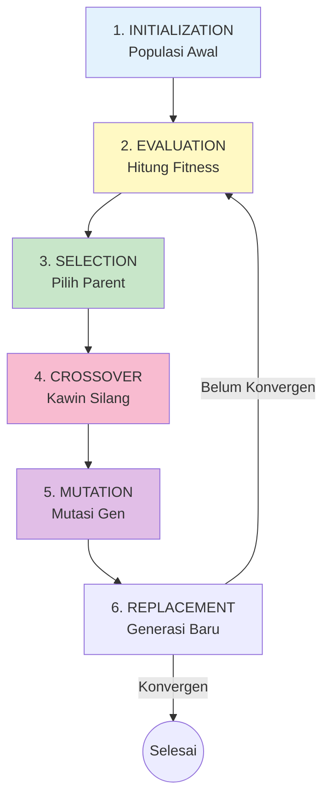

**Gambar 4.12**: Siklus Genetic Algorithm (GA). Proses evolusi berulang dari evaluasi hingga penggantian populasi.

### 4.5.3 Representasi dan Operator

**Representasi (Chromosome):**
Solusi dikodekan sebagai string, biasanya binary:

```
Individu 1: 1 0 1 1 0 1 0 0
Individu 2: 0 1 1 0 1 1 0 1
```

**Selection:**

- **Roulette Wheel**: Probabilitas proporsional dengan fitness
- **Tournament**: Pilih terbaik dari subset random

**Crossover (Rekombinasi):**

```
Parent 1:  1 0 1 1 | 0 1 0 0
Parent 2:  0 1 1 0 | 1 1 0 1
           ────────┬────────
                   ↓
Child 1:   1 0 1 1 | 1 1 0 1
Child 2:   0 1 1 0 | 0 1 0 0
```

**Mutation:**

```
Before:    1 0 1 1 0 1 0 0
                ↓
After:     1 0 1 0 0 1 0 0  (bit ke-4 flip)
```

### 4.5.4 Contoh: Maximize f(x) = x²

**Setup:**

- x ∈ [0, 31] → bisa direpresentasikan dengan 5 bit
- Fitness function: f(x) = x²
- Population size: 4

**Generasi 0:**
| Individual | Binary | x | f(x) = x² |
|------------|--------|---|-----------|
| A | 01101 | 13 | 169 |
| B | 11000 | 24 | 576 |
| C | 01000 | 8 | 64 |
| D | 10011 | 19 | 361 |

**Selection** (tournament): B dan D dipilih (fitness tertinggi)

**Crossover** (1-point di posisi 3):

```
B: 110|00    D: 100|11
         ↓
Child 1: 110|11 = 27 → f = 729
Child 2: 100|00 = 16 → f = 256
```

**Mutation** (flip random bit dengan probabilitas kecil):

- Child 1: 11011 → 11111 = 31 → f = 961 (mutasi menguntungkan!)

### 4.5.5 Aplikasi Genetic Algorithm

| Domain           | Aplikasi                            |
| ---------------- | ----------------------------------- |
| Scheduling       | Jadwal penerbangan, jadwal kuliah   |
| Design           | Desain aerodinamis, circuit design  |
| Routing          | Vehicle routing, network design     |
| Machine Learning | Neural network weight optimization  |
| Bioinformatics   | Protein folding, sequence alignment |

---

## 4.6 Optimality dan Completeness

### 4.6.1 Ringkasan Perbandingan

| Algoritma           | Complete? | Optimal? | Time         | Space        |
| ------------------- | --------- | -------- | ------------ | ------------ |
| BFS                 | ✅        | ✅\*     | O(b^d)       | O(b^d)       |
| DFS                 | ❌        | ❌       | O(b^m)       | O(bm)        |
| UCS                 | ✅        | ✅       | O(b^(C\*/ε)) | O(b^(C\*/ε)) |
| IDDFS               | ✅        | ✅\*     | O(b^d)       | O(bd)        |
| Greedy              | ❌        | ❌       | O(b^m)       | O(b^m)       |
| A\*                 | ✅        | ✅†      | O(b^d)       | O(b^d)       |
| Hill Climbing       | ❌        | ❌       | -            | O(1)         |
| Simulated Annealing | ✅‡       | ✅‡      | -            | O(1)         |

\*) Jika step cost uniform
†) Jika heuristic admissible
‡) Dengan schedule yang tepat dan waktu tak terbatas

### 4.6.2 Kapan Menggunakan Algoritma Mana?

```
┌─────────────────────────────────────────────────────────────┐
│              PEMILIHAN ALGORITMA                            │
├─────────────────────────────────────────────────────────────┤
│                                                             │
│  Butuh path ke solusi?                                      │
│       │                                                     │
│       ├── YA ────► Punya heuristic yang baik?              │
│       │                 │                                   │
│       │                 ├── YA ────► A*                    │
│       │                 │                                   │
│       │                 └── TIDAK ───► Uniform Cost sama?   │
│       │                                    │                │
│       │                                    ├── YA → BFS/IDDFS│
│       │                                    └── TIDAK → UCS  │
│       │                                                     │
│       └── TIDAK ──► Memory terbatas?                       │
│                          │                                  │
│                          ├── YA ────► SA / GA              │
│                          │                                  │
│                          └── TIDAK ──► Hill Climbing       │
│                                                             │
└─────────────────────────────────────────────────────────────┘
```

---

## 📝 Ringkasan

1. **Masalah pencarian** terdiri dari: state space, initial state, goal test, actions, transition model, dan path cost

2. **Uninformed Search**:
   - BFS: Level by level, complete & optimal (uniform cost), high memory
   - DFS: Depth first, low memory, not complete/optimal
   - UCS: Lowest cost first, complete & optimal
   - IDDFS: Best of both worlds

3. **Informed Search**:
   - Greedy: Follows h(n), fast but not optimal
   - A\*: Uses f(n) = g(n) + h(n), optimal if h admissible

4. **Heuristic**: Estimasi biaya ke goal
   - Admissible: Tidak overestimate
   - Consistent: h(n) ≤ cost + h(successor)

5. **Local Search**:
   - Hill Climbing: Simple but stuck at local maxima
   - Simulated Annealing: Allow bad moves to escape
   - Genetic Algorithm: Population-based evolution

---

## 📚 Studi Kasus: Google Maps Route Finding

### Bagaimana Google Maps Bekerja?

Google Maps menggunakan variasi A* yang disebut \*\*ALT (A* + Landmarks + Triangle inequality)** dan **Contraction Hierarchies\*\*.

**Tantangan:**

- Graf jalan raya: miliaran node
- Query harus dijawab dalam millisekon
- Multiple criteria: jarak, waktu, tol, dll.

**Solusi:**

1. **Preprocessing**: Hitung jarak ke "landmark" terpilih
2. **Hierarchy**: Road network disusun hirarkis (jalan kecil → jalan besar → highway)
3. **Bidirectional search**: Cari dari start dan goal secara bersamaan

### Contoh Heuristic

Untuk estimasi waktu tempuh:

- h(n) = straight_line_distance(n, goal) / max_speed

Ini admissible karena:

- Tidak ada jalan yang lebih pendek dari garis lurus
- Tidak ada kendaraan yang lebih cepat dari max_speed

---

## ✏️ Soal Latihan

### Pilihan Ganda

**1.** Algoritma pencarian yang menggunakan Queue sebagai struktur data adalah:

- a) DFS
- b) BFS
- c) A\*
- d) Hill Climbing

**2.** A\* optimal jika heuristic bersifat:

- a) Consistent saja
- b) Admissible
- c) Overestimate
- d) Random

**3.** Manakah yang BUKAN masalah Hill Climbing?

- a) Local maximum
- b) Plateau
- c) Infinite loop
- d) Ridge

**4.** Dalam Simulated Annealing, ketika temperature tinggi:

- a) Hanya menerima langkah yang lebih baik
- b) Lebih mungkin menerima langkah yang lebih buruk
- c) Berhenti mencari
- d) Tidak ada yang terjadi

**5.** Operator dalam Genetic Algorithm yang menggabungkan dua parent adalah:

- a) Selection
- b) Mutation
- c) Crossover
- d) Fitness evaluation

### Esai Singkat

**6.** Jelaskan perbedaan antara g(n), h(n), dan f(n) dalam A\* search. Berikan contoh konkret.

**7.** Mengapa IDDFS lebih baik dari BFS untuk masalah dengan branching factor tinggi dan kedalaman solusi tidak diketahui?

**8.** Desain heuristic admissible untuk 8-puzzle. Jelaskan mengapa heuristic tersebut admissible.

### Tantangan

**9.** Diberikan graf berikut, trace A\* dari S ke G dengan h values yang diberikan:

```
    S ──2── A ──3── G
    │       │
    4       1
    │       │
    B ──2── C

h(S)=6, h(A)=2, h(B)=4, h(C)=2, h(G)=0
```

**10.** Implementasikan Simulated Annealing dalam pseudocode untuk masalah Traveling Salesman Problem (TSP).

---

## 📖 Glosarium Bab 4

| Istilah                 | Definisi                                              |
| ----------------------- | ----------------------------------------------------- |
| **Search Tree**         | Representasi ruang pencarian sebagai pohon            |
| **Frontier**            | Node yang sudah di-generate tapi belum di-explore     |
| **BFS**                 | Breadth-First Search, eksplorasi level by level       |
| **DFS**                 | Depth-First Search, eksplorasi sedalam mungkin        |
| **UCS**                 | Uniform Cost Search, eksplorasi berdasarkan path cost |
| **IDDFS**               | Iterative Deepening DFS, kombinasi BFS dan DFS        |
| **Heuristic**           | Estimasi biaya dari node ke goal                      |
| **Admissible**          | Heuristic yang tidak overestimate                     |
| **Consistent**          | Heuristic yang memenuhi triangle inequality           |
| **A\***                 | Algoritma pencarian dengan f(n) = g(n) + h(n)         |
| **Local Search**        | Pencarian yang hanya mempertimbangkan state saat ini  |
| **Hill Climbing**       | Selalu bergerak ke arah yang lebih baik               |
| **Simulated Annealing** | Memperbolehkan langkah buruk dengan probabilitas      |
| **Genetic Algorithm**   | Optimasi berbasis evolusi biologis                    |
| **Fitness**             | Ukuran kualitas solusi dalam GA                       |

---

## 📚 Bacaan Lebih Lanjut

1. Russell, S., & Norvig, P. (2020). _Artificial Intelligence: A Modern Approach_ (4th ed.). Chapter 3-4.
2. Hart, P. E., Nilsson, N. J., & Raphael, B. (1968). A Formal Basis for the Heuristic Determination of Minimum Cost Paths. _IEEE Transactions on Systems Science and Cybernetics_.
3. Kirkpatrick, S., et al. (1983). Optimization by Simulated Annealing. _Science_.
4. Holland, J. H. (1975). _Adaptation in Natural and Artificial Systems_. MIT Press.

---

_← [BAB 3: Representasi Pengetahuan dalam AI](./BAB-03-Representasi-Pengetahuan-dalam-AI.md) | [BAB 5: Pengantar Machine Learning](./BAB-05-Pengantar-Machine-Learning.md) →_
