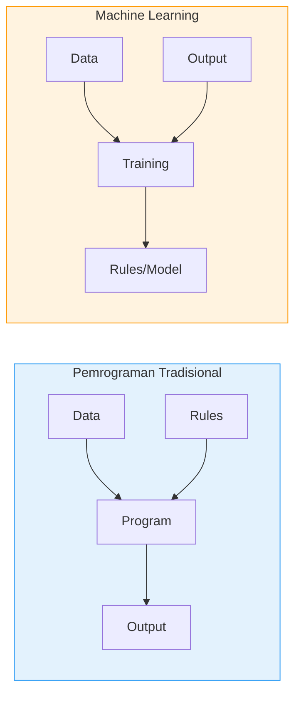
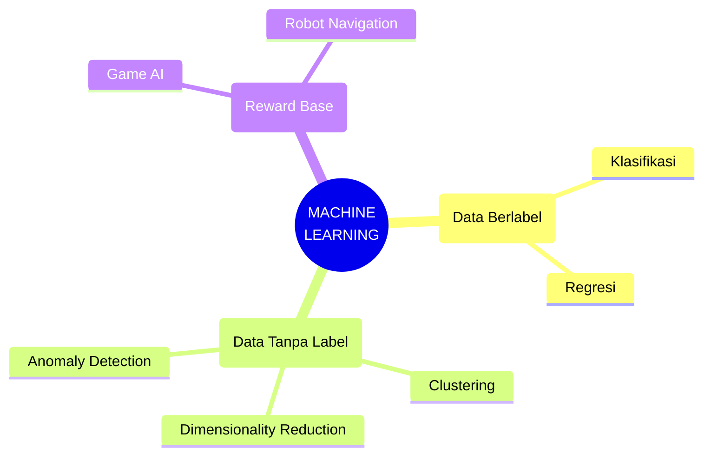
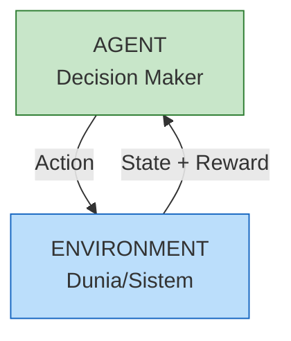
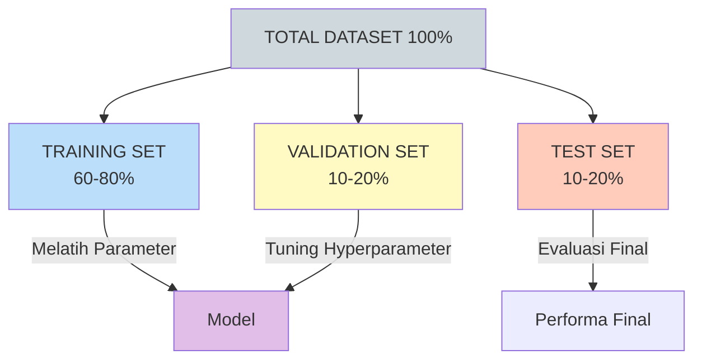
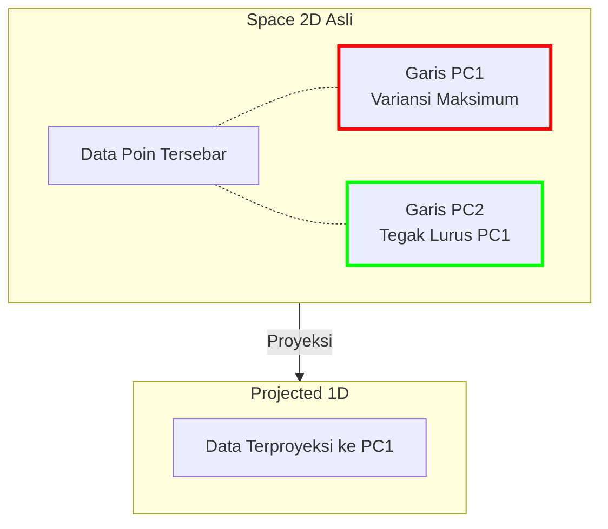
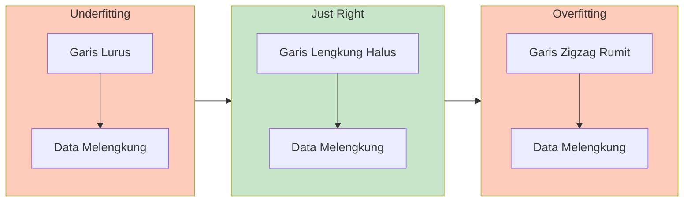
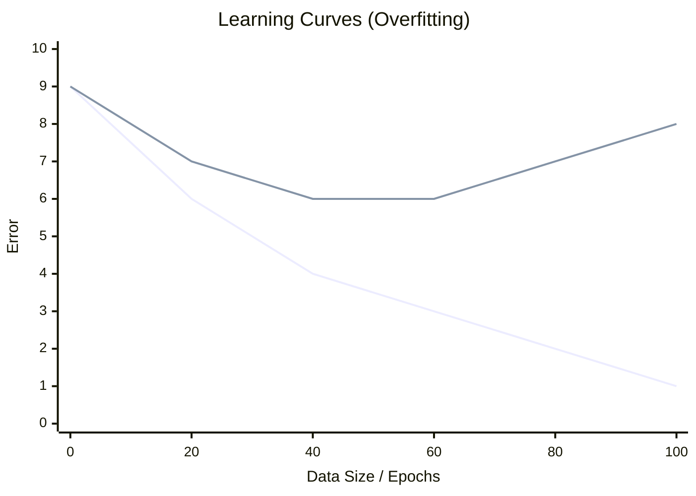
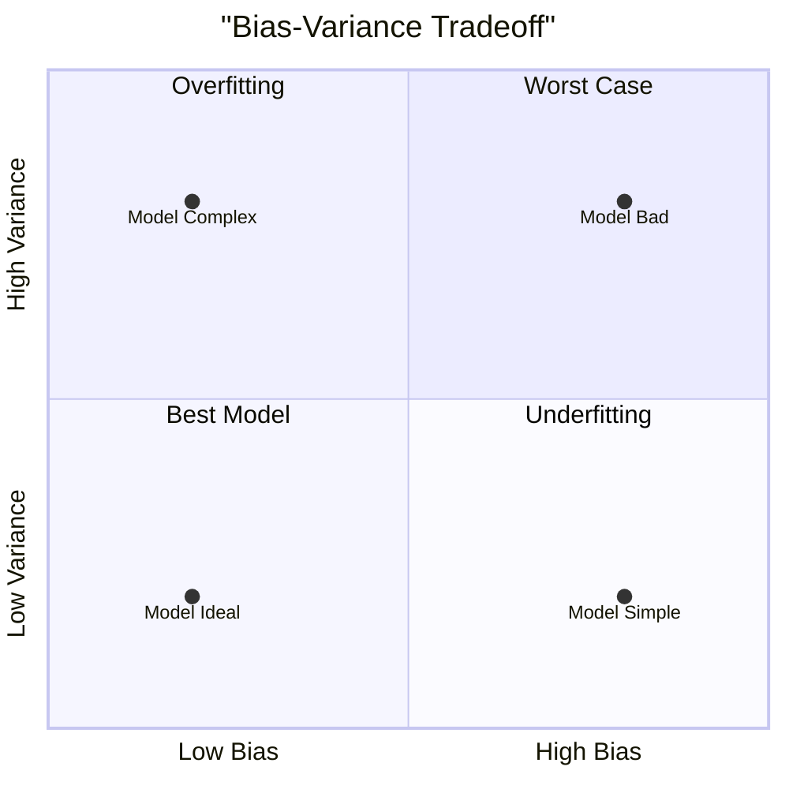
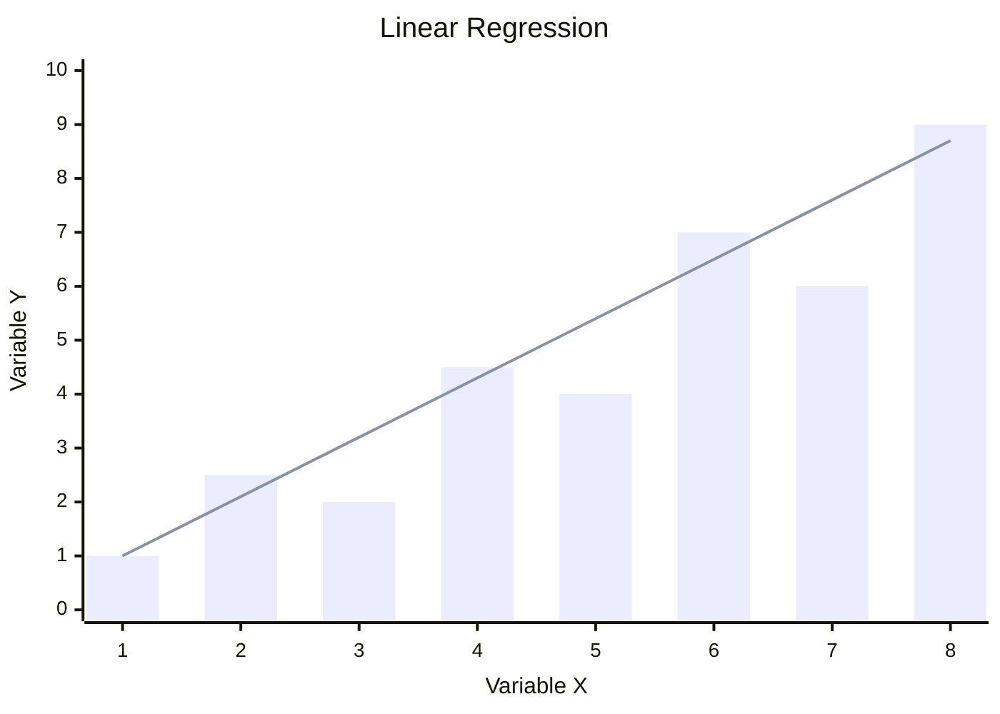
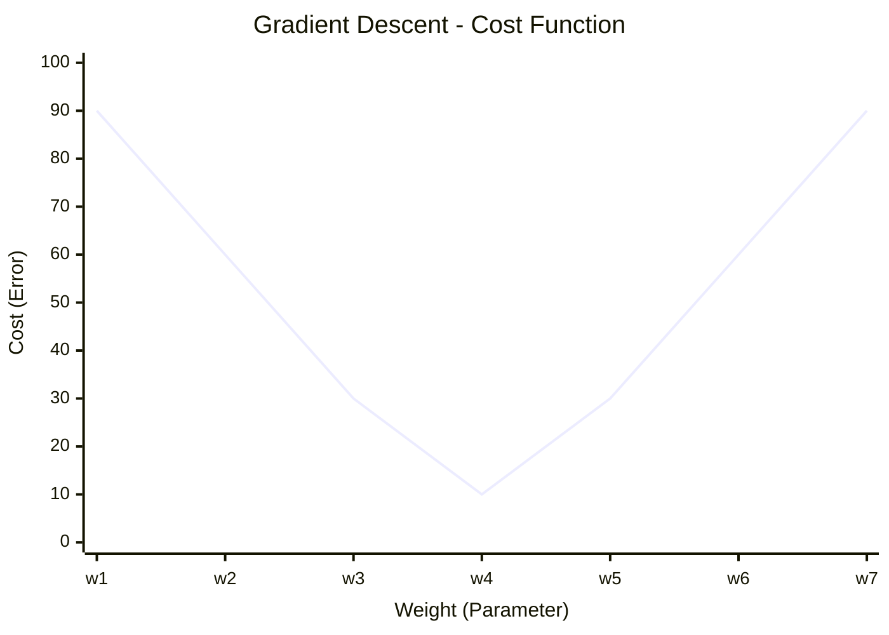

# BAB 5: Pengantar Machine Learning

---

## 🎯 Tujuan Pembelajaran

Setelah mempelajari bab ini, Anda akan mampu:

- Mendefinisikan Machine Learning dan perbedaannya dengan pemrograman tradisional
- Membedakan Supervised, Unsupervised, dan Reinforcement Learning
- Memahami konsep dataset: training, validation, dan testing
- Menjelaskan proses feature engineering dasar
- Memahami feature scaling: normalization vs standardization
- Mengenal dimensionality reduction dengan PCA
- Mengidentifikasi overfitting dan underfitting
- Memahami bias-variance tradeoff
- Mengimplementasikan Linear Regression sebagai fondasi

---

## 📖 Pendahuluan

Pernahkah Anda bertanya-tanya bagaimana email Anda secara otomatis memfilter spam? Atau bagaimana Netflix tahu film apa yang Anda sukai? Semua ini dimungkinkan oleh **Machine Learning** — cabang AI yang memungkinkan komputer belajar dari data tanpa diprogram secara eksplisit.

Dalam pemrograman tradisional, kita menulis aturan yang tepat. Tapi bagaimana jika aturannya terlalu kompleks atau bahkan tidak kita ketahui? Di sinilah Machine Learning berperan — menemukan pola dalam data untuk membuat prediksi.

---

## 5.1 Apa Itu Machine Learning?

### 5.1.1 Definisi

> **Machine Learning** adalah bidang studi yang memberikan komputer kemampuan untuk belajar tanpa diprogram secara eksplisit.
> — Arthur Samuel, 1959

Definisi yang lebih teknis:

> Sebuah program komputer dikatakan _belajar_ dari pengalaman **E** dengan mengacu pada tugas **T** dan ukuran kinerja **P**, jika kinerjanya pada T, yang diukur oleh P, meningkat seiring pengalaman E.
> — Tom Mitchell, 1997

### 5.1.2 Pemrograman Tradisional vs Machine Learning



**Gambar 5.1**: Perbedaan mendasar alur kerja Pemrograman Tradisional vs Machine Learning. ML mempelajari aturan dari data dan output yang diinginkan.

### 5.1.3 Kapan Menggunakan Machine Learning?

ML cocok ketika:

- ✅ Aturan terlalu kompleks untuk ditulis manual (pengenalan wajah)
- ✅ Aturan berubah seiring waktu (deteksi fraud)
- ✅ Data sangat besar (analisis media sosial)
- ✅ Butuh personalisasi (rekomendasi produk)

ML TIDAK cocok ketika:

- ❌ Aturan sudah jelas dan sederhana
- ❌ Data tidak tersedia atau sangat sedikit
- ❌ Error tidak bisa ditoleransi (sistem kritis tanpa fallback)
- ❌ Perlu explainability tinggi (regulasi ketat)

---

## 5.2 Tipe-tipe Machine Learning



**Gambar 5.2**: Tiga pilar utama Machine Learning: Supervised, Unsupervised, dan Reinforcement Learning.

### 5.2.1 Supervised Learning

Dalam **Supervised Learning**, kita memiliki data dengan label (jawaban yang benar). Model belajar memetakan input ke output.

**Dua jenis utama:**

| Jenis           | Output           | Contoh                              |
| --------------- | ---------------- | ----------------------------------- |
| **Klasifikasi** | Kategori diskrit | Spam/bukan spam, Diagnosis penyakit |
| **Regresi**     | Nilai kontinu    | Prediksi harga rumah, Prediksi suhu |

**Contoh dataset klasifikasi:**

| Email | Panjang | Kata "lottery" | Kata "meeting" | **Label**      |
| ----- | ------- | -------------- | -------------- | -------------- |
| 1     | pendek  | ya             | tidak          | **Spam**       |
| 2     | panjang | tidak          | ya             | **Bukan Spam** |
| 3     | pendek  | ya             | tidak          | **Spam**       |
| 4     | panjang | tidak          | ya             | **Bukan Spam** |

### 5.2.2 Unsupervised Learning

Dalam **Unsupervised Learning**, data tidak memiliki label. Sistem mencari pola atau struktur dalam data.

**Teknik utama:**

| Teknik                       | Tujuan                     | Contoh                       |
| ---------------------------- | -------------------------- | ---------------------------- |
| **Clustering**               | Mengelompokkan data serupa | Segmentasi pelanggan         |
| **Dimensionality Reduction** | Menyederhanakan data       | Kompresi gambar, visualisasi |
| **Anomaly Detection**        | Menemukan outlier          | Deteksi fraud                |
| **Association Rules**        | Menemukan hubungan         | Market basket analysis       |

### 5.2.3 Reinforcement Learning

Dalam **Reinforcement Learning**, _agent_ belajar melalui interaksi dengan _environment_ dan menerima _reward_ atau _punishment_.



**Gambar 5.3**: Siklus perulangan dalam Reinforcement Learning. Agent belajar dari umpan balik (reward/punishment) lingkungan.

**Contoh RL:**

- AlphaGo: Reward = menang (+1) atau kalah (-1)
- Mobil otonom: Reward = sampai tujuan (+), tabrakan (-)
- Game AI: Reward = skor game

---

## 5.3 Dataset: Training, Validation, Testing

### 5.3.1 Mengapa Membagi Data?

Kita ingin model yang **generalizable** — bisa perform baik pada data baru, bukan hanya pada data yang sudah dilihat.

**Analogi**: Jika siswa hanya menghafal soal ujian tahun lalu, dia mungkin gagal jika soalnya berbeda. Kita ingin siswa yang benar-benar _memahami_ materi.

### 5.3.2 Pembagian Dataset



**Gambar 5.4**: Pembagian Dataset standar menjadi tiga bagian: Training, Validation, dan Testing.

| Set            | Fungsi                                       | Kapan Digunakan        |
| -------------- | -------------------------------------------- | ---------------------- |
| **Training**   | Melatih model                                | Selama training        |
| **Validation** | Tuning hyperparameter, early stopping        | Selama development     |
| **Test**       | Evaluasi final, estimasi performa real-world | Hanya di akhir, SEKALI |

> ⚠️ **Peringatan**: Jangan pernah menggunakan test set untuk membuat keputusan selama development! Ini menyebabkan "data leakage" dan overestimasi performa.

### 5.3.3 Proporsi Umum

| Ukuran Dataset   | Training | Validation | Test |
| ---------------- | -------- | ---------- | ---- |
| Kecil (<1K)      | 60%      | 20%        | 20%  |
| Sedang (1K-100K) | 70%      | 15%        | 15%  |
| Besar (>100K)    | 98%      | 1%         | 1%   |

---

## 5.4 Feature Engineering

### 5.4.1 Apa Itu Feature?

**Feature** (fitur) adalah variabel atau atribut yang digunakan sebagai input untuk model ML.

**Contoh:**

- Prediksi harga rumah → Features: luas, jumlah kamar, lokasi, tahun dibangun
- Klasifikasi spam → Features: panjang email, jumlah link, kata tertentu

### 5.4.2 Feature Engineering

**Feature engineering** adalah proses membuat, memilih, dan mentransformasi features untuk meningkatkan performa model.

**Teknik umum:**

| Teknik                     | Deskripsi                           | Contoh                             |
| -------------------------- | ----------------------------------- | ---------------------------------- |
| **Feature Creation**       | Membuat fitur baru dari yang ada    | BMI = berat / tinggi²              |
| **Feature Selection**      | Memilih fitur yang relevan          | Hapus fitur dengan korelasi rendah |
| **Feature Transformation** | Mengubah skala/distribusi           | Log transform, standardization     |
| **Encoding**               | Mengkonversi kategorikal ke numerik | One-hot encoding                   |

### 5.4.3 Contoh Feature Engineering

**Kasus: Prediksi Keterlambatan Penerbangan**

Data mentah:

```
Departure: 2024-01-15 14:30
Arrival: 2024-01-15 17:45
Route: CGK-DPS
Aircraft: Boeing 737
```

Features yang di-engineer:

```
hour_of_day: 14
day_of_week: Senin → 1
is_weekend: 0
month: Januari → 1
is_peak_season: 0
flight_duration: 3.25 (jam)
route_encoded: [1, 0, 0, ...] (one-hot)
aircraft_age: 5 (tahun)
prev_flight_delay: 15 (menit)
```

---

## 5.5 Feature Scaling

### 5.5.1 Mengapa Scaling Penting?

Banyak algoritma ML sensitif terhadap skala fitur. Fitur dengan range besar akan mendominasi fitur dengan range kecil.

**Contoh:**

- Usia: 0-100 tahun
- Pendapatan: 0-1.000.000.000 rupiah

Tanpa scaling, model akan "menganggap" pendapatan lebih penting hanya karena nilainya lebih besar.

### 5.5.2 Normalization (Min-Max Scaling)

**Formula:**
$$x_{normalized} = \frac{x - x_{min}}{x_{max} - x_{min}}$$

Hasil: Nilai antara 0 dan 1

**Contoh:**

```
Data: [10, 20, 30, 40, 50]
Min = 10, Max = 50

Normalized:
10 → (10-10)/(50-10) = 0.00
20 → (20-10)/(50-10) = 0.25
30 → (30-10)/(50-10) = 0.50
40 → (40-10)/(50-10) = 0.75
50 → (50-10)/(50-10) = 1.00
```

**Kapan digunakan:**

- Data bounded (ada batas jelas)
- Algoritma yang membutuhkan range tertentu (Neural Networks dengan sigmoid)
- Image pixel values (0-255 → 0-1)

### 5.5.3 Standardization (Z-Score)

**Formula:**
$$x_{standardized} = \frac{x - \mu}{\sigma}$$

Hasil: Mean = 0, Standard Deviation = 1

**Contoh:**

```
Data: [10, 20, 30, 40, 50]
Mean (μ) = 30, Std (σ) = √200 ≈ 14.14

Standardized:
10 → (10-30)/14.14 ≈ -1.41
20 → (20-30)/14.14 ≈ -0.71
30 → (30-30)/14.14 = 0.00
40 → (40-30)/14.14 ≈ 0.71
50 → (50-30)/14.14 ≈ 1.41
```

**Kapan digunakan:**

- Algoritma yang mengasumsikan distribusi normal
- SVM, Logistic Regression
- Data dengan outliers (lebih robust daripada normalization)

### 5.5.4 Perbandingan

| Aspek              | Normalization  | Standardization |
| ------------------ | -------------- | --------------- |
| Range output       | [0, 1]         | Unbounded       |
| Sensitif outlier   | ✅ Ya          | Lebih robust    |
| Menjaga distribusi | ❌ Tidak       | ✅ Ya           |
| Algoritma cocok    | NN, KNN, Image | SVM, LR, PCA    |

---

## 5.6 Dimensionality Reduction: PCA

### 5.6.1 Curse of Dimensionality

Semakin banyak fitur (dimensi), semakin sulit bagi model untuk belajar:

- Data menjadi "sparse" di ruang dimensi tinggi
- Butuh lebih banyak data untuk mengisi ruang
- Komputasi lebih berat

### 5.6.2 Principal Component Analysis (PCA)

**PCA** adalah teknik untuk mereduksi dimensi dengan tetap mempertahankan informasi sebanyak mungkin.

**Ide dasar:**

1. Temukan arah (principal components) dengan variasi data terbesar
2. Proyeksikan data ke arah-arah tersebut
3. Ambil k komponen teratas

**Visualisasi:**



_(Visualisasi Konseptual: PCA mencari garis (PC1) yang menangkap sebaran data terluas dan memproyeksikan data ke garis tersebut)._

**Gambar 5.5**: Konsep Principal Component Analysis (PCA). Mereduksi 2D menjadi 1D dengan mempertahankan variansi terbesar.

### 5.6.3 Langkah-langkah PCA

```
1. Standardize data
2. Hitung covariance matrix
3. Hitung eigenvalues dan eigenvectors
4. Urutkan berdasarkan eigenvalue
5. Pilih k komponen teratas
6. Proyeksikan data ke k komponen
```

### 5.6.4 Memilih Jumlah Komponen

**Explained Variance Ratio:**

- Berapa persen variasi yang ditangkap oleh k komponen?
- Umum: pilih k yang menangkap 95% variasi

```
Komponen | Explained Variance | Cumulative
─────────┼───────────────────┼───────────
   PC1   |       0.60        |    60%
   PC2   |       0.25        |    85%
   PC3   |       0.10        |    95%  ← Stop di sini
   PC4   |       0.05        |   100%
```

---

## 5.7 Overfitting dan Underfitting

### 5.7.1 Konsep



_(Visualisasi Konseptual: Underfitting terlalu polos, Just Right pas polanya, Overfitting terlalu menghafal noise)._

**Gambar 5.6**: Ilustrasi Underfitting, Model yang Ideal (Just Right), dan Overfitting.

### 5.7.2 Penjelasan

| Kondisi          | Penyebab                | Tanda                                 | Solusi                            |
| ---------------- | ----------------------- | ------------------------------------- | --------------------------------- |
| **Underfitting** | Model terlalu sederhana | Train error tinggi, Test error tinggi | Tambah kompleksitas, tambah fitur |
| **Just Right**   | Keseimbangan pas        | Train error rendah, Test error rendah | -                                 |
| **Overfitting**  | Model terlalu kompleks  | Train error rendah, Test error tinggi | Regularization, lebih banyak data |

### 5.7.3 Learning Curves



_(Garis Biru: Training Error (turun terus). Garis Merah/Ke-2: Test Error (turun lalu naik). Gap besar = Overfitting)._

**Gambar 5.7**: Learning Curve yang menunjukkan gejala overfitting dimana Training Error rendah tetapi Test Error tinggi.

---

## 5.8 Bias-Variance Tradeoff

### 5.8.1 Konsep

**Total Error** = Bias² + Variance + Irreducible Error

| Komponen        | Penjelasan                                              |
| --------------- | ------------------------------------------------------- |
| **Bias**        | Error karena asumsi yang terlalu sederhana              |
| **Variance**    | Error karena sensitivitas tinggi terhadap training data |
| **Irreducible** | Noise dalam data yang tidak bisa dihilangkan            |

### 5.8.2 Visualisasi



**Gambar 5.8**: Bias-Variance Tradeoff. Kita mencari titik keseimbangan di kuadran kiri bawah (Low Bias, Low Variance).

### 5.8.3 Analogi

> 💡 **Analogi Penembak:**
>
> - **Low Bias, Low Variance**: Semua tembakan tepat sasaran ✓
> - **High Bias, Low Variance**: Semua tembakan menyimpang ke arah yang sama (konsisten salah)
> - **Low Bias, High Variance**: Rata-rata dekat sasaran tapi tersebar luas
> - **High Bias, High Variance**: Tersebar dan jauh dari sasaran (worst case)

---

## 5.9 Linear Regression

### 5.9.1 Konsep Dasar

**Linear Regression** adalah algoritma supervised learning untuk memprediksi nilai kontinu berdasarkan hubungan linear.

**Model:**
$$\hat{y} = w_0 + w_1 x_1 + w_2 x_2 + ... + w_n x_n$$

atau dalam notasi vektor:
$$\hat{y} = \mathbf{w}^T \mathbf{x} + b$$

Di mana:

- $\hat{y}$ = nilai prediksi
- $w_i$ = weights (koefisien)
- $x_i$ = features
- $b$ atau $w_0$ = bias (intercept)

### 5.9.2 Simple Linear Regression

Untuk satu fitur:
$$\hat{y} = wx + b$$

**Visualisasi:**



_(Bar charts merepresentasikan titik data, garis merepresentasikan model regresi linear $y = wx + b$)_

**Gambar 5.9**: Visualisasi Regresi Linear berusaha mencari garis lurus yang "paling pas" dengan sebaran data.

### 5.9.3 Cost Function (Mean Squared Error)

Kita ingin menemukan w dan b yang **meminimalkan** perbedaan antara prediksi dan nilai aktual:

$$MSE = \frac{1}{n} \sum_{i=1}^{n} (y_i - \hat{y}_i)^2$$

atau:
$$MSE = \frac{1}{n} \sum_{i=1}^{n} (y_i - (wx_i + b))^2$$

### 5.9.4 Gradient Descent

**Gradient Descent** adalah algoritma optimasi untuk menemukan minimum cost function.

**Algoritma:**

```
1. Inisialisasi w dan b secara random
2. Hitung gradient (turunan parsial terhadap w dan b)
3. Update parameter:
   w = w - α × ∂MSE/∂w
   b = b - α × ∂MSE/∂b
4. Ulangi sampai konvergen
```

Di mana α adalah **learning rate**.

**Visualisasi Gradient Descent:**



_(Kurva berbentuk mangkuk (convex). Algoritma turun dari sisi kiri/kanan menuju ke dasar lembah yaitu minimum error)._

**Gambar 5.10**: Visualisasi Gradient Descent menuruni lembah fungsi biaya (Cost Function) untuk mencari nilai minimum.

### 5.9.5 Contoh Numerik

**Data:**
| Luas (m²) x | Harga (juta) y |
|-------------|----------------|
| 50 | 300 |
| 80 | 450 |
| 100 | 550 |
| 120 | 650 |

**Langkah 1: Inisialisasi**

- w = 0, b = 0

**Langkah 2: Iterasi (simplified)**

- Prediksi dengan w=0, b=0: semua ŷ = 0
- Error sangat besar
- Gradient menunjukkan arah update
- Setelah banyak iterasi...

**Hasil akhir (approximate):**

- w ≈ 5 (setiap 1 m² → +5 juta)
- b ≈ 50 (base price 50 juta)

**Model final:**
$$\text{Harga} = 5 \times \text{Luas} + 50$$

### 5.9.6 Multiple Linear Regression

Untuk banyak fitur:
$$\hat{y} = w_0 + w_1 x_1 + w_2 x_2 + ... + w_n x_n$$

**Contoh:**
$$\text{Harga} = 5 \times \text{Luas} + 20 \times \text{Kamar} - 0.5 \times \text{Usia} + 100$$

### 5.9.7 Asumsi Linear Regression

1. **Linearity**: Hubungan antara X dan Y linear
2. **Independence**: Observasi independent
3. **Homoscedasticity**: Variance error konstan
4. **Normality**: Error berdistribusi normal

---

## 📝 Ringkasan

1. **Machine Learning**: Komputer belajar dari data tanpa diprogram eksplisit

2. **Tipe ML**:
   - **Supervised**: Data berlabel (klasifikasi, regresi)
   - **Unsupervised**: Data tidak berlabel (clustering)
   - **Reinforcement**: Belajar dari reward

3. **Dataset split**: Training (melatih), Validation (tuning), Test (evaluasi final)

4. **Feature Engineering**: Membuat dan memilih fitur yang baik

5. **Feature Scaling**:
   - Normalization: [0, 1]
   - Standardization: mean=0, std=1

6. **PCA**: Reduksi dimensi dengan mempertahankan variasi

7. **Overfitting vs Underfitting**:
   - Overfitting: Terlalu kompleks, bagus di training, buruk di test
   - Underfitting: Terlalu sederhana, buruk di keduanya

8. **Bias-Variance Tradeoff**: Balance antara kesederhanaan dan kompleksitas

9. **Linear Regression**: Model dasar untuk prediksi nilai kontinu
   - MSE sebagai cost function
   - Gradient Descent untuk optimasi

---

## 📚 Studi Kasus: Prediksi Harga Rumah di Jakarta

### Problem Statement

Sebuah startup properti ingin memberikan estimasi harga rumah berdasarkan karakteristiknya.

### Dataset Sample

| ID  | Luas (m²) | Kamar | Kamar Mandi | Lokasi  | Usia (tahun) | Harga (Milyar) |
| --- | --------- | ----- | ----------- | ------- | ------------ | -------------- |
| 1   | 120       | 3     | 2           | Selatan | 5            | 2.5            |
| 2   | 200       | 4     | 3           | Pusat   | 10           | 5.0            |
| 3   | 80        | 2     | 1           | Timur   | 3            | 1.5            |
| 4   | 150       | 3     | 2           | Barat   | 8            | 3.0            |

### Feature Engineering

1. **Numerical features**: Luas, Kamar, Kamar Mandi, Usia
2. **Categorical encoding**: Lokasi → One-hot
3. **Feature creation**: Luas per kamar = Luas / Kamar

### Preprocessing

1. Standard scaling untuk fitur numerik
2. One-hot encoding untuk lokasi
3. Train-Test split: 80%-20%

### Model: Linear Regression

$$\text{Harga} = w_1 \times \text{Luas} + w_2 \times \text{Kamar} + w_3 \times \text{Usia} + ...$$

### Hasil

- Training MSE: 0.15
- Test MSE: 0.18
- Model tidak overfitting (gap kecil)

### Interpretasi

- Setiap 10 m² tambahan → harga naik ~0.2 milyar
- Lokasi Pusat/Selatan → premium ~0.5 milyar
- Setiap 10 tahun usia → harga turun ~0.3 milyar

---

## ✏️ Soal Latihan

### Pilihan Ganda

**1.** Manakah yang merupakan contoh supervised learning?

- a) Clustering pelanggan berdasarkan perilaku
- b) Mendeteksi anomali dalam transaksi
- c) Memprediksi harga saham
- d) Visualisasi data dengan PCA

**2.** Jika model memiliki training error rendah tapi test error tinggi, ini menunjukkan:

- a) Underfitting
- b) Overfitting
- c) Model yang baik
- d) Data yang buruk

**3.** Standardization menghasilkan data dengan:

- a) Range [0, 1]
- b) Mean = 0, Std = 1
- c) Range [-1, 1]
- d) Median = 0

**4.** Dalam bias-variance tradeoff, model yang terlalu kompleks memiliki:

- a) High bias, low variance
- b) Low bias, high variance
- c) High bias, high variance
- d) Low bias, low variance

**5.** Tujuan PCA adalah:

- a) Klasifikasi data
- b) Prediksi nilai
- c) Reduksi dimensi
- d) Clustering

### Esai Singkat

**6.** Jelaskan perbedaan antara supervised, unsupervised, dan reinforcement learning dengan memberikan contoh masing-masing.

**7.** Mengapa kita perlu membagi data menjadi training, validation, dan test set? Apa yang terjadi jika kita hanya menggunakan training set?

**8.** Diberikan data: [100, 200, 300, 400, 500], lakukan normalization dan standardization. Tunjukkan perhitungannya.

### Tantangan

**9.** Implementasikan gradient descent untuk linear regression dalam pseudocode.

**10.** Jika Anda memiliki dataset dengan 1000 fitur dan hanya 500 sampel, strategi apa yang akan Anda gunakan untuk menghindari overfitting?

---

## 📖 Glosarium Bab 5

| Istilah                    | Definisi                                       |
| -------------------------- | ---------------------------------------------- |
| **Machine Learning**       | Subset AI dimana sistem belajar dari data      |
| **Supervised Learning**    | Belajar dari data berlabel                     |
| **Unsupervised Learning**  | Belajar dari data tidak berlabel               |
| **Reinforcement Learning** | Belajar dari reward dan punishment             |
| **Feature**                | Variabel input untuk model                     |
| **Feature Engineering**    | Proses membuat dan memilih fitur               |
| **Normalization**          | Scaling ke range [0, 1]                        |
| **Standardization**        | Scaling ke mean=0, std=1                       |
| **PCA**                    | Teknik reduksi dimensi                         |
| **Overfitting**            | Model terlalu kompleks, poor generalization    |
| **Underfitting**           | Model terlalu sederhana                        |
| **Bias**                   | Error dari asumsi yang terlalu sederhana       |
| **Variance**               | Error dari sensitivitas terhadap training data |
| **Linear Regression**      | Algoritma untuk regresi dengan hubungan linear |
| **Gradient Descent**       | Algoritma optimasi iteratif                    |
| **Learning Rate**          | Parameter yang mengontrol besar langkah update |

---

## 📚 Bacaan Lebih Lanjut

1. Géron, A. (2019). _Hands-On Machine Learning with Scikit-Learn, Keras & TensorFlow_. O'Reilly.
2. Bishop, C. M. (2006). _Pattern Recognition and Machine Learning_. Springer.
3. Murphy, K. P. (2012). _Machine Learning: A Probabilistic Perspective_. MIT Press.

---

_← [BAB 4: Algoritma Pencarian](./BAB-04-Algoritma-Pencarian.md) | [BAB 6: Algoritma Klasifikasi Dasar](./BAB-06-Algoritma-Klasifikasi-Dasar.md) →_
