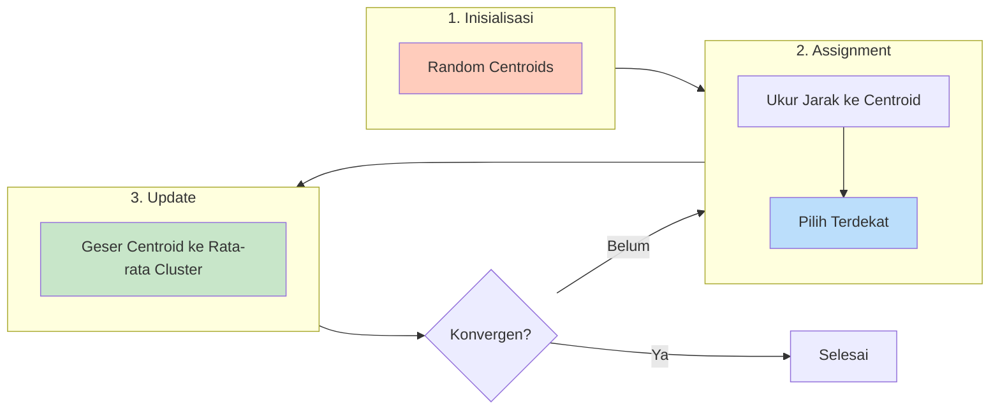
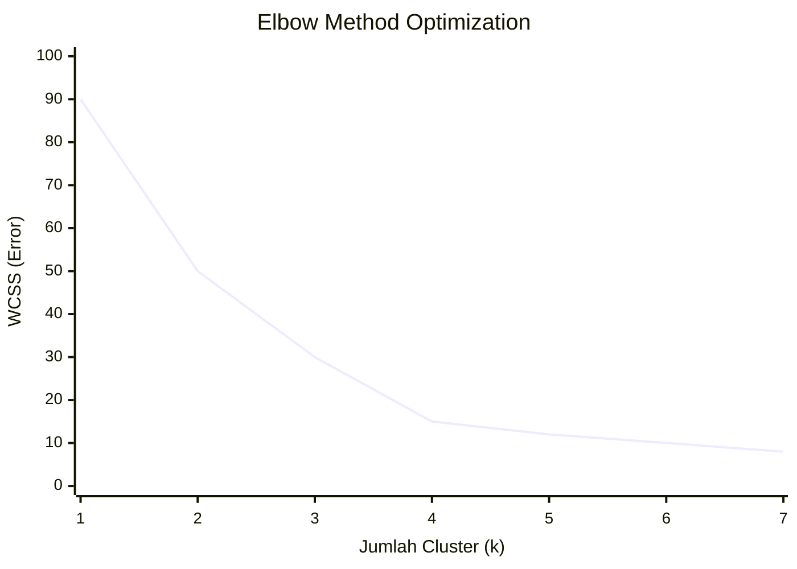
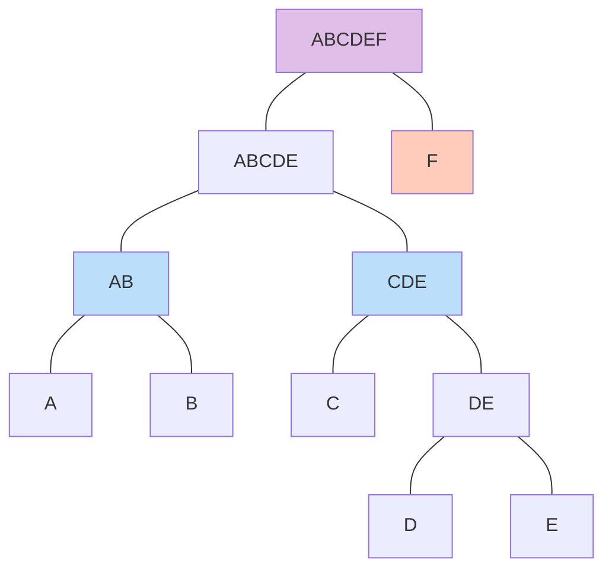
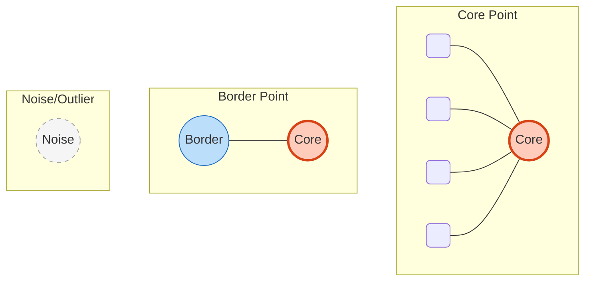
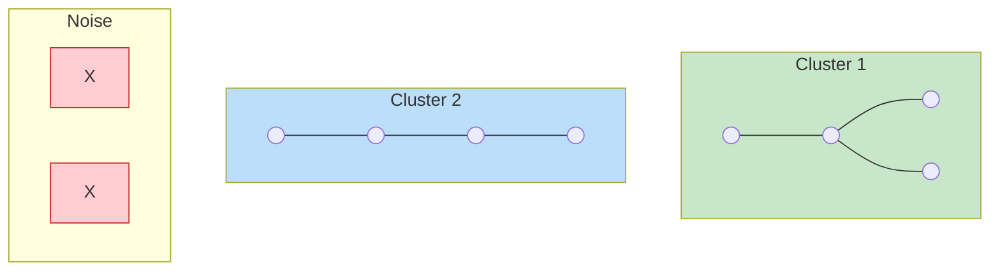
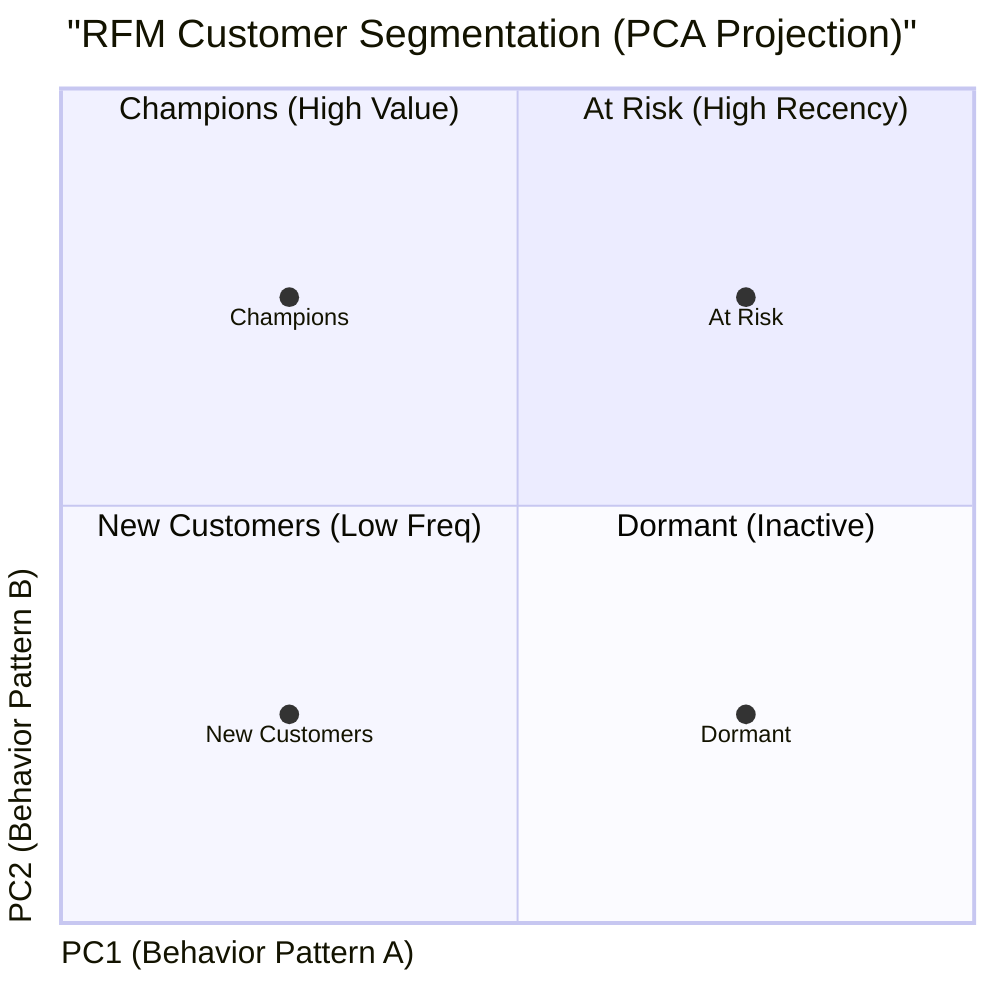

# BAB 7: Algoritma Klastering

---

## 🎯 Tujuan Pembelajaran

Setelah mempelajari bab ini, Anda akan mampu:

- Memahami konsep clustering dan perbedaannya dengan klasifikasi
- Mengimplementasikan algoritma K-Means Clustering
- Menjelaskan Hierarchical Clustering dan dendrogramnya
- Memahami DBSCAN untuk data dengan noise dan bentuk tidak teratur
- Mengevaluasi hasil clustering dengan Silhouette Score dan Elbow Method
- Mengidentifikasi aplikasi clustering di dunia nyata

---

## 📖 Pendahuluan

Bayangkan Anda adalah manajer marketing di sebuah e-commerce. Anda memiliki jutaan pelanggan dengan perilaku belanja yang berbeda-beda. Bagaimana Anda mengelompokkan mereka untuk campaign yang lebih targeted? Apakah pelanggan A lebih mirip dengan B atau C?

Ini adalah masalah **clustering** — menemukan kelompok alami dalam data **tanpa label**. Berbeda dengan klasifikasi yang diawasi dengan label, clustering adalah pembelajaran tanpa pengawasan (_unsupervised_) yang mencari pola tersembunyi.

---

## 7.1 Konsep Clustering

### 7.1.1 Definisi

**Clustering** adalah proses mengelompokkan data ke dalam **clusters** (kelompok) di mana:

- Data dalam satu cluster **mirip** satu sama lain
- Data antar cluster **berbeda** satu sama lain

```mermaid
graph TD
    subgraph SVC [KLASIFIKASI (Supervised)]
        D1[Data + Label] --> M1[Model Training]
        M1 --> P1[Prediksi Kelas]
        style SVC fill:#e3f2fd
    end

    subgraph CLS [CLUSTERING (Unsupervised)]
        D2[Data Tanpa Label] --> A1[Algoritma Clustering]
        A1 --> G1[Kelompok/Cluster]
        style CLS fill:#fff9c4
    end

    D1:::input
    D2:::input
    P1:::output
    G1:::output

    classDef input fill:#f5f5f5,stroke:#333,stroke-dasharray: 5 5;
    classDef output fill:#c8e6c9,stroke:#2e7d32,stroke-width:2px;
```

**Gambar 7.1**: Perbedaan mendasar: Klasifikasi belajar dari data berlabel (guru), Clustering mencari pola sendiri dari data tanpa label (otodidak).

### 7.1.2 Jenis Clustering

| Jenis                  | Deskripsi                       | Contoh Algoritma        |
| ---------------------- | ------------------------------- | ----------------------- |
| **Partitional**        | Membagi data ke dalam k cluster | K-Means                 |
| **Hierarchical**       | Membangun hierarki cluster      | Agglomerative, Divisive |
| **Density-based**      | Cluster berdasarkan kepadatan   | DBSCAN                  |
| **Distribution-based** | Cluster berdasarkan distribusi  | Gaussian Mixture        |

### 7.1.3 Aplikasi Clustering

| Domain                | Aplikasi                         |
| --------------------- | -------------------------------- |
| **Marketing**         | Customer segmentation            |
| **Biologi**           | Pengelompokan gen/spesies        |
| **Image Processing**  | Segmentasi gambar, kompresi      |
| **Anomaly Detection** | Menemukan outlier                |
| **Social Networks**   | Community detection              |
| **Recommendation**    | Mengelompokkan produk/user mirip |

---

## 7.2 K-Means Clustering

### 7.2.1 Konsep Dasar

**K-Means** membagi n data ke dalam **k clusters** dengan cara meminimalkan jarak data ke pusat cluster-nya (**centroid**).

**Objective:**
$$\min \sum_{i=1}^{k} \sum_{x \in C_i} \|x - \mu_i\|^2$$

Di mana:

- $C_i$ = cluster ke-i
- $\mu_i$ = centroid (pusat) cluster ke-i
- $\|x - \mu_i\|^2$ = jarak kuadrat ke centroid

### 7.2.2 Algoritma K-Means

```
FUNGSI KMeans(data, k):
    // 1. Inisialisasi: Pilih k centroid secara random
    centroids ← random_pick(data, k)

    ULANGI:
        // 2. Assignment: Assign setiap data ke centroid terdekat
        UNTUK setiap x DALAM data:
            cluster[x] ← argmin_i jarak(x, centroid_i)

        // 3. Update: Hitung centroid baru
        UNTUK i DARI 1 SAMPAI k:
            centroid_i ← mean(data di cluster i)

    SAMPAI centroid tidak berubah (konvergen)

    KEMBALIKAN clusters, centroids
```

### 7.2.3 Visualisasi Iterasi K-Means



**Gambar 7.2**: Siklus algoritma K-Means. Centroid terus bergeser sampai posisinya stabil (konvergen) di tengah-tengah cluster.

### 7.2.4 Contoh Numerik K-Means

**Data 2D:**
| Point | x | y |
|-------|---|---|
| A | 1 | 1 |
| B | 1.5 | 2 |
| C | 3 | 4 |
| D | 5 | 7 |
| E | 3.5 | 5 |
| F | 4.5 | 5 |

**Langkah 1: Inisialisasi k=2**

- Centroid 1: A(1, 1)
- Centroid 2: D(5, 7)

**Langkah 2: Assignment (Iterasi 1)**
| Point | Dist to C1 | Dist to C2 | Cluster |
|-------|------------|------------|---------|
| A | 0 | 7.21 | 1 |
| B | 1.12 | 6.10 | 1 |
| C | 3.61 | 3.61 | 1 (tie) |
| D | 7.21 | 0 | 2 |
| E | 4.72 | 2.50 | 2 |
| F | 5.32 | 2.06 | 2 |

**Langkah 3: Update Centroids**

- New C1 = mean(A, B, C) = (1.83, 2.33)
- New C2 = mean(D, E, F) = (4.33, 5.67)

**Ulangi sampai konvergen...**

### 7.2.5 Memilih K: Elbow Method

Bagaimana menentukan jumlah cluster k yang optimal?

**Elbow Method:**

1. Jalankan K-Means untuk k = 1, 2, 3, ...
2. Hitung **Within-Cluster Sum of Squares (WCSS)**:
   $$WCSS = \sum_{i=1}^{k} \sum_{x \in C_i} \|x - \mu_i\|^2$$
3. Plot WCSS vs k
4. Cari "elbow" — titik di mana penurunan WCSS melambat



_(Titik siku "elbow" berada di k=4, di mana penurunan error mulai melambat drastis. Ini adalah k optimal)._

**Gambar 7.3**: Metode Elbow untuk menentukan jumlah cluster terbaik. WCSS adalah total jarak kuadrat dalam cluster.

### 7.2.6 K-Means++: Inisialisasi Lebih Baik

K-Means biasa sensitif terhadap inisialisasi random. **K-Means++** memilih centroid awal yang lebih tersebar:

1. Pilih centroid pertama secara random
2. Pilih centroid berikutnya dengan probabilitas proporsional terhadap $D(x)^2$ (jarak ke centroid terdekat)
3. Ulangi sampai k centroid

### 7.2.7 Kelebihan dan Kekurangan K-Means

**✅ Kelebihan:**

- Sederhana dan cepat: O(nkt) di mana t = iterasi
- Mudah diinterpretasikan
- Scalable untuk dataset besar

**❌ Kekurangan:**

- Harus tentukan k di awal
- Sensitif terhadap outliers
- Hanya menemukan cluster berbentuk spherical (bola)
- Hasil bisa berbeda tergantung inisialisasi

---

## 7.3 Hierarchical Clustering

### 7.3.1 Konsep Dasar

**Hierarchical Clustering** membangun hierarki nested clusters yang dapat divisualisasikan sebagai **dendrogram** (pohon).

**Dua pendekatan:**

- **Agglomerative (Bottom-up)**: Mulai dari n cluster, gabungkan pasangan paling mirip
- **Divisive (Top-down)**: Mulai dari 1 cluster, pecah menjadi sub-clusters

### 7.3.2 Algoritma Agglomerative Clustering

```
FUNGSI AgglomerativeClustering(data):
    // Inisialisasi: setiap data adalah cluster sendiri
    clusters ← {{x} untuk setiap x dalam data}

    SELAMA jumlah(clusters) > 1:
        // Cari pasangan cluster paling mirip
        (C_i, C_j) ← argmin jarak(C_a, C_b) untuk semua pasangan

        // Gabungkan
        C_new ← C_i ∪ C_j
        clusters.hapus(C_i, C_j)
        clusters.tambah(C_new)

        // Catat penggabungan untuk dendrogram

    KEMBALIKAN dendrogram
```

### 7.3.3 Linkage Methods

Bagaimana mengukur jarak antar cluster?

| Linkage      | Formula                             | Karakteristik                     |
| ------------ | ----------------------------------- | --------------------------------- | --- | --- | -------------------- | -------------------- |
| **Single**   | $\min\{d(a,b) : a \in A, b \in B\}$ | Sensitif outlier, bisa "chaining" |
| **Complete** | $\max\{d(a,b) : a \in A, b \in B\}$ | Cluster compact, sensitif outlier |
| **Average**  | $\frac{1}{                          | A                                 |     | B   | }\sum\_{a,b} d(a,b)$ | Balance, paling umum |
| **Ward**     | Penambahan variance minimal         | Cluster equal-sized               |

### 7.3.4 Dendrogram



_(Contoh Dendrogram: Jika dipotong di tengah, kita dapat 3 cluster: {A,B}, {C,D,E}, dan {F})._

**Gambar 7.4**: Visualisasi Dendrogram pada Hierarchical Clustering yang menunjukkan bagaimana data digabungkan bertahap.

### 7.3.5 Memilih Jumlah Cluster dari Dendrogram

Potong dendrogram secara horizontal pada level tertentu:

- Tidak perlu tentukan k di awal
- Dapat eksplorasi berbagai k
- Gap besar = cluster yang kuat

### 7.3.6 Perbandingan K-Means vs Hierarchical

| Aspek            | K-Means       | Hierarchical                    |
| ---------------- | ------------- | ------------------------------- |
| Tentukan k       | Harus di awal | Bisa setelah melihat dendrogram |
| Kompleksitas     | O(nkt)        | O(n²) atau O(n³)                |
| Interpretability | Centroid      | Dendrogram                      |
| Scalability      | Baik          | Buruk untuk n besar             |
| Bentuk cluster   | Spherical     | Arbitrary                       |

---

## 7.4 DBSCAN

### 7.4.1 Konsep Dasar

**DBSCAN (Density-Based Spatial Clustering of Applications with Noise)** mengelompokkan data berdasarkan **kepadatan** (density).

**Ide:** Cluster adalah area dengan kepadatan tinggi yang dipisahkan oleh area dengan kepadatan rendah.

### 7.4.2 Parameter

| Parameter   | Simbol | Deskripsi                                   |
| ----------- | ------ | ------------------------------------------- |
| **Epsilon** | ε      | Radius neighborhood                         |
| **MinPts**  | MinPts | Minimum points untuk membentuk dense region |

### 7.4.3 Jenis Point



_(Core: Punya banyak tetangga. Border: Punya sedikit tetangga tapi dekat Core. Noise: Sendirian)._

**Gambar 7.5**: Tiga jenis titik dalam DBSCAN: Core Point (padat), Border Point (pinggir cluster), dan Noise (sampah/outlier).

### 7.4.4 Algoritma DBSCAN

```
FUNGSI DBSCAN(data, ε, MinPts):
    label ← semuanya UNDEFINED
    cluster_id ← 0

    UNTUK setiap point P DALAM data:
        JIKA label[P] ≠ UNDEFINED:
            LANJUTKAN  // Sudah diproses

        neighbors ← RangeQuery(data, P, ε)

        JIKA |neighbors| < MinPts:
            label[P] ← NOISE
        LAINNYA:
            cluster_id ← cluster_id + 1
            ExpandCluster(P, neighbors, cluster_id, ε, MinPts)

    KEMBALIKAN label

FUNGSI ExpandCluster(P, neighbors, cluster_id, ε, MinPts):
    label[P] ← cluster_id

    UNTUK setiap Q DALAM neighbors:
        JIKA label[Q] = NOISE:
            label[Q] ← cluster_id  // Border point
        JIKA label[Q] ≠ UNDEFINED:
            LANJUTKAN

        label[Q] ← cluster_id
        neighbors_Q ← RangeQuery(data, Q, ε)

        JIKA |neighbors_Q| ≥ MinPts:
            neighbors ← neighbors ∪ neighbors_Q  // Expand!
```

### 7.4.5 Visualisasi DBSCAN



**Gambar 7.6**: Hasil clustering DBSCAN. Data padat membentuk cluster, data terpencil ditandai sebagai noise (X).

### 7.4.6 Kelebihan dan Kekurangan DBSCAN

**✅ Kelebihan:**

- Tidak perlu tentukan k
- Menemukan cluster bentuk arbitrary
- Robust terhadap outliers
- Mengidentifikasi noise secara otomatis

**❌ Kekurangan:**

- Sensitif terhadap ε dan MinPts
- Kesulitan dengan cluster density berbeda
- Tidak cocok untuk dimensi tinggi

### 7.4.7 Memilih ε dan MinPts

**Aturan praktis:**

- MinPts ≥ dimensi + 1 (minimum: 3)
- ε: gunakan k-distance graph
  1. Untuk setiap point, hitung jarak ke k-th nearest neighbor
  2. Urutkan ascending
  3. Plot → cari "elbow"

---

## 7.5 Evaluasi Clustering

Bagaimana kita tahu clustering kita bagus? Berbeda dengan supervised learning, tidak ada "jawaban benar."

### 7.5.1 Metrik Internal (Tanpa Ground Truth)

#### Silhouette Score

**Silhouette Score** mengukur seberapa mirip data dengan cluster-nya dibanding cluster lain.

Untuk setiap data point i:
$$s(i) = \frac{b(i) - a(i)}{\max(a(i), b(i))}$$

Di mana:

- a(i) = rata-rata jarak ke point lain dalam cluster yang sama
- b(i) = rata-rata jarak ke point di cluster terdekat berikutnya

**Interpretasi:**

- s = 1: Sangat baik (jauh dari cluster lain)
- s = 0: Di batas cluster
- s = -1: Salah cluster!

**Silhouette Score keseluruhan:** rata-rata s(i) untuk semua data.

| Score       | Kualitas           |
| ----------- | ------------------ |
| 0.71 - 1.00 | Sangat baik        |
| 0.51 - 0.70 | Baik               |
| 0.26 - 0.50 | Lemah              |
| < 0.25      | Tidak ada struktur |

#### Davies-Bouldin Index

$$DB = \frac{1}{k} \sum_{i=1}^{k} \max_{j \neq i} \frac{\sigma_i + \sigma_j}{d(c_i, c_j)}$$

- σ = rata-rata jarak data ke centroid cluster
- d(ci, cj) = jarak antar centroid

**Interpretasi:** Semakin kecil, semakin baik (cluster compact dan jauh satu sama lain).

### 7.5.2 Metrik Eksternal (Dengan Ground Truth)

Jika kita punya label sebenarnya untuk evaluasi:

| Metrik                                  | Deskripsi                                          |
| --------------------------------------- | -------------------------------------------------- |
| **Adjusted Rand Index (ARI)**           | Kesamaan dengan label, adjusted for chance         |
| **Normalized Mutual Information (NMI)** | Information shared antara clustering dan label     |
| **Purity**                              | Proporsi data dengan label mayoritas dalam cluster |

### 7.5.3 Visualisasi Hasil Clustering

Untuk data dimensi tinggi, gunakan **dimensionality reduction**:

- PCA → 2D scatter plot
- t-SNE → 2D, preservasi lokal
- UMAP → 2D, preservasi global

---

## 7.6 Studi Kasus: Customer Segmentation

### 7.6.1 Problem Statement

Sebuah retail ingin mengelompokkan pelanggan untuk personalisasi marketing.

### 7.6.2 Data

| CustomerID | Recency | Frequency | Monetary |
| ---------- | ------- | --------- | -------- |
| 1          | 5       | 10        | 500000   |
| 2          | 30      | 2         | 50000    |
| 3          | 1       | 15        | 1000000  |
| 4          | 60      | 1         | 20000    |
| ...        | ...     | ...       | ...      |

**RFM Analysis:**

- **Recency**: Hari sejak pembelian terakhir
- **Frequency**: Jumlah transaksi
- **Monetary**: Total nilai transaksi

### 7.6.3 Preprocessing

1. Handle outliers (cap at 99 percentile)
2. Standardization (mean=0, std=1)
3. Log transform untuk Monetary (skewed)

### 7.6.4 Menentukan K

```
Elbow Method:
   WCSS │
        │●
        │  ●
        │    ●
        │       ●------●------●
        └────────────────────────► k
          2   3   4   5   6   7

Optimal k = 4
```

### 7.6.5 Hasil Clustering

| Cluster | Nama          | Karakteristik         | Strategi                |
| ------- | ------------- | --------------------- | ----------------------- |
| 0       | Champions     | Low R, High F, High M | Reward, early access    |
| 1       | At Risk       | High R, Was frequent  | Win-back campaign       |
| 2       | New Customers | Medium R, Low F       | Onboarding, upsell      |
| 3       | Dormant       | Very High R, Low F    | Aggressive reactivation |

### 7.6.6 Visualisasi



_(Plot 2D hasil reduksi dimensi. Kelompok pelanggan terpisah secara visual di kuadran berbeda)._

**Gambar 7.7**: Visualisasi hasil segmentasi pelanggan. Setiap warna/kuadran merepresentasikan persona pelanggan yang berbeda.

---

## 📝 Ringkasan

1. **Clustering**: Unsupervised grouping berdasarkan similarity

2. **K-Means**:
   - Partisi n data ke k clusters
   - Minimize within-cluster variance
   - Simple, fast, tapi butuh k dan sensitif inisialisasi
   - Elbow method untuk memilih k

3. **Hierarchical Clustering**:
   - Bangun hierarki cluster (dendrogram)
   - Tidak perlu k di awal
   - O(n²) atau lebih, tidak scalable

4. **DBSCAN**:
   - Density-based
   - Menemukan arbitrary shapes
   - Otomatis mendeteksi noise
   - Parameter: ε dan MinPts

5. **Evaluasi**:
   - Internal: Silhouette Score, Davies-Bouldin
   - External: ARI, NMI (jika ada label)

---

## ✏️ Soal Latihan

### Pilihan Ganda

**1.** K-Means meminimalkan:

- a) Jarak antar centroid
- b) Within-cluster sum of squares
- c) Jumlah cluster
- d) Jarak maksimum dalam cluster

**2.** DBSCAN tidak cocok untuk:

- a) Data dengan noise
- b) Cluster berbentuk irregular
- c) Cluster dengan density berbeda
- d) Data 2D

**3.** Silhouette score yang mendekati -1 menunjukkan:

- a) Clustering excellent
- b) Data di boundary
- c) Data mungkin salah cluster
- d) Jumlah cluster optimal

**4.** Dalam Hierarchical Clustering, dendrogram dipotong untuk:

- a) Menghitung jarak antar cluster
- b) Menentukan linkage method
- c) Menentukan jumlah cluster
- d) Menormalisasi data

**5.** MinPts dalam DBSCAN menentukan:

- a) Jumlah cluster
- b) Minimum points untuk membentuk core point
- c) Radius pencarian
- d) Threshold density

### Esai Singkat

**6.** Jelaskan mengapa K-Means tidak cocok untuk cluster berbentuk bulan sabit (crescent).

**7.** Diberikan data 1D: [1, 2, 8, 9, 10, 25], jalankan K-Means dengan k=2 dan centroid awal [1, 25]. Tunjukkan 2 iterasi.

**8.** Bagaimana cara menentukan ε yang tepat untuk DBSCAN?

### Tantangan

**9.** Implementasikan algoritma K-Means dalam pseudocode lengkap dengan stopping criterion.

**10.** Jelaskan bagaimana menangani situasi di mana DBSCAN menghasilkan terlalu banyak noise points.

---

## 📖 Glosarium Bab 7

| Istilah              | Definisi                                                  |
| -------------------- | --------------------------------------------------------- |
| **Clustering**       | Pengelompokan data tanpa label                            |
| **K-Means**          | Algoritma partisi ke dalam k clusters berbentuk spherical |
| **Centroid**         | Pusat cluster (rata-rata semua point dalam cluster)       |
| **WCSS**             | Within-Cluster Sum of Squares                             |
| **Elbow Method**     | Teknik menentukan k optimal dengan melihat kurva WCSS     |
| **Hierarchical**     | Clustering yang membangun hierarki                        |
| **Dendrogram**       | Visualisasi pohon dari hierarchical clustering            |
| **Linkage**          | Metode mengukur jarak antar cluster                       |
| **DBSCAN**           | Density-Based Spatial Clustering with Noise               |
| **Core Point**       | Point dengan ≥ MinPts dalam radius ε                      |
| **Border Point**     | Point dalam ε dari core point                             |
| **Noise**            | Point yang bukan core dan bukan border                    |
| **Silhouette Score** | Ukuran kualitas clustering (-1 to 1)                      |

---

## 📚 Bacaan Lebih Lanjut

1. MacQueen, J. (1967). Some methods for classification and analysis of multivariate observations. _Berkeley Symposium_.
2. Ester, M., et al. (1996). A density-based algorithm for discovering clusters. _KDD_.
3. Murtagh, F., & Contreras, P. (2012). Algorithms for hierarchical clustering: an overview. _WIREs Data Mining_.

---

_← [BAB 6: Algoritma Klasifikasi Dasar](./BAB-06-Algoritma-Klasifikasi-Dasar.md) | [BAB 8: Dasar Jaringan Saraf Tiruan](./BAB-08-Dasar-Jaringan-Saraf-Tiruan.md) →_
